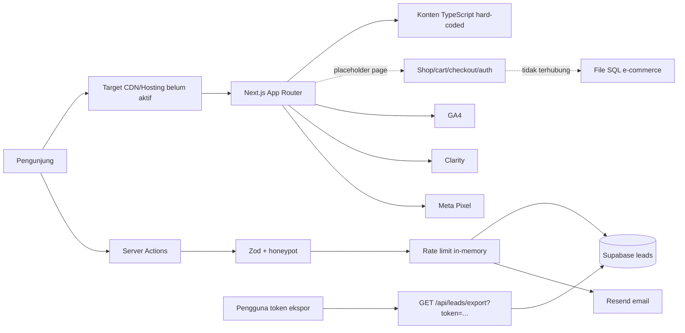
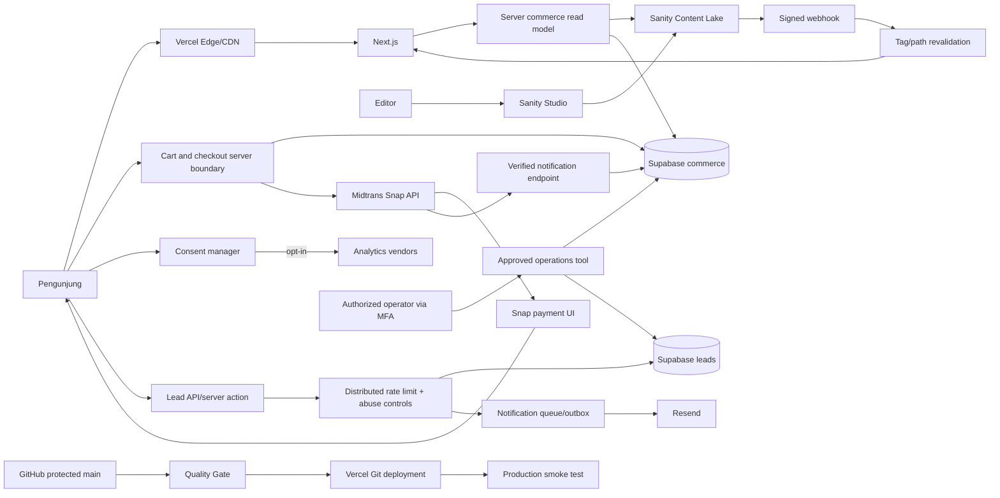

# Alfa Beauty Website - Project Source of Truth

> Status rilis: **TIDAK DISETUJUI UNTUK PRODUKSI**  
> Tanggal audit terakhir: **20 Agustus 2026 (Asia/Jakarta)**  
> Cakupan snapshot: basis commit `65ea011`, checkout lokal `master`, perubahan
> CMS/commerce/CI yang belum di-commit, dependency terpasang, build produksi, konfigurasi
> Git, DNS publik, dan respons domain publik
> Pemilik dokumen: **TBD - Product Owner Alfa Beauty**  
> Pemilik teknis: **TBD - Engineering Lead**  
> Klasifikasi: **Internal - tidak memuat secret**

Dokumen ini adalah sumber kebenaran utama untuk scope, arsitektur, data,
keamanan, CMS, CI/CD, operasi, risiko, serta urutan implementasi website Alfa
Beauty Indonesia. Ia sengaja membedakan fakta saat ini dari rancangan target.
Dokumen ini bukan bukti bahwa sistem telah lolos penetration test, audit hukum,
atau audit akun cloud.

## 1. Cara Menggunakan Dokumen Ini

### 1.1 Urutan otoritas

Jika sumber saling bertentangan, gunakan urutan berikut:

1. Keputusan tertulis berstatus `Accepted` pada bagian ADR dokumen ini.
2. Requirement bisnis yang telah ditandatangani Product Owner dan tercatat pada
   change log dokumen ini.
3. Implementasi dan konfigurasi pada branch produksi yang terlindungi.
4. Dokumen proposal di `docs/archive/` sebagai rekam historis.
5. Percakapan, asumsi lisan, mockup, dan catatan lain.

Kode bukan otomatis sumber requirement yang benar. Kode dapat mengandung bug,
placeholder, atau implementasi yang melenceng. Sebaliknya, proposal lama juga
bukan otomatis gambaran keadaan sistem saat ini.

### 1.2 Kategori pernyataan

- **CURRENT**: diverifikasi dari repo atau layanan publik pada tanggal audit.
- **TARGET**: desain yang harus dicapai, belum tentu telah diterapkan.
- **DECISION REQUIRED**: tidak boleh diasumsikan; pemilik keputusan wajib
  memberi persetujuan tertulis.
- **EXTERNAL CONFIG**: harus dilakukan pada GitHub, Vercel, Sanity, Supabase,
  DNS, atau layanan lain dan tidak dapat diselesaikan hanya dengan commit repo.

### 1.3 Aturan pembaruan

Setiap perubahan arsitektur, data pribadi, CMS, pipeline, domain, vendor, atau
release policy wajib memperbarui dokumen ini dalam pull request yang sama.
Perubahan harus mencantumkan alasan, dampak, migrasi, rollback, pemilik, tanggal,
dan ADR terkait. Jangan memasukkan credential, token, alamat lead, atau data
pribadi ke dokumen.

## 2. Kesimpulan Eksekutif

### 2.1 Putusan audit

Frontend memiliki fondasi visual dan katalog yang cukup luas, tetapi sistem
belum memiliki fondasi operasional yang setara. Kelemahan utamanya bukan sekadar
"CMS belum dipasang". Masalah akar adalah:

1. Tidak ada batas otoritas yang aman untuk admin dan ekspor lead.
2. Tidak ada kontrak database, migration, Row Level Security, atau bukti restore.
3. Consent banner tidak mengendalikan pemuatan analytics.
4. Konten produksi berada di TypeScript, bercampur placeholder dan aset yang
   salah, sehingga tidak memiliki workflow editorial atau audit trail memadai.
5. Requirement CMS Free bertentangan dengan requirement pemisahan peran.
6. Tidak ada test otomatis untuk perilaku bisnis, API, consent, atau browser.
7. Sebelum audit ini, workflow CI berada di lokasi yang tidak dibaca GitHub dan
   berisi perintah yang tidak tersedia.
8. Domain publik masih melayani WordPress/LiteSpeed maintenance page, bukan
   aplikasi Next.js dari repo ini.
9. Dua remote Git memiliki sejarah yang divergen; canonical repository belum
   disahkan secara eksplisit.

Keputusan tegas: **jangan menghubungkan domain produksi, mengaktifkan analytics,
memberi akses CMS kepada staf, memasang Midtrans production key, atau menerima
transaksi sebelum blocker P0 ditutup dan release gate terkait lulus**.

### 2.2 Perbaikan yang telah diterapkan dalam audit ini

- Dependency produksi utama diperbarui dan `npm audit` menjadi nol temuan pada
  snapshot audit.
- `eslint-config-next` disejajarkan dengan versi Next.js.
- Lint error aksesibilitas dan pola React yang gagal telah diperbaiki.
- Warning lint yang ada dibersihkan dan lint diubah menjadi zero-warning gate.
- Kontrak `lint`, `typecheck`, `build`, dan production dependency audit ditambah.
- Runtime ditetapkan pada Node.js 24 LTS / npm 11.
- Konvensi `src/middleware.ts` dimigrasikan menjadi `src/proxy.ts` untuk Next.js
  16.
- `.env.example`, `.nvmrc`, dan perlindungan `.gitignore` ditambahkan.
- GitHub Actions CI, deployment smoke test, dan Dependabot ditambahkan di root
  repo yang benar.

Perubahan ini membuat baseline engineering dapat diulang. Ia **belum** menutup
risiko aplikasi dan operasi pada bagian risk register.

### 2.3 Delta audit setelah pull `f96779e` dan merge `65ea011`

Pull pada 20 Agustus 2026 memasukkan commit `f96779e` melalui merge commit
`65ea011`. Perubahan memindahkan kode ke boundary `features/` dan `shared/`,
menambah fallback nama environment Supabase, 9 page baru, type e-commerce, dan
sebuah file SQL berisi 12 tabel. Refactor import dapat dikompilasi. Pada audit
awal, perluasan ini belum mempunyai keputusan bisnis. Product Owner kemudian
menetapkan bahwa rilis sementara justru ditujukan sebagai **MVP e-commerce**.
Keputusan lanjutan menetapkan MVP tersebut tidak menerima pembayaran nyata;
payment flow hanya boleh berupa sandbox/demo terisolasi.
Dengan keputusan terbaru tersebut, scaffold selaras secara arah, tetapi belum
selaras secara perilaku, data, dan keamanan karena:

- shop, cart, checkout, login, register, my-account, Midtrans, order, profile,
  inventory, dan blog baru berupa route, type, atau schema parsial tanpa alur
  transaksi yang dapat dijalankan;
- page baru hanya placeholder tetapi dapat diakses publik dan sebagian masuk
  navigation/sitemap dengan klaim pembelian serta pembayaran;
- redirect permanen `/products/:path*` menuju `/brands/:path*`, sedangkan build
  hanya memiliki `/brands` dan tidak memiliki `/brands/[id]`; detail produk lama
  menjadi 308 menuju 404;
- `brands/page.tsx` masih menetapkan canonical `/products`, yaitu URL yang
  sekarang redirect permanen;
- migration tidak membuat tabel `leads` atau `contacts` yang dipakai Server
  Actions, sehingga fresh database dari migration repo tidak mendukung fitur
  form yang sudah ada;
- 12 tabel dibuat tetapi hanya 10 mengaktifkan RLS; `product_feature_map` dan
  `product_variants` tidak dilindungi RLS;
- pengguna dapat meng-update row profile sendiri termasuk kolom `role`, sehingga
  desain `customer|admin` memungkinkan privilege escalation bila grant API
  mengizinkan update;
- fungsi `SECURITY DEFINER public.handle_new_user()` tidak mengunci
  `search_path`;
- type database ditulis manual, tidak digunakan sebagai generic Supabase client,
  dan menganggap beberapa foreign key/default nullable sebagai non-null;
- `npm run lint` gagal dengan 5 warning setelah merge, sehingga `Quality Gate`
  tidak hijau;
- workflow hanya trigger pada `main`, sementara checkout/push terbaru berada di
  `master`; push ke `master` tidak menjalankan CI tersebut.

Putusan pasca-pull: **struktur folder dan route dapat menjadi titik awal MVP
setelah gate kembali hijau, tetapi schema e-commerce, placeholder checkout,
redirect, dan klaim Midtrans tidak boleh dipromosikan ke produksi dalam bentuk
sekarang**. MVP non-transaksional boleh menunda payment/inventory production,
tetapi tidak boleh diam-diam memakai credential production, mengumpulkan data
pelanggan untuk order palsu, atau menampilkan placeholder sebagai penawaran nyata.

### 2.4 Delta implementasi CMS setelah audit

Pada 20 Agustus 2026, setelah Product Owner mengizinkan implementasi untuk demo
production non-transaksional, fondasi CMS lokal mulai diterapkan. Status yang
benar setelah perubahan ini adalah:

- schema Sanity lokal tersedia untuk `productContent`, `brand`,
  `productCategory`, dan singleton `siteSettings`;
- `/shop` dan `/shop/[slug]` membaca catalog adapter server-side;
- adapter memakai published perspective/CDN untuk request normal, authenticated
  drafts tanpa CDN untuk preview, tag cache, dan validasi DTO dengan Zod;
- source TypeScript 50 produk dipertahankan sebagai fallback demo terkontrol,
  bukan sebagai authority commerce;
- `SANITY_CONTENT_MODE=required` gagal tegas bila konfigurasi hilang, query
  gagal, record aktif tidak valid, atau katalog aktif kosong;
- signed Sanity webhook hanya merevalidasi cache content dan tidak mempunyai
  jalur menulis price, stock, order, payment, lead, atau PII;
- Presentation Tool memakai official preview URL handshake dan draft cookie;
- `/products/**` dan `/brands` memakai redirect sementara menuju canonical
  `/shop`, dan sitemap menghasilkan `/shop/{slug}`;
- lint, typecheck, schema validation, serta build production lokal lulus setelah
  implementasi; bukti rinci berada pada Bagian 29.

Hal yang **belum** selesai: Sanity organization/project/dataset nyata, pemilihan
plan, role assignment, MFA/SSO, CORS, hosted Studio deployment, webhook vendor,
secret provisioning, migrasi/rekonsiliasi konten, business acceptance, dan
monitoring. Karena itu CMS belum boleh diberikan kepada editor dan risiko
`CMS-001`/`CMS-002` tetap Open.

## 3. Scope Produk

### 3.1 Tujuan produk

Website adalah MVP pengalaman e-commerce B2C dan kanal korporat Alfa Beauty
Indonesia. Tujuan rilis sementara adalah membuktikan discovery, merchandising,
cart, dan simulasi checkout tanpa menerima pembayaran atau fulfillment nyata:

- memperkenalkan perusahaan, brand, dan kategori produk;
- membantu salon, barber, profesional, dan calon mitra menemukan produk;
- menampilkan katalog yang siap dihubungkan ke harga/ketersediaan authoritative
  pada fase transaksi;
- menyediakan cart serta checkout sandbox/demo yang terisolasi bila diperlukan;
- mempublikasikan artikel edukasi serta event;
- menangkap permintaan partnership dan kontak;
- mengarahkan percakapan ke WhatsApp;
- menyediakan informasi legal dan kontak resmi.

Rilis ini tidak menerima uang, tidak mengurangi stok nyata, dan tidak memulai
fulfillment. Production Midtrans key dilarang. Fixture harga/order hanya boleh
berada pada environment demo/test serta tidak boleh bercampur dengan data bisnis.
Arsitektur CMS tetap disiapkan untuk e-commerce agar migrasi menuju transaksi
nyata kelak tidak menimbulkan dual source of truth.

### 3.2 Scope yang diwarisi dari proposal

Requirement historis pada `docs/archive/proposal.md` dan
`docs/archive/paket-a.md` mencakup:

- Home;
- daftar dan detail produk;
- education, event, dan article;
- partnership;
- about dan contact;
- privacy, terms, 404;
- lead capture dengan validasi, anti-spam, Supabase, email, dan CSV;
- CMS Sanity untuk Owner dan Karyawan;
- GA4 dan Google Search Console;
- Bahasa Indonesia dan Inggris;
- WhatsApp CTA.

### 3.3 Scope MVP CMS + e-commerce demo/sandbox yang disetujui

- katalog produk publish dari Sanity dengan binding ke record commerce;
- model binding produk Sanity ke commerce ID yang stabil agar siap dikembangkan;
- harga/variant/stock fixture hanya pada environment demo yang terisolasi;
- cart non-finansial untuk memvalidasi pengalaman pengguna;
- checkout dan Midtrans sandbox hanya bila berada pada preview yang dilindungi,
  memakai data uji, dan tidak menghasilkan order fulfillment;
- tidak ada production payment notification, settlement, refund, atau operasi
  order nyata pada scope rilis ini;
- CMS Sanity untuk merchandising, konten katalog, brand, kategori, collection,
  campaign, artikel, event, legal, navigation, dan SEO;
- lead partnership/contact tetap berada di Supabase, terpisah dari CMS.

### 3.4 Di luar scope MVP

- marketplace, multi-vendor, multi-warehouse, atau sinkronisasi ERP penuh;
- pembayaran uang nyata, production Midtrans key, settlement, dan fulfillment;
- harga atau inventory production serta reservasi stok nyata;
- wishlist, loyalty, review pelanggan, recommendation engine, dan subscription;
- promotion engine kompleks, dynamic pricing, bundling, atau gift card;
- multi-currency, international tax, dan international shipping;
- return/refund mandiri pelanggan serta otomatisasi dispute/chargeback;
- custom admin dashboard untuk konten, order, lead, atau customer;
- pengelolaan order, pembayaran, stok, lead, atau customer PII di Sanity;
- workflow approval CMS kompleks di luar kemampuan plan yang disetujui.

Deferred bukan berarti boleh ditampilkan sebagai placeholder publik. Route atau
CTA untuk fitur di luar scope harus dihapus, dilindungi feature flag server-side,
atau diberi respons eksplisit yang tidak mengklaim fitur tersedia.

### 3.5 Guardrail MVP non-transaksional

Untuk rilis ini, enforcement minimum adalah:

1. `MIDTRANS_IS_PRODUCTION` tidak boleh `true` dan production key tidak tersedia
   pada development, preview, CI, ataupun runtime rilis;
2. sandbox checkout hanya pada deployment terproteksi dan memakai data uji;
3. route/API payment production dinonaktifkan server-side, bukan hanya
   menyembunyikan tombol;
4. fixture order tidak masuk fulfillment, laporan keuangan, notifikasi pelanggan,
   analytics conversion production, atau database production;
5. halaman publik tidak mengklaim pembayaran/pemesanan tersedia dan tidak
   menampilkan harga placeholder sebagai penawaran nyata;
6. CMS tetap tidak menyimpan customer, payment, order, atau secret;
7. setiap pengaktifan transaksi nyata membutuhkan ADR, threat/privacy review,
   seluruh keputusan commerce, dan gate di bawah.

Yang **tidak dapat ditunda** bila transaksi nyata kelak diaktifkan:

1. harga dan total dihitung ulang server dari data authoritative;
2. order serta item snapshot dibuat atomik dengan identifier unik;
3. strategi stok/reservasi dan perilaku oversell disetujui tertulis;
4. Server Key Midtrans hanya server-side;
5. status pembayaran diverifikasi melalui notification atau status API;
6. webhook tahan retry, duplicate, replay, delay, dan out-of-order event;
7. fulfillment tidak dimulai dari callback sukses di browser;
8. RLS, grant, role, session, dan ownership data diuji positif serta negatif;
9. privacy notice, retention, logging redaction, monitoring, dan rollback aktif;
10. sandbox E2E dan rekonsiliasi transaksi lulus sebelum production key dipasang.

### 3.6 Koreksi terhadap rancangan awal

Rancangan "Sanity Free dengan Owner dan Karyawan" tidak dapat memenuhi prinsip
least privilege. Sanity Free hanya menyediakan role Administrator dan Viewer.
Role Editor, Developer, dan Contributor tersedia pada Growth atau Enterprise;
custom roles serta SAML SSO memerlukan Enterprise. Karena itu:

- **Free ditolak** untuk operasi editorial multi-user.
- **Growth adalah minimum fungsional** bila staf memakai Contributor dan
  publisher memakai Editor.
- **Enterprise adalah target keamanan ketat** bila SSO terpusat, custom role,
  atau kontrol perusahaan wajib.

Sumber vendor:

- <https://www.sanity.io/docs/user-guides/roles>
- <https://www.sanity.io/docs/developer-guides/sso-saml>
- <https://www.sanity.io/docs/user-guides/history-experience>

## 4. Cakupan dan Metode Audit

### 4.1 Yang diperiksa

- seluruh struktur file relevan pada root dan `frontend/`;
- proposal dan dokumentasi yang tersedia;
- `package.json`, lockfile, dependency tree, outdated package, dan audit npm;
- konfigurasi Next.js, TypeScript, ESLint, middleware/proxy, metadata, sitemap;
- route, server action, API route, Supabase, Resend, logging, rate limiting;
- komponen analytics, consent, bahasa, produk, artikel, dan event;
- konfigurasi Git, remote, branch, divergence, tracked secret patterns;
- build produksi, lint, dan type-check;
- DNS serta respons HTTP domain publik;
- dokumentasi resmi Next.js, Sanity, Supabase, Midtrans, GitHub Actions, dan
  Vercel yang relevan.

### 4.2 Yang belum dapat diverifikasi

Tidak ada akses terautentikasi ke GitHub Settings, Vercel project, Sanity
project, Supabase project, Resend, registrar DNS, GA4, Clarity, Meta, email
server, atau backup. Karena itu hal berikut belum terbukti:

- branch protection dan reviewer yang aktif;
- MFA/SSO anggota organisasi;
- isi secret store dan riwayat rotasi;
- schema tabel produksi, RLS, grants, backup, PITR, dan restore;
- konfigurasi domain di Vercel;
- ownership analytics dan consent mode;
- deliverability email, SPF, DKIM, dan DMARC;
- vulnerability pada host WordPress yang saat ini melayani domain;
- hasil DAST, SAST penuh, penetration test, dan browser E2E.

Semua item tersebut harus diperlakukan **belum aman**, bukan diasumsikan aman.

### 4.3 Bukti snapshot

Pada 20 Agustus 2026:

- commit setelah pull: `65ea011` dengan parent `d86891d` dan `f96779e`;
- checkout lokal: `master`, clean, tracking `origin/master`;
- local `main` juga menunjuk `65ea011`, tetapi tracking `origin/main` dan berada
  2 commit di depan;
- remote default `origin/HEAD` masih menunjuk `origin/main` pada `d86891d`;
- remote `origin`: `rikzacraft11-art/alfabeauty.git`;
- remote `upstream`: `Farid-Ze/alfabeauty.git`;
- `origin/master` memuat `origin/main` plus commit `f96779e` dan merge
  `65ea011`; CI hanya dikonfigurasi untuk `main`;
- `origin/master` berada 8 commit di depan `upstream/master` pada snapshot;
- tag rilis: tidak ditemukan;
- domain apex `alfabeauty.co.id`: A `103.79.244.233`, TTL sekitar 300 detik;
- `www`: CNAME ke apex;
- MX: `mailserver.abhatigroup.com`, preference 0;
- HTTP publik: WordPress/LiteSpeed maintenance page, bukan aplikasi repo;
- workflow pada sejarah upstream berada di `frontend/.github/workflows`, lokasi
  yang tidak dijalankan GitHub sebagai workflow root.

DNS dan respons domain bersifat temporer. Ambil snapshot baru sebelum cutover.

## 5. Inventaris Sistem Saat Ini

### 5.1 Struktur repo

```text
alfa/
|-- .github/
|   |-- dependabot.yml
|   `-- workflows/
|       |-- ci.yml
|       `-- deployment-smoke.yml
|-- docs/
|   |-- PROJECT_SOURCE_OF_TRUTH.md
|   |-- archive/
|   `-- yucca-uml-system-documentation.md
|-- frontend/
|   |-- public/
|   |-- src/
|   |   |-- actions/
|   |   |-- app/
|   |   |-- features/
|   |   |-- shared/
|   |   |   |-- components/
|   |   |   |-- hooks/
|   |   |   |-- lib/
|   |   |   `-- types/
|   |   `-- proxy.ts
|   |-- .env.example
|   |-- .nvmrc
|   |-- package.json
|   |-- package-lock.json
|   |-- next.config.ts
|   `-- tsconfig.json
|-- materi/
|-- .gitignore
`-- README.MD
```

Catatan: `docs/yucca-uml-system-documentation.md` membahas sistem Yucca
Packaging dan bukan spesifikasi Alfa Beauty. Jangan menjadikannya requirement
tanpa ADR eksplisit.

### 5.2 Stack CURRENT

| Lapisan | Teknologi | Kondisi |
|---|---|---|
| Web | Next.js 16.3.1 App Router | Build berhasil; seluruh halaman terdeteksi dinamis akibat nonce CSP |
| UI | React 19.2.8, Tailwind CSS 4, Radix, shadcn, Framer Motion | Banyak komponen client dan animasi |
| Bahasa | Context + `localStorage` | Bukan routing i18n; sebagian besar konten tetap Inggris |
| Konten | Sanity catalog adapter + TypeScript fallback | Vertical slice produk terpasang; migrasi content belum dilakukan |
| Lead DB | Supabase JS 2.112.3 | Client server-side memakai secret/service role; migration baru tidak membuat tabel `leads`/`contacts` |
| E-commerce DB | SQL manual 12 tabel | Belum dibuktikan diterapkan; 2 tabel tanpa RLS, grant tidak eksplisit, schema belum aman |
| Auth/payment | Page/type/schema placeholder | Tidak ada auth client, guard, checkout, webhook, atau integrasi Midtrans |
| Email | Resend 6.20.0 | Mengirim notifikasi lead; konfigurasi akun belum diaudit |
| Validasi | Zod 4.3.6 | Ada pada server action lead/kontak |
| Rate limit | `Map` in-memory | Tidak cocok untuk multi-instance/serverless |
| Analytics | Next third parties, Clarity, Meta Pixel | Dimuat tanpa enforcement consent yang benar |
| Logging | JSON ke `console` | Tidak terpusat, tidak immutable, belum ada kebijakan redaksi |
| Hosting target | Belum dikonfirmasi; rancangan memakai Vercel | Domain live masih WordPress |
| CMS target | Sanity Studio 6.10.1 + next-sanity 13.3.3 | Fondasi lokal terpasang; project/plan/role external belum disetujui |

### 5.3 Konten CURRENT

- `features/brands/components/product-data.ts`: 50 produk hard-coded dan sekitar
  1.588 baris.
- `features/education/components/education-data.ts`: 10 event dan 5 artikel
  placeholder.
- Event April-Juni 2026 masih ditandai `isUpcoming: true` pada tanggal audit
  Agustus 2026.
- Sejumlah produk Alfaparf/Farmavita menunjuk aset Montibello/CORE yang tidak
  sesuai. Rekonsiliasi sumber aset wajib dilakukan, bukan menebak gambar.
- Sitemap produk sekarang mengambil slug melalui catalog adapter dan memakai
  canonical `/shop/{slug}`; event/artikel masih berasal dari fixture.
- Schema, query, preview, signed webhook, konfigurasi Studio, dan client Sanity
  tersedia untuk vertical slice katalog produk.
- Hard-coded catalog tetap ada sebagai fallback demo sampai migrasi tervalidasi;
  aset salah, provenance yang belum lengkap, dan rekonsiliasi 50 produk belum
  otomatis terselesaikan oleh pemasangan CMS.
- Tidak ada locale route, `hreflang`, atau katalog terjemahan lengkap.

### 5.4 Bukti implementasi e-commerce CURRENT

| Area | File/bukti | Hasil audit |
|---|---|---|
| Shop | `src/app/(commerce)/shop/page.tsx`, `shop/[slug]/page.tsx` | catalog UI aktif melalui Sanity adapter; fallback demo; tanpa offer/price authority Supabase |
| Cart | `src/app/(commerce)/cart/page.tsx` | shell/placeholder; tidak ada add/update/remove atau ownership |
| Checkout | `src/app/(commerce)/checkout/page.tsx` | shell/placeholder; menyebut Midtrans tanpa token/payment implementation |
| Customer auth | `src/app/(auth)/login/page.tsx`, `register/page.tsx`, `(account)/my-account/page.tsx` | UI placeholder; tidak ada Supabase Auth/SSR/session/guard |
| Katalog lama | `src/app/products/**`, `src/app/brands/page.tsx` | dialihkan sementara ke canonical `/shop`; source lama belum dihapus untuk rollback |
| Navigation/SEO | `sitemap.ts`, navigation/footer data, `robots.ts` | product sitemap memakai `/shop/{slug}`; event/article dan beberapa placeholder masih perlu audit |
| Commerce schema | `src/shared/lib/supabase/001_initial_ecommerce.sql` | file SQL 258 baris di source tree; belum ada Supabase CLI/migration history/apply evidence |
| Database types | `src/shared/types/database.ts` | type manual per entity; bukan generated `Database` generic dan belum mengikat client/query |
| Supabase runtime | `src/shared/lib/supabase.ts` | hanya admin/service-role client untuk server; tidak ada browser/server auth client |
| Sanity | `package.json`, `sanity.config.ts`, `sanity/**`, `src/shared/lib/sanity/**`, API routes | vertical slice lokal terpasang dan tervalidasi; external project/content/role setup belum ada |
| Midtrans | `package.json`, source tree, `.env.example` | SDK/adapter/API route/env contract/notification handler belum ada |
| Automated tests | `package.json`, workflow | tidak ada unit/integration/E2E/migration/payment test dependency atau script |

Audit isi `001_initial_ecommerce.sql`:

- membuat 12 tabel: `product_categories`, `product_brands`, `product_features`,
  `products`, `product_feature_map`, `product_variants`, `profiles`, `addresses`,
  `cart_items`, `orders`, `order_items`, dan `blog_posts`;
- hanya 10 tabel mengaktifkan RLS; junction `product_feature_map` dan
  `product_variants` terlewat walaupun comment menyatakan semua tabel;
- tidak mendeklarasikan `GRANT`/`REVOKE`, sehingga exposure dan kemampuan role
  bergantung pada default project yang tidak tercatat;
- profile menyimpan `role` pada row yang boleh di-update customer sendiri tanpa
  column-level restriction atau pemisahan entitlement;
- `handle_new_user()` memakai `SECURITY DEFINER` tanpa fixed `search_path` dan
  tanpa execute privilege contract;
- migration tidak membuat `leads` atau `contacts` yang sudah dipakai server
  action, sehingga fresh environment tidak mereproduksi fitur aktif;
- `CREATE TABLE IF NOT EXISTS` tidak memigrasikan definisi tabel lama yang telah
  berbeda dan tidak mempunyai down/rollback path atau migration history;
- product/variant/order price, sale price, stock, subtotal, shipping, tax, total,
  item quantity, weight, dan dimension tidak mempunyai constraint domain lengkap;
- comment menyatakan price adalah `IDR * 100`, sedangkan integrasi Midtrans
  meminta integer `gross_amount`; tanpa currency-unit contract eksplisit terdapat
  risiko amount terkirim 100 kali atau reconciliation berbeda;
- `products` dan `product_variants` sama-sama menyimpan price/stock tanpa aturan
  variant precedence; `is_in_stock` juga dapat bertentangan dengan
  `stock_quantity`;
- sejumlah foreign key penting nullable (`addresses.user_id`, cart owner/product,
  variant product, order item order), sementara type manual menganggap sebagian
  field tersebut selalu ada;
- unique cart `(user_id, product_id, variant_id)` tidak mencegah duplicate row
  ketika `variant_id` `NULL` karena semantics `NULL` biasa;
- order number wajib unik tetapi tidak ada generator/sequence/idempotency policy;
- order status memiliki enum check, tetapi tidak ada transition enforcement;
- `payment_status` free text, `payment_id` tidak unique, dan tidak ada payment
  attempt, verified event, refund, reconciliation, atau raw vendor status model;
- tidak ada inventory reservation, expiry/release, atomic checkout, atau locking;
- shipping address berupa JSONB tanpa schema/version validation;
- timestamp `updated_at` tidak mempunyai trigger, sehingga nama field tidak
  menjamin pembaruan otomatis;
- schema menduplikasi konten produk, brand, category, image, description, serta
  blog yang direncanakan authoritative di Sanity.

Putusan schema: file tersebut adalah bahan eksplorasi model, **bukan migration
yang boleh dijalankan ke staging/production**. Ia harus diganti dengan ordered
migration baru setelah keputusan DEC-012 sampai DEC-019, bukan ditambal sambil
mempertahankan kontrak yang ambigu.

### 5.5 Dependency utama setelah stabilisasi

| Package | Versi/audit state |
|---|---|
| `next` | 16.3.1, exact |
| `@next/third-parties` | 16.3.1, exact |
| `react`, `react-dom` | 19.2.8, exact |
| `next-sanity` | 13.3.3, exact; runtime integration |
| `sanity` | 6.10.1, exact dev dependency; Studio/CLI |
| `@supabase/supabase-js` | 2.112.3, exact |
| `resend` | 6.20.0, exact |
| `sharp` | 0.35.3, exact |
| `eslint-config-next` | 16.3.1, exact |
| runtime CI | Node 24 LTS, npm 11 |

Audit awal menemukan 8 vulnerability dependency produksi (5 high, 3
moderate). Pembaruan terarah menghilangkan temuan tersebut. Percobaan menambah
Vercel CLI 59.1.4 menghasilkan 41 vulnerability transitive sehingga dibatalkan.
Ini alasan CD memakai Vercel Git Integration, bukan menyimpan CLI sebagai
dependency proyek.

Audit setelah pemasangan Sanity menemukan kembali 8 advisory (1 high, 7
moderate) pada chain build-time Studio CLI:
`sanity -> @sanity/cli -> @vercel/frameworks -> js-yaml/smol-toml` dan
`typeid-js -> uuid`. `@vercel/frameworks@3.31.0` terbaru yang diperiksa masih
mem-pin `js-yaml@3.13.1` dan `smol-toml@1.5.2`. `npm audit fix --force`
mengusulkan downgrade breaking `sanity@5.14.1` yang tidak memenuhi peer range
`next-sanity@13.3.3`; proposal tersebut ditolak. Override `js-yaml` major juga
tidak diterapkan karena framework memanggil API `safeLoad` yang dihapus pada
v4. Output Next production tidak memuat `@sanity/cli`, `@vercel/frameworks`,
atau `safeLoad`, tetapi CI audit tetap sengaja merah sampai update upstream atau
security owner menerima exception sempit/time-boxed dengan bukti. Lihat
`DEP-001` dan Bagian 29.12.

`npm audit` adalah satu sinyal, bukan bukti ketiadaan kerentanan. Ia tidak
mendeteksi logic flaw, salah konfigurasi cloud, zero-day yang belum tercatat,
atau risiko kode first-party.

## 6. Arsitektur CURRENT



Trust boundary yang ada:

1. Browser publik ke Next.js.
2. Runtime Next.js ke Supabase memakai service-role key.
3. Runtime Next.js ke Resend.
4. Browser ke vendor analytics.
5. Endpoint ekspor ke seluruh dataset lead.

Boundary nomor 5 tidak memiliki identitas manusia, sesi, MFA, role, atau audit
yang layak. Token query tunggal bukan admin system.

## 7. Arsitektur TARGET - fase transaksi nyata setelah MVP

Diagram ini menjaga arah evolusi sistem, tetapi bukan seluruh scope rilis MVP
non-transaksional. Pada MVP saat ini, jalur checkout production, Midtrans
production, order, inventory mutation, fulfillment, dan operator commerce wajib
tidak aktif.



Prinsip target:

- CMS hanya menyimpan konten publik/non-rahasia.
- Data lead, customer, address, cart, order, payment, dan inventory tidak pernah
  masuk Sanity.
- Sanity adalah otoritas konten dan merchandising; Supabase adalah otoritas
  commerce; Midtrans adalah otoritas hasil pemrosesan pembayaran.
- Harga, stok, total, entitlement, dan status order tidak dipercaya dari browser
  atau field editorial CMS.
- Setiap produk Sanity terhubung ke record commerce dengan identifier immutable;
  satu field tidak boleh mempunyai dua sistem yang sama-sama authoritative.
- Akses editor dan akses lead dipisah.
- Akses editor, customer, dan operator commerce dipisah.
- Service-role hanya berada di server dan dipersempit melalui server function
  atau pola database yang disetujui; browser tidak pernah menerima key tersebut.
- Server Key Midtrans hanya berada di runtime server; Client Key hanya digunakan
  pada konteks browser yang didokumentasikan vendor.
- Notification pembayaran diverifikasi, diproses idempotent, dan direkonsiliasi;
  callback browser bukan bukti pembayaran.
- Deploy hanya berasal dari commit terlindungi yang melewati gate.
- Konten publish memicu revalidasi terbatas, bukan full rebuild tanpa kontrol.
- Analytics tidak dimuat sebelum opt-in yang relevan.
- Semua tindakan administratif sensitif memiliki identitas, authorization, dan
  audit trail.

## 8. Aliran Data dan Klasifikasi

### 8.1 Klasifikasi

| Kelas | Contoh | Penyimpanan yang diizinkan | Kontrol minimum |
|---|---|---|---|
| Public | konten produk, brand, artikel, event | Sanity, Next cache, CDN | validasi, review, provenance |
| Internal | roadmap, konfigurasi non-secret | Git private/project docs | least privilege, review |
| Confidential | email/telepon lead/customer, alamat, order | Supabase/tool operasi | encryption, RLS/RBAC, retention, audit |
| Financial metadata | payment reference, amount, status, event | Supabase + Midtrans | server authority, integrity, idempotency, reconciliation |
| Restricted | service-role key, API key, signing secret | platform secret store | no log, rotation, limited admins |

CMS tidak boleh menerima lead, token, credential, data karyawan, kontrak, daftar
harga rahasia, atau dokumen identitas tanpa threat model serta ADR baru.

### 8.2 Aliran lead CURRENT

1. Pengunjung mengisi form partnership/contact.
2. Server Action memvalidasi Zod dan honeypot.
3. Rate limiter memeriksa IP menggunakan `Map` proses lokal.
4. Runtime memakai `SUPABASE_SERVICE_ROLE_KEY` untuk insert.
5. Data lead, termasuk IP pada aliran tertentu, disimpan.
6. Salinan detail lead dikirim melalui email Resend.
7. GET export dengan token query dapat mengambil `select("*")` seluruh lead.

Masalah:

- IP dari forwarded header tidak memiliki trust proxy policy yang terdokumentasi.
- limiter hilang saat cold start dan tidak sinkron antar-instance.
- service-role memiliki blast radius besar.
- email menggandakan PII ke sistem mailbox.
- tidak ada consent version, source version, retention job, delete workflow, atau
  subject-access workflow.
- ekspor tidak memiliki user identity, MFA, per-role authorization, pagination,
  rate limit, immutable audit, atau formula-injection protection.

### 8.3 Aliran lead TARGET

1. Form menyertakan purpose-specific privacy notice dan versi consent/notice.
2. Server memvalidasi schema, content length, origin, honeypot, dan abuse signal.
3. Distributed rate limiter memakai key yang tidak hanya bergantung pada IP.
4. Insert dilakukan melalui database function/role dengan privilege minimum.
5. Record menyimpan `created_at`, `source`, `notice_version`, status, dan
   retention deadline; IP disimpan hanya jika tujuan serta periode disetujui.
6. Notification memakai ID dan ringkasan minimum; detail dibuka pada sistem
   terautentikasi, bukan dikirim penuh ke banyak mailbox.
7. Export hanya melalui Supabase Dashboard/CRM atau service admin dengan SSO/MFA,
   role, alasan export, limit, watermark, audit, dan expiry.

### 8.4 Retention TARGET - menunggu legal approval

Angka berikut adalah default engineering proposal, bukan putusan hukum:

| Data | Retention usulan | Aksi akhir |
|---|---:|---|
| Lead belum diproses | 12 bulan | delete/anonymize |
| Lead aktif | selama hubungan + periode legal yang disetujui | review berkala |
| Raw IP/abuse metadata | maksimal 30 hari | delete/anonymize |
| File export | maksimal 7 hari | auto-delete |
| Security/audit log | 90-365 hari sesuai risiko | archive/delete |
| Backup | 30 hari atau kebijakan vendor yang disetujui | expiry teruji |

Product Owner, Privacy/Legal Owner, dan Security Owner wajib menyetujui tujuan,
dasar pemrosesan, periode, serta proses penghapusan sebelum produksi.

### 8.5 Aliran e-commerce CURRENT

Implementasi saat ini belum mempunyai aliran transaksi end-to-end:

1. Data katalog berasal dari TypeScript dan tidak memiliki harga, stok, atau SKU
   commerce yang authoritative.
2. `/shop`, `/shop/[slug]`, `/cart`, dan `/checkout` hanya placeholder.
3. `/login`, `/register`, dan `/my-account` tidak terhubung ke Supabase Auth.
4. Tidak ada cart mutation, checkout command, order creation, Snap token request,
   payment notification endpoint, status reconciliation, atau fulfillment rule.
5. SQL `001_initial_ecommerce.sql` belum menjadi migration yang terbukti dijalankan
   dan memiliki temuan RLS, role escalation, nullability, serta integrity.
6. Teks checkout menyebut pembayaran aman melalui Midtrans walaupun integrasi dan
   buktinya belum ada. Klaim tersebut harus dihapus sampai implementasi lolos uji.

Kesimpulan: codebase baru memuat **e-commerce-shaped scaffold**, bukan MVP
e-commerce yang dapat menerima transaksi.

### 8.6 Batas source of truth TARGET

| Domain/field | Otoritas | Boleh di Sanity? | Aturan sinkronisasi |
|---|---|---|---|
| Deskripsi, manfaat terverifikasi, gambar, SEO | Sanity | Ya | published content dibaca melalui typed query |
| Brand, category, collection, campaign | Sanity | Ya | referensi editorial, bukan penentu harga/stok |
| Commerce product ID, variant ID, SKU | Supabase commerce | Hanya reference immutable | validasi binding sebelum publish/sell |
| Harga, currency, tax/discount result | Supabase commerce/server pricing | Tidak sebagai otoritas | total selalu dihitung ulang server |
| Stok, availability, reservation | Supabase commerce | Tidak | mutation atomik dan auditable |
| Cart dan checkout attempt | Supabase commerce | Tidak | dimiliki session/customer, TTL eksplisit |
| Customer, address, order, order item | Supabase commerce | Tidak | RLS/RBAC dan retention |
| Payment processing/status vendor | Midtrans | Tidak | notification/status API direkonsiliasi ke payment event internal |
| Order status operasional | Supabase commerce | Tidak | transisi state tervalidasi dan diaudit |
| Lead partnership/contact | Supabase lead domain | Tidak | terpisah dari customer/order |

Sanity tidak menggantikan commerce backend. `productContent` menyimpan
`commerceProductId` atau reference ekuivalen, tetapi tidak menduplikasi field
transactional yang dapat diedit editor. Supabase menyimpan identifier dan offer
minimum, bukan salinan bebas dari seluruh konten marketing. Read model server
menggabungkan published Sanity content dengan offer Supabase. Bila salah satu
binding tidak valid, produk tidak boleh dapat dibeli.

Order item wajib menyimpan snapshot nama, SKU, variant, unit price, quantity,
discount/tax/shipping allocation, currency, dan content reference pada waktu
checkout. Perubahan CMS atau harga berikutnya tidak boleh mengubah order lama.

### 8.7 Aliran checkout TARGET

1. Browser mengirim intent cart; server mengambil ulang product/variant/offer dan
   menolak item inactive, tidak terikat, harga usang, atau quantity tidak valid.
2. Server menghitung subtotal, discount yang didukung, ongkir, pajak bila berlaku,
   dan grand total. Angka dari browser hanya input tampilan, bukan otoritas.
3. Dalam transaction database, server membuat checkout/order, item snapshot,
   identifier order unik, serta reservation stok atau mencatat kebijakan
   no-reservation yang telah disetujui.
4. Setelah commit berhasil, server meminta Snap token menggunakan Server Key dan
   `order_id` unik serta amount integer sesuai kontrak currency unit.
5. Token/client data minimum dikirim ke browser untuk membuka Snap.
6. Return/finish callback hanya mengarahkan UI ke halaman status `processing`;
   ia tidak mengubah order menjadi paid.
7. Endpoint notification menerima event, memverifikasi keaslian sesuai panduan
   Midtrans, mengambil status API bila diperlukan, dan menyimpan event idempotent.
8. Transaction database mengunci payment/order terkait, menolak transisi ilegal,
   memperbarui status, dan menyimpan audit event.
9. Fulfillment hanya dimulai setelah status authoritative dipetakan ke paid.
10. Job rekonsiliasi memeriksa order pending, notification terlambat, expiration,
    dan perbedaan status; reservation dilepas sesuai policy.

### 8.8 State machine minimum TARGET

Order state minimum:

```text
draft -> awaiting_payment -> paid -> processing -> shipped -> completed
   |            |             |          |
   +----------> cancelled <---+----------+
                              +---------> refunded
```

Payment event menyimpan status vendor mentah dan status internal yang dipetakan,
misalnya `pending`, `paid`, `denied`, `cancelled`, `expired`, `refunded`, atau
`chargeback`. Pemetaan tidak boleh tersebar di komponen UI. Setiap transisi wajib
menyatakan allowed-from state, actor/source, timestamp, external reference, dan
idempotency key. Event duplicate adalah sukses tanpa side effect kedua; event
out-of-order tidak boleh menurunkan state final tanpa aturan eksplisit.

### 8.9 Inventory dan oversell TARGET

Sebelum implementasi, Product dan Operations wajib memilih salah satu kontrak:

- reserve saat order dibuat dengan expiry dan release job; atau
- kurangi stok hanya setelah paid dan secara sadar menerima risiko oversell.

Pilihan harus diterapkan melalui transaction/function database yang mengunci row
variant atau mekanisme concurrency setara. Pola read-stock lalu update-stock dari
dua request terpisah ditolak. Quantity, price, stock, subtotal, shipping, tax,
discount, dan grand total wajib memiliki check constraint sesuai domain.

### 8.10 Identity dan session TARGET

Guest checkout telah diterima sebagai jalur utama MVP. Cart/checkout memakai
opaque high-entropy session ID, expiry, rotation, CSRF/origin protection,
ownership check, dan rate limit. Email atau order number saja tidak cukup untuk
membuka detail order. Link status order harus memakai token terpisah yang dapat
kedaluwarsa/dirotasi dan tidak boleh memberikan akses ke order lain.

Guest checkout tidak menghapus kebutuhan privacy, access control, retention, dan
order lookup yang aman. Account linking setelah pembelian ditunda dan kelak harus
melalui verifikasi kepemilikan, bukan mencocokkan email saja. Route account yang
sudah ada bukan fitur aktif MVP.

Bila account ditambahkan pada fase berikutnya, Next.js harus memakai pola cookie
SSR Supabase dengan browser client, server client, dan refresh proxy;
route/session terautentikasi tidak boleh masuk shared cache. Publishable key boleh
berada di browser, tetapi secret/service-role key tetap server-only dan tidak
boleh dipakai sebagai pengganti authorization.

## 9. Threat Model Ringkas

### 9.1 Aset utama

- integritas konten brand dan produk;
- data pribadi lead;
- credential Supabase, Resend, Sanity, Vercel, GitHub, analytics;
- domain dan DNS;
- reputasi pengirim email;
- availability website dan form;
- riwayat publish dan deployment.

### 9.2 Aktor

- pengunjung sah;
- bot/spammer;
- editor/publisher;
- operator lead;
- developer;
- akun internal yang diambil alih;
- pihak ketiga/vendor;
- insider dengan akses berlebihan.

### 9.3 Ancaman prioritas

- pengambilan seluruh lead melalui token bocor dari URL/log/history;
- account takeover pada GitHub, CMS, database, atau registrar;
- publish konten berbahaya/keliru karena role terlalu luas;
- manipulasi harga/quantity/total melalui request browser;
- order dianggap paid dari callback browser atau notification palsu;
- duplicate/replayed/out-of-order payment notification menggandakan fulfillment;
- oversell akibat update stok non-atomik atau reservation yang tidak dilepas;
- customer membaca atau mengubah cart, alamat, atau order milik pihak lain;
- perubahan konten/harga mengubah histori order yang seharusnya immutable;
- secret masuk bundle browser, log, artifact, atau commit;
- injection pada rich text, URL, redirect, email, dan CSV;
- spam dan cost exhaustion pada form/email;
- analytics berjalan tanpa consent;
- supply-chain compromise pada npm atau GitHub Action;
- DNS takeover atau cutover yang merusak email;
- kehilangan data tanpa restore yang pernah diuji.

## 10. Risk Register

Skala: P0 Critical, P1 High, P2 Medium, P3 Low. Status `Open` berarti belum
ditutup oleh commit audit ini.

| ID | Severity | Temuan dan akar masalah | Dampak | Remediasi wajib | Status |
|---|---|---|---|---|---|
| SEC-001 | P0 | Export lead memakai bearer token di query string dan `select("*")` | Kebocoran seluruh PII melalui history/log/referrer/token reuse | Nonaktifkan route; gunakan dashboard/CRM atau auth+MFA+RBAC+audit+pagination | Open |
| SEC-002 | P0 | Service-role key menjadi primitive umum tanpa migration/RLS/grant contract | Kompromi runtime dapat membaca/menulis luas | Definisikan migration, role minimum, DB function, RLS, key rotation | Open |
| PRIV-001 | P0 | Analytics dimuat terlepas dari accept/reject | Pelacakan sebelum consent dan kebijakan tidak akurat | Consent-aware lazy loading; block default; uji accept/reject/revoke | Open |
| AUTH-002 | P0 | Policy profile mengizinkan user mengubah row sendiri yang juga menyimpan `role` | Customer dapat menjadi admin bila update grant tersedia dan role dipercaya aplikasi | Pisahkan role/entitlement; revoke column update; policy dan negative test | Open |
| COM-001 | P0 | Tidak ada price authority atau server-side total calculation; data produk hard-coded bahkan belum mempunyai harga/SKU/stok commerce | Manipulasi total, mismatch katalog-order, atau order tak dapat direkonsiliasi | Bentuk offer/variant authoritative, currency-unit contract, server pricing, dan order snapshot | Open |
| COM-002 | P0 | Checkout hanya placeholder; tidak ada Snap token server-side, verified notification, status API reconciliation, atau payment event | Order palsu dianggap paid, pembayaran sah hilang, double fulfillment | Implementasikan Midtrans sandbox end-to-end dengan server key, verification, idempotency, dan reconciliation | Open |
| COM-003 | P0 | Tidak ada transaction/reservation inventory atau kontrak oversell | Stok minus, dua customer membeli unit yang sama, reservation menggantung | Pilih policy reservasi, gunakan DB transaction/locking, expiry/release job, dan concurrency test | Open |
| COM-004 | P1 | Tidak ada order/payment state machine, unique idempotency contract, atau immutable event log | Retry, event terlambat, dan out-of-order menghasilkan state korup | Definisikan allowed transitions, unique keys, raw event store, audit, dan replay test | Open |
| DATA-001 | P1 | Ada SQL e-commerce parsial, tetapi bukan generated migration contract untuk fitur aktif; retention/deletion/restore tetap tidak ada | Drift, kehilangan data, fresh environment tidak reproducible | Gunakan migration tooling resmi, generated types, RLS/grant tests, backup/restore | Open |
| DATA-002 | P1 | Migration tidak membuat `leads` dan `contacts` yang dipakai Server Actions | Form gagal pada database yang dibuat hanya dari repo | Tambahkan migration fitur aktif lebih dahulu dan integration test | Open |
| DATA-003 | P1 | `product_feature_map` dan `product_variants` tidak mengaktifkan RLS; grant tidak eksplisit | Data API dapat terbuka atau tidak berfungsi bergantung default project | Enable RLS seluruh exposed table dan deklarasikan grant/policy eksplisit | Open |
| DATA-004 | P1 | `SECURITY DEFINER handle_new_user` tanpa fixed `search_path` | Object resolution dapat disalahgunakan dan tidak mengikuti hardening vendor | `SET search_path = ''`, schema-qualified objects, restrict execute | Open |
| DATA-005 | P1 | Schema tidak menetapkan constraint domain lengkap; beberapa FK/timestamp nullable, total/stok tanpa check, cart dengan nullable variant dapat duplikat | Data order/cart tidak konsisten dan type manual memberi rasa aman palsu | Desain ulang schema, constraints, unique semantics, generated types, migration test | Open |
| AUTH-001 | P1 | Tidak ada identitas admin untuk akses lead | Tidak ada accountability atau revocation per-user | SSO/MFA dan role terpisah; hilangkan shared token | Open |
| AUTH-003 | P1 | Login/register/account hanya placeholder dan belum ada guest-session contract atau ownership policy | Session lemah, IDOR pada cart/order, atau flow tidak dapat dipakai | Implement opaque guest session, expiry/rotation, private order token, CSRF/origin control, authorization, dan negative test | Open |
| ABUSE-001 | P1 | Rate limit in-memory dan forwarded IP dipercaya tanpa policy | Spam, bypass, biaya email/database | Distributed limiter/WAF, trusted proxy policy, layered abuse checks | Open |
| PRIV-002 | P1 | PII diduplikasi ke email dan IP disimpan tanpa policy | Blast radius serta retention tidak terkendali | Minimisasi notifikasi, retention, notice version, legal review | Open |
| CMS-001 | P1 | Requirement Free bertentangan dengan editor non-admin | Semua editor harus admin atau tidak bisa edit | Growth minimum; Enterprise bila SSO/custom role wajib | Open |
| CMS-002 | P1 | Konten hard-coded, placeholder, tanggal usang, aset salah | Salah informasi brand, publish tanpa provenance | Content inventory, owner sign-off, migrasi tervalidasi | Open |
| CMS-003 | P1 | Schema SQL lama masih menduplikasi field editorial; adapter baru menetapkan `commerceProductId` immutable dan melarang price/stock/order di Sanity | Split-brain saat commerce diaktifkan tanpa read model gabungan | Pertahankan authority matrix; redesign SQL; tambah unique binding, offer join, publish/sell guard, dan contract test | Mitigated in CMS code; Open untuk commerce |
| DEP-001 | P1 | Sanity Studio CLI menarik 1 high/7 moderate advisory melalui `@vercel/frameworks`/`typeid-js`; upstream terbaru masih mem-pin package terdampak | Build workstation/CI memproses dependency rentan; audit gate merah walau chain tidak masuk Next runtime bundle | Pantau upstream; update segera saat kompatibel; jangan force downgrade/major override; bila demo mendesak, exception tertulis yang time-boxed dan isolated build runner | Open; release gate blocked |
| TEST-001 | P1 | Tidak ada unit/integration/E2E/API/consent tests | CI hanya membuktikan kompilasi dan lint | Tambahkan test pyramid dan critical-flow E2E | Open |
| OPS-001 | P1 | Domain live bukan aplikasi repo | Cutover/rollback belum teruji | Vercel project, preview validation, DNS snapshot, rollback drill | Open |
| GIT-001 | P1 | `origin/main` dan `upstream/main` divergen | Kehilangan perubahan atau deploy branch salah | Tetapkan canonical repo dan rekonsiliasi melalui reviewed PR | Open |
| GIT-002 | P1 | Remote default/CI memakai `main`, perubahan terbaru berada di `master` | Merge terbaru dapat lolos tanpa CI atau tidak ikut deployment default | Pilih satu production branch, push reviewed merge, hapus ambiguity | Open |
| CI-001 | P1 | Merge mengembalikan 5 unused-import warning sementara lint zero-warning | `Quality Gate` gagal sebelum typecheck/build | Lima import dibersihkan; lint lokal lulus; workflow kini trigger `main` dan `master` | Closed in code; external run pending |
| SCOPE-001 | P1 | Scope kini e-commerce, tetapi route placeholder publik dan teks checkout mengklaim kemampuan Midtrans yang belum ada | Pengguna/mesin pencari melihat fitur palsu; support, legal, dan reputasi terdampak | Implementasikan flow yang lolos gate atau feature-flag/noindex route sampai siap | Open |
| ROUTE-001 | P1 | Permanent redirect detail produk dahulu menuju `/brands/[id]` yang tidak ada | Semua product detail lama menjadi 308 ke 404 dan redirect ter-cache | Redirect diganti temporary menuju `/shop/:path*`; sitemap canonical diperbaiki; tambah automated link test | Mitigated in code; test pending |
| I18N-001 | P1 | Switcher localStorage bukan implementasi bilingual | SEO/akses bahasa tidak memenuhi scope | Locale routes, full dictionary/CMS locale, canonical/hreflang tests | Open |
| WEB-001 | P2 | Nonce CSP membuat seluruh route dinamis | CDN/ISR hilang dan biaya/latency naik | Pilih nonce dynamic secara sadar atau hash/static strategy | Open |
| WEB-002 | P2 | CSP masih mengizinkan inline style dan vendor luas | XSS surface dan third-party surface lebih besar | Kurangi source per consent/vendor; evaluasi hash/style strategy | Open |
| WEB-003 | P2 | HSTS tidak didefinisikan di repo | Downgrade protection tergantung platform | Aktifkan setelah HTTPS/domain tervalidasi; includeSubDomains bertahap | Open |
| SEO-001 | P2 | Product sitemap sudah memakai adapter; status event/artikel masih fixture/hard-coded | Search metadata sebagian masih tidak akurat | Migrasikan event/article dan tambah automated validation | Partial |
| OBS-001 | P2 | Log hanya console tanpa redaksi/alert | Incident sulit dideteksi dan direkonstruksi | Central logging, error tracking, alert, PII redaction | Open |
| PERF-001 | P2 | Banyak client component/animasi dan route dinamis | JS serta render cost lebih tinggi | Bundle/profile audit, server component boundary, CWV budget | Open |
| DOC-001 | P3 | Root README lama minimal dan ber-encoding non-UTF-8 | Onboarding buruk | Normalisasi encoding dan tautkan dokumen ini dalam PR terpisah | Open |

### 10.1 Release policy

- Tidak boleh menerima transaksi production bila satu P0 masih Open. Menyebut
  rilis sebagai beta/MVP/temporary tidak merupakan risk acceptance.
- Rilis publik non-transaksional dapat menunda P0 commerce hanya bila production
  payment/order/inventory path terbukti tidak dapat dijalankan, sandbox berada di
  preview terproteksi, tidak memakai data pelanggan nyata, dan tidak ada klaim
  penjualan palsu. P0 security/privacy lain tetap mengikuti release policy.
- P1 hanya dapat diterima sementara dengan risk acceptance tertulis, expiry,
  compensating control, dan owner. `TEST-001`, `OPS-001`, `GIT-001`, serta
  `CMS-002`, `CMS-003`, `COM-004`, dan `AUTH-003` tidak direkomendasikan untuk
  di-waive pada launch. `COM-001`, `COM-002`, dan `COM-003` adalah P0 dan tidak
  dapat di-waive untuk transaksi nyata.
- P2 masuk backlog terjadwal dengan owner dan due date.
- Risk acceptance tidak boleh berupa persetujuan lisan.

## 11. Analisis Akar Masalah

### 11.1 CMS diperlakukan sebagai form editor, bukan boundary keamanan

Proposal menyebut CMS dan role, tetapi tidak menyelaraskan requirement dengan
kemampuan plan vendor. Akibatnya implementasi berpotensi memilih Free terlebih
dahulu lalu memberi Administrator ke semua editor. Koreksi: putuskan data,
workflow, role, retention history, SSO, dan budget sebelum menulis schema.

### 11.2 Fitur admin direduksi menjadi shared secret

CSV export memecahkan kebutuhan "ambil data" tanpa memodelkan siapa, mengapa,
berapa banyak, kapan, dan bagaimana dicabut. Shared token tidak dapat menjawab
pertanyaan tersebut. Koreksi: gunakan identity provider, authorization per-role,
audit, dan tool operasi yang sudah matang; jangan membangun admin dashboard baru
hanya untuk membungkus endpoint yang sama.

### 11.3 Security control tidak mengikuti deployment model

Rate limit proses tunggal terlihat benar saat lokal, tetapi tidak konsisten pada
serverless multi-instance. Nonce CSP kuat terhadap script injection tertentu,
namun memaksa dynamic rendering pada Next.js dan mengubah biaya/performa.
Koreksi: setiap kontrol harus diuji pada topologi produksi, bukan hanya unit
proses lokal.

### 11.4 Scope konten tidak memiliki ownership

Hard-coded data mempercepat mockup, tetapi tidak ada content provenance,
approval, freshness, atau deprecation. Placeholder akhirnya terlihat seperti
fakta. Koreksi: setiap dokumen CMS wajib memiliki owner, source, locale status,
review date, dan publication state.

### 11.5 Pipeline lama tidak mengikuti struktur monorepo

Workflow historis ditempatkan di `frontend/.github`, menggunakan working
directory yang salah, dan memanggil test/Playwright yang tidak ada. Koreksi:
workflow berada di root `.github/workflows`, menggunakan lockfile path eksplisit,
dan hanya mengklaim gate yang sungguh tersedia.

### 11.6 CMS dan commerce diperlakukan sebagai satu database produk

Schema SQL baru memuat nama, deskripsi, gambar, brand, category, variant, harga,
dan stok, sedangkan Sanity direncanakan mengelola katalog yang sama. Tanpa field
authority, editor dan operator dapat mengubah representasi berbeda dari satu
produk. Koreksi: Sanity memegang content/merchandising; Supabase memegang
identifier/offer/inventory/order; read model menggabungkannya melalui immutable
binding dan menolak produk yang tidak konsisten.

### 11.7 MVP disamakan dengan prototype publik

Route, type, dan tabel memberi kesan progres cepat, tetapi transaksi baru valid
bila failure path, concurrency, retry, dan rekonsiliasi ikut dirancang. MVP boleh
memiliki sedikit fitur, namun setiap fitur yang menerima uang harus complete pada
jalur sukses dan gagal. Koreksi: feature flag route yang belum lengkap, tutup P0,
dan ukur kesiapan dari acceptance scenario, bukan jumlah page/schema.

## 12. Keputusan dan Desain CMS

### 12.0 Log tanya jawab integrasi

#### Pertanyaan 1 - Scope rilis CMS

**Pertanyaan:** Apakah fase pertama CMS hanya mengelola website korporat,
katalog produk, brand, artikel, event, halaman legal, dan konfigurasi situs,
sementara akun pelanggan, cart, checkout, pembayaran, stok, order, serta
e-commerce ditunda?

**Jawaban pemilik proyek:** Ya. E-commerce ditunda pada rilis ini.

**Status:** Superseded pada sesi yang sama oleh klarifikasi Pertanyaan 1A di
bawah. Jawaban ini dipertahankan hanya sebagai audit trail dan tidak boleh lagi
dipakai untuk menentukan backlog atau release gate.

#### Pertanyaan 1A - Klarifikasi tujuan bisnis

**Pernyataan pemilik proyek:** Produk yang dikejar adalah MVP website e-commerce;
rilis awal bersifat sementara.

**Keputusan:** Accepted dan menggantikan jawaban Pertanyaan 1. Cart, checkout,
pembayaran, order, serta data commerce masuk scope MVP. Sifat sementara hanya
mempersempit fitur lanjutan dan tidak menurunkan kontrol minimum untuk uang,
stok, identitas, data pelanggan, serta operasi. Lihat ADR-008.

#### Pertanyaan 2 - Identitas checkout

**Pertanyaan:** Apakah checkout MVP wajib memakai akun pelanggan, atau guest
checkout menjadi jalur utama dan akun ditunda?

**Jawaban pemilik proyek:** Ya, guest checkout disetujui sebagai jalur utama MVP.

**Keputusan:** Accepted. Checkout tidak mewajibkan akun pelanggan pada rilis MVP.
Guest cart/checkout wajib memakai opaque high-entropy session, expiry, rotation,
CSRF/origin control, ownership check, rate limit, dan private order lookup. Route
login/register/my-account bukan dependency transaksi dan harus dinonaktifkan,
di-feature-flag server-side, atau tetap `noindex` sampai auth benar-benar selesai.

#### Pertanyaan 3 - Kontrak harga MVP

**Pertanyaan:** Apakah harga memakai satu mata uang IDR, disimpan sebagai integer
rupiah, ditampilkan sebagai harga final produk, dan ongkir dihitung terpisah?

**Jawaban pemilik proyek:** Ya, tidak masalah untuk harga karena hanya
placeholder.

**Disposisi audit:** Belum dapat diterima sebagai kontrak transaksi production.
Placeholder hanya boleh dipakai pada prototype, fixture test, atau Midtrans
sandbox. Bila rilis menerima pembayaran nyata, setiap SKU/variant harus mempunyai
harga authoritative yang disetujui Commerce/Finance Owner dan dihitung ulang oleh
server. Bila rilis hanya demo, production payment wajib tetap nonaktif dan UI
tidak boleh membuat pengguna percaya bahwa order nyata akan diproses.

**Klarifikasi pemilik proyek:** Rilis MVP tidak perlu menerima pembayaran uang
nyata.

**Keputusan terbaru:** Superseded oleh Bagian 30. Rilis adalah CMS + e-commerce
MVP dengan order state, reservation, dan payment flow demo/sandbox end-to-end.
Harga placeholder menjadi authoritative hanya di environment demo yang
terisolasi dan selalu dihitung ulang server. Production Midtrans, uang nyata,
settlement, serta fulfillment tetap di luar scope.

### 12.1 Keputusan bersyarat

**Sanity dipertahankan sebagai CMS target dan fondasi lokal vertical slice produk
sudah diimplementasikan.** Aktivasi organisasi, dataset production, dan akses
editor tetap diblokir sampai plan, ownership, role, dan security setup
disetujui. Dependency langsung yang dipakai adalah `next-sanity`; package
`sanity` berada di development dependencies untuk Studio/CLI. Image URL
diproyeksikan dari asset dan divalidasi ke `cdn.sanity.io`, sehingga
`@sanity/image-url` tidak menjadi dependency langsung pada slice ini.

- <https://www.sanity.io/docs/nextjs/introduction>
- <https://www.sanity.io/plugins/next-sanity>

Jangan membuat project/dataset production atau mengundang editor secara
asal-asalan sebelum keputusan berikut dijawab:

1. Apakah SSO wajib? Jika ya, gunakan Enterprise.
2. Siapa dua administrator/break-glass owner?
3. Siapa yang boleh publish dan siapa yang hanya membuat draft?
4. Apakah audit history 3 hari Free, 90 hari Growth, atau 365 hari Enterprise
   memenuhi kebijakan perusahaan?
5. Apakah Studio di-host Sanity atau pada subdomain perusahaan?
6. Siapa yang membayar dan memiliki organisasi Sanity?

### 12.2 Role TARGET

Model minimum Growth:

| Persona | Sanity role | Hak | Larangan |
|---|---|---|---|
| Platform owner, maksimal 2 | Administrator | member/project config, recovery | editing harian bila tidak perlu |
| Publisher/Marketing Lead | Editor | review dan publish konten | project security/billing |
| Content staff | Contributor | create/edit draft | publish, project config |
| Auditor/stakeholder | Viewer | read | edit/publish |
| Developer | Developer bila diperlukan | schema/tooling | publish bisnis tanpa approval |

Untuk Enterprise, ganti role generik dengan custom least-privilege roles dan
SSO. Administrator harian harus dihindari. Akun keluar perusahaan harus dicabut
sebelum hari terakhir dan diaudit berkala.

### 12.3 Dataset

- `production`: konten yang dapat dipublish ke domain utama.
- `staging`: hanya jika proses editorial benar-benar memerlukannya; jangan
  membuat dataset tanpa owner dan lifecycle.
- Dataset private membutuhkan Growth. Asset Sanity tetap dapat diakses publik
  melalui URL asset meskipun dataset private; jangan unggah materi rahasia.

Sumber:

- <https://www.sanity.io/docs/content-lake/datasets>
- <https://www.sanity.io/docs/content-lake/keeping-your-data-safe>

### 12.4 Content model TARGET

Semua nama field teknis menggunakan Inggris agar konsisten di kode; label Studio
dapat menggunakan Bahasa Indonesia.

#### `siteSettings` - singleton

- `siteName`, `legalName`, `defaultLocale`;
- `contactEmail`, `phone`, `whatsappNumber`;
- alamat terstruktur;
- social links dengan allowlist protocol/host;
- default SEO title, description, OG image;
- analytics ID **bukan secret**, tetapi aktivasi tetap melalui consent manager;
- `contentOwner`, `lastReviewedAt`.

#### `navigation` - singleton atau keyed document

- locale;
- ordered items;
- label dan internal reference/external URL;
- external URL validator `https` dan allowlist bila perlu;
- maksimum kedalaman yang eksplisit.

#### `brand`

- `name`, unique stable `slug`, summary, body;
- logo dan hero asset dengan alt text wajib;
- country/origin bila disahkan;
- official URL;
- status `active|inactive`;
- display order;
- source/provenance dan review date.

#### `productCategory`

- localized name/description;
- stable slug;
- image + alt;
- display order dan active flag.

#### `productContent`

- `commerceProductId` immutable dan unik sebagai binding ke Supabase commerce;
- localized name dan slug;
- references ke brand/category;
- localized short/long description;
- verified benefits, directions, ingredients/technical data;
- hero image, gallery, info slides, alt text, asset attribution;
- references ke variant commerce bila konten per-variant diperlukan; tidak
  menyimpan price, stock, reservation, atau payment state;
- CTA configuration;
- `status: draft|active|discontinued`;
- `sourceDocument`, `sourceOwner`, `lastVerifiedAt`;
- SEO fields;
- publish validation yang menolak placeholder dan missing required locale.

Document yang binding commerce-nya hilang, duplicate, inactive, atau tidak
memiliki sellable variant boleh dipreview sebagai draft, tetapi tidak boleh
ditampilkan dengan CTA beli di production.

#### `collection` dan `campaign`

- localized name, slug, hero, copy, SEO, start/end time, dan content owner;
- ordered references ke `productContent` atau rule merchandising terbatas;
- tidak boleh menyimpan authoritative price/discount/stock;
- campaign expiry dihitung dari timezone-aware timestamp;
- product yang tidak sellable otomatis tidak menampilkan CTA walaupun masih
  direferensikan campaign.

Klaim manfaat tidak boleh dibuat oleh developer atau AI tanpa sumber bisnis
yang disetujui.

#### `article`

- localized title, slug, excerpt, Portable Text body;
- author reference, categories/tags;
- cover image + alt;
- `publishedAt`, `updatedAt`, `reviewAt`;
- references ke produk/brand terkait;
- SEO dan canonical override yang tervalidasi.

#### `event`

- localized title, description, slug;
- timezone-aware `startsAt` dan `endsAt`;
- venue/online URL;
- registration URL allowlist;
- capacity bila public;
- status dihitung dari waktu dan explicit cancellation, bukan boolean
  `isUpcoming` manual;
- cover image + alt;
- organizer dan contact owner.

#### `page`

- enum template untuk about, partnership, contact, atau halaman editorial;
- localized title, slug, approved block list;
- jangan menyediakan arbitrary HTML atau arbitrary script field;
- SEO, owner, review date.

#### `legalDocument`

- type `privacy|terms|cookie`;
- locale dan semantic version;
- effective date, approvedBy, approvedAt;
- immutable published revision/reference;
- Portable Text dengan block types terbatas.

#### Object bersama

- `localizedString`, `localizedText`, `seo`, `accessibleImage`, `cta`,
  `sourceMetadata`, `portableText`.
- URL, slug, panjang teks, alt text, reference, dan date range wajib divalidasi.
- Rich text renderer memakai komponen allowlist; jangan merender raw HTML.

### 12.5 I18n

Target route adalah `/id/...` dan `/en/...` atau strategi locale routing lain
yang disetujui secara eksplisit. Satu switcher `localStorage` tidak cukup.

Syarat publish:

- locale wajib lengkap untuk field kritis;
- canonical dan `hreflang` konsisten;
- slug collision dicegah per-locale;
- fallback terlihat pada Studio dan tidak menyamarkan terjemahan yang hilang;
- metadata, sitemap, structured data, form errors, dan legal text ikut
  diterjemahkan.

### 12.6 Editorial workflow

Target:

1. Contributor membuat/mengubah draft.
2. Publisher memeriksa fakta, aset, alt text, locale, link, tanggal, dan SEO.
3. Publisher melakukan preview pada deployment aman.
4. Publisher mempublish.
5. Signed webhook merevalidasi tag/path yang terdampak.
6. Smoke/monitor memeriksa route.
7. Konten memiliki review date; expired event dan discontinued product tidak
   bergantung pada ingatan editor.

Content Releases adalah fitur Enterprise. Jangan menulis workflow yang
bergantung pada fitur tersebut bila plan bukan Enterprise.

### 12.7 Integrasi Next.js

Target module boundary:

```text
frontend/
|-- sanity.config.ts
|-- sanity.cli.ts
|-- sanity/
|   |-- schemaTypes/
|   `-- structure.ts
`-- src/
    |-- app/api/sanity/revalidate/route.ts
    |-- app/api/draft-mode/enable/route.ts
    `-- shared/lib/sanity/
        |-- client.ts
        |-- queries.ts
        |-- catalog.ts
        `-- env.ts
```

Aturan:

- browser memakai public project ID/dataset saja;
- write/read token privat tetap server-only;
- production query published perspective dan CDN/cache yang disetujui;
- preview route memverifikasi secret, slug, dan redirect internal;
- webhook memverifikasi signature resmi Sanity sebelum revalidation;
- revalidation menggunakan tag/path minimum;
- query dibuat terpusat dan typed;
- query failure memiliki fallback/monitor, tidak diam-diam mengubah fakta;
- jangan mengaktifkan Sanity Live tanpa load/cost test pada Next.js 16.

Validasi webhook resmi:
<https://www.sanity.io/docs/nextjs/validating-sanity-webhooks-nextjs>.

### 12.8 Migrasi konten

Migrasi tidak boleh berupa copy otomatis buta dari TypeScript.

1. Export inventory 50 produk, 10 event, dan 5 artikel.
2. Tetapkan business owner untuk setiap brand/product.
3. Tandai placeholder, duplikat, orphan, stale date, missing locale, missing alt,
   dan image mismatch.
4. Cocokkan setiap aset dengan sumber resmi; jangan infer dari nama folder.
5. Normalisasi brand/category/SKU/slug.
6. Buat import script idempotent dengan stable `_id` dan dry-run report.
7. Import ke dataset non-produksi.
8. Bandingkan jumlah, reference integrity, URL, gambar, locale, dan sample visual.
9. Business owner menandatangani content acceptance.
10. Freeze perubahan hard-coded, import delta terakhir, lalu alihkan read path.
11. Simpan rollback switch sementara untuk dataset/query lama yang tervalidasi.
12. Hapus hard-coded source hanya setelah dua rilis stabil.

Acceptance migrasi:

- 100% record memiliki provenance/status;
- nol unresolved image mismatch;
- nol stale upcoming event;
- nol duplicate slug/reference orphan;
- seluruh halaman utama lolos visual comparison dan link check;
- jumlah source, imported, rejected, dan exception terdokumentasi.

### 12.9 Kontrak CMS-commerce TARGET

Implementasi tidak boleh membuat satu query client yang mengambil harga dari
Sanity lalu mengirimnya kembali sebagai total checkout. Boundary yang dituju:

```text
frontend/src/
|-- app/api/payments/midtrans/notification/route.ts
|-- app/api/sanity/revalidate/route.ts
|-- features/commerce/
|   |-- server/catalog-read-model.ts
|   |-- server/pricing.ts
|   |-- server/inventory.ts
|   |-- server/orders.ts
|   `-- server/payments/midtrans.ts
|-- shared/lib/sanity/
|   |-- client.ts
|   |-- queries.ts
|   `-- types.ts
`-- shared/lib/supabase/
    |-- browser.ts
    |-- server.ts
    |-- admin.ts
    `-- database.types.ts
```

Aturan kontrak:

1. `catalog-read-model` menggabungkan published `productContent` dengan offer
   Supabase menggunakan `commerceProductId`/variant ID.
2. Listing boleh tetap tampil sebagai editorial content saat commerce backend
   terganggu, tetapi harga/CTA beli harus fail closed dan tidak menampilkan angka
   cache yang tidak dapat divalidasi.
3. `pricing.ts` adalah satu-satunya authority kalkulasi order; komponen UI hanya
   menampilkan hasil.
4. `orders.ts` membuat order/item snapshot melalui transaction database.
5. `midtrans.ts` memakai Server Key hanya pada server dan tidak menulis status
   paid dari callback frontend.
6. Notification route menyimpan event/raw identifiers minimum, memverifikasi,
   lalu menjalankan idempotent state transition.
7. Sanity webhook hanya merevalidasi konten/cache; webhook tersebut tidak boleh
   mengubah order, stok, atau payment.
8. Studio menampilkan status binding/sellability untuk editor, tetapi perubahan
   transactional dilakukan melalui Supabase/tool operasi, bukan field CMS.
9. Generated Sanity types dan generated Supabase `Database` types harus berasal
   dari schema yang benar dan diperbarui melalui CI drift check.
10. Tidak ada fallback dari commerce data ke harga hard-coded atau harga CMS.

Dependency CMS minimum kini terpasang: `next-sanity@13.3.3` sebagai production
dependency dan `sanity@6.10.1` sebagai development dependency. React/React DOM
dipin `19.2.8` untuk memenuhi peer/security patch line. `@supabase/ssr` masih
belum ada dan hanya diperlukan bila Supabase Auth benar-benar diimplementasikan.
Integrasi Midtrans dapat memakai HTTPS API terbungkus adapter internal;
penambahan SDK harus melalui dependency/security review dan tidak mengubah
aturan authority di atas.

## 13. CI/CD yang Diimplementasikan

### 13.1 File

- `.github/workflows/ci.yml`
- `.github/workflows/deployment-smoke.yml`
- `.github/dependabot.yml`
- `frontend/.nvmrc`
- scripts pada `frontend/package.json`

### 13.2 CI Quality Gate

Trigger:

- pull request ke `main` atau `master` selama branch canonical belum diputuskan;
- push ke `main` atau `master` selama masa rekonsiliasi;
- manual `workflow_dispatch`.

Environment:

- `ubuntu-24.04`;
- Node.js latest patch pada line 24 LTS;
- npm cache keyed oleh `frontend/package-lock.json`;
- `npm ci`, bukan `npm install`;
- timeout 20 menit dan concurrency cancellation.

Gate berurutan:

1. production dependency audit pada level high;
2. ESLint dengan zero warning;
3. TypeScript no-emit;
4. validasi schema Sanity pada level error;
5. Next.js production build dalam mode catalog fallback demo.

GitHub Action dipin dengan full commit SHA untuk mengurangi tag retargeting.
Dependabot tetap memantau update action.

### 13.3 Batas CI saat ini

CI **belum** menjalankan unit, integration, E2E, accessibility browser, visual
regression, migration/RLS test, payment contract test, atau DAST karena test
suite tersebut belum ada. Build hijau tidak berarti aman untuk produksi.
`TEST-001` tetap P1.

Status lokal setelah implementasi CMS di atas basis `65ea011`:

- `npm run lint`: lulus dengan zero warning;
- `npm run typecheck`: lulus;
- `npm run cms:schema:validate`: lulus, 0 error;
- `npm run build`: lulus dan menghasilkan 143 static page instances saat
  fallback catalog aktif;
- manifest memuat `/shop`, `/shop/[slug]`, `/api/draft-mode/enable`,
  `/api/draft-mode/disable`, dan `/api/sanity/revalidate`;
- redirect katalog lama sekarang temporary menuju `/shop`/`/shop/:path*`;
- workflow telah ditambah CMS schema gate dan trigger sementara untuk kedua
  branch; bukti hosted GitHub Actions masih EXTERNAL CONFIG/pending.

Gate yang wajib ditambahkan sebelum fase setelah MVP menerima transaksi nyata:

1. database reset dari nol menggunakan seluruh ordered migration;
2. SQL/schema lint, `NOT NULL`/check/FK/unique verification, dan generated type
   drift check;
3. RLS/grant test untuk anonymous, guest/session owner, authenticated customer,
   operator, dan admin termasuk negative cases;
4. unit test currency integer, pricing, rounding, quantity, state transition,
   idempotency, inventory release, dan Midtrans status mapping;
5. integration test order transaction, concurrency stock, duplicate notification,
   replay, invalid signature/status, out-of-order event, dan reconciliation;
6. mocked provider contract test pada setiap PR; Midtrans sandbox E2E pada
   pre-release/nightly yang dapat menyimpan bukti tanpa production secret;
7. browser E2E untuk cart, guest/account decision, checkout success, pending,
   deny, cancel, expire, refresh, dan private order access;
8. secret scanning, dependency review, SAST, DAST staging, accessibility, serta
   route/link/sitemap test;
9. aktivasi production payment membutuhkan manual approval dan seluruh P0
   commerce `Closed`.

### 13.4 CD TARGET melalui Vercel Git Integration

Vercel Git Integration resmi membuat preview deployment untuk branch/PR dan
production deployment dari production branch. Referensi:

- <https://vercel.com/docs/git>
- <https://vercel.com/docs/git/vercel-for-github>
- <https://vercel.com/docs/deployment-checks>

Konfigurasi EXTERNAL yang wajib:

1. Tetapkan canonical GitHub repository.
2. Hubungkan Vercel project hanya ke repository tersebut.
3. Set Root Directory `frontend`.
4. Framework preset Next.js; install command `npm ci` bila override diperlukan.
5. Production branch `main` setelah branch reconciliation.
6. Preview deployment untuk PR; production hanya merge `main`.
7. Required GitHub check: `Quality Gate`.
8. Nonaktifkan direct push dan force push ke `main`.
9. Require minimal satu approval; dua approval untuk perubahan auth/data/DNS.
10. Require conversation resolution dan branch up-to-date.
11. Batasi siapa yang dapat mengubah Vercel project, domain, dan environment.
12. Aktifkan deployment protection yang tersedia untuk preview berisi draft.
13. Jangan expose preview ke dataset/lead produksi.
14. Gunakan Vercel Deployment Checks untuk mencegah promotion bila gate gagal.

GitHub environment dengan required reviewers dapat dipakai bila kelak deploy
dijalankan oleh Actions. Referensi:
<https://docs.github.com/en/actions/reference/workflows-and-actions/deployments-and-environments>.

### 13.5 Deployment smoke test

Workflow menerima:

- event deployment production sukses; atau
- URL manual melalui `workflow_dispatch`.

Kontrol:

- URL wajib HTTPS;
- host hanya apex, `www`, atau `*.vercel.app`;
- memeriksa `/`, `/shop`, `/education`, `/partnership`, `/contact`, dan
  `/privacy` menghasilkan HTTP 200;
- memeriksa CSP, `X-Content-Type-Options`, dan `Referrer-Policy`.

Smoke test tidak mengirim form dan tidak mengubah data. Vercel preview protection
dapat membuat manual preview test membutuhkan mekanisme bypass resmi; jangan
menonaktifkan protection secara global hanya agar test hijau.

Canonical katalog MVP sekarang `/shop`; smoke test telah memakai URL tersebut.
Gate berikutnya harus memeriksa detail produk yang dipilih dari dataset secara
dinamis, cart/checkout shell tanpa membuat transaksi, dan memvalidasi bahwa placeholder
atau claim payment palsu tidak terindeks. Synthetic payment harus menggunakan
Midtrans sandbox serta isolated database dan tidak boleh dijalankan terhadap
production order table.

### 13.6 Dependabot

- npm path `/frontend`, mingguan Senin 01:00 Asia/Jakarta;
- production serta development minor/patch dikelompokkan;
- major update tetap menjadi PR terpisah agar migration review eksplisit;
- GitHub Actions diperiksa mingguan;
- tidak ada auto-merge.

### 13.7 Environment contract

`frontend/.env.example` adalah daftar nama variable, bukan secret store.

| Variable | Browser? | Development | Preview | Production |
|---|---|---|---|---|
| `NEXT_PUBLIC_SITE_DOMAIN` | Ya | localhost URL | preview URL bila diperlukan | canonical HTTPS |
| analytics IDs | Ya | kosong | kosong/test | hanya setelah consent fix |
| `SUPABASE_URL` | Tidak | dev project | isolated staging | production |
| `SUPABASE_SERVICE_ROLE_KEY` | Tidak | dev secret | isolated staging secret | production secret |
| `NEXT_PUBLIC_SUPABASE_URL` | Ya bila Auth/Data API browser dipakai | dev project | staging | production |
| `NEXT_PUBLIC_SUPABASE_PUBLISHABLE_KEY` | Ya | dev key | staging key | production key |
| `RESEND_API_KEY` | Tidak | test key | test domain/key | production key |
| email sender/recipient | Tidak | safe sink | safe sink | approved mailbox |
| `CSV_EXPORT_TOKEN` | Tidak | legacy only | kosong | **dilarang; route harus diganti** |
| `NEXT_PUBLIC_SANITY_PROJECT_ID`, `NEXT_PUBLIC_SANITY_DATASET` | Ya | dev project | staging project | production project |
| `SANITY_CONTENT_MODE` | Tidak | `fallback` | `fallback` selama migrasi | `required` setelah acceptance; demo sementara boleh `fallback` secara eksplisit |
| `SANITY_API_READ_TOKEN` | Tidak | Viewer token untuk draft | scoped Viewer | scoped Viewer; bukan write token |
| `SANITY_REVALIDATE_SECRET` | Tidak | random >=32 karakter | secret terpisah | secret terpisah |
| `SANITY_STUDIO_PROJECT_ID`, `SANITY_STUDIO_DATASET` | Studio build | dev | staging | production |
| `SANITY_STUDIO_PREVIEW_ORIGIN`, `SANITY_STUDIO_ORIGIN` | Studio/server policy | localhost origins | protected preview/Studio | canonical HTTPS origins |
| `MIDTRANS_IS_PRODUCTION` | Tidak | `false` | `false` | `false` atau tidak dikonfigurasi |
| `MIDTRANS_SERVER_KEY` | Tidak | sandbox bila perlu | sandbox hanya protected preview | **tidak dikonfigurasi** |
| `NEXT_PUBLIC_MIDTRANS_CLIENT_KEY` | Ya | sandbox bila perlu | sandbox hanya protected preview | **tidak dikonfigurasi** |

Jangan memakai production database, email, Sanity write token, atau Midtrans
Server Key pada PR dari fork atau preview.
Environment variable yang hilang harus gagal dengan pesan yang jelas pada path
terkait; tambahkan startup/env schema saat integrasi backend diselesaikan.

### 13.8 Secret management

- Secret hanya di GitHub/Vercel/Sanity/Supabase/Resend secret store yang sesuai.
- Jangan taruh secret di `NEXT_PUBLIC_*`, CMS content, source map, log, issue,
  screenshot, artifact, atau chat.
- Tetapkan owner, purpose, scope, created date, last rotated, next rotation,
  revoke procedure untuk setiap secret.
- Rotasi segera setelah dugaan kebocoran, perubahan anggota, atau perubahan
  vendor; rotasi berkala mengikuti policy organisasi.
- Preview dan production memakai secret/project terpisah.
- Setelah rotasi, verifikasi versi lama benar-benar ditolak.

## 14. Branch, Release, dan Repository Governance

### 14.1 Canonical repository - DECISION REQUIRED

Branch lokal/remote saat ini ambigu: remote default dan workflow memakai `main`,
sedangkan perubahan hasil merge berada pada `origin/master`. Local `main` dan
`master` menunjuk commit sama, tetapi upstream tracking berbeda. Jangan melakukan
merge/rebase/push tambahan sebelum production branch diputuskan. Langkah:

1. Product/Engineering Owner menetapkan canonical organization/repository.
2. Ambil backup refs dan catat commit SHA kedua main.
3. Tinjau commit eksklusif dengan:

```powershell
git log --left-right --cherry-pick --oneline origin/main...upstream/main
git log --left-right --cherry-pick --oneline origin/main...origin/master
```

4. Kelompokkan perubahan: feature, security, generated asset, obsolete workflow.
5. Port perubahan yang masih valid melalui pull request ke canonical repo.
6. Jalankan seluruh gate dan review visual.
7. Archive atau ubah remote non-canonical menjadi read-only setelah sign-off.

### 14.2 Branch policy TARGET

- `main` selalu releasable setelah blocker launch tertutup.
- Feature branch berumur pendek.
- Tidak ada direct push/force push/deletion pada `main`.
- Require `Quality Gate` dan kelak test tambahan.
- Require code owner untuk `.github/**`, data/auth/API, CMS schema, dan DNS docs.
- PR dependency tidak auto-merge sebelum CI serta compatibility review.
- Commit deploy harus dapat ditelusuri ke PR dan approver.

### 14.3 Versioning dan release

Saat ini tidak ada tag. Target:

- gunakan SemVer untuk release aplikasi setelah baseline produksi;
- tag annotated dari commit yang telah deployed, contoh `v1.0.0`;
- release note mencantumkan migration, env changes, CMS schema, known issue,
  rollback SHA;
- breaking content/schema/data change membutuhkan migration dan rollback plan;
- jangan memindahkan tag yang sudah dipublish.

## 15. DNS Cutover Runbook

### 15.1 Precondition

- seluruh P0 tertutup;
- canonical repo dan branch disahkan;
- production Vercel deployment tervalidasi pada URL preview;
- database, email, CMS, consent, legal pages, test, monitoring, dan rollback siap;
- akses registrar dengan MFA tersedia untuk minimal dua owner;
- snapshot lengkap A/AAAA/CNAME/MX/TXT/CAA/SRV dan TTL disimpan;
- pemilik email menyetujui perubahan.

### 15.2 Larangan penting

Jangan menghapus atau mengubah MX/TXT email saat mengalihkan web. MX saat audit
menunjuk `mailserver.abhatigroup.com`. DNS web dan email harus diperlakukan
sebagai record terpisah.

### 15.3 Langkah cutover

1. H-2: turunkan TTL web record bila registrar mengizinkan; jangan sentuh mail.
2. H-1: verifikasi Vercel domain ownership dan certificate readiness.
3. T-30 menit: freeze deployment dan content publish.
4. Simpan screenshot/export DNS serta IP/target lama.
5. Ubah hanya apex/`www` sesuai instruksi Vercel yang tampil saat itu.
6. Pantau authoritative resolver dan resolver publik.
7. Uji HTTPS apex/`www`, redirect canonical, seluruh smoke route, form dengan
   safe test data, robots/sitemap, CSP, dan analytics consent.
8. Uji email inbound/outbound untuk memastikan MX/TXT tidak terdampak.
9. Pantau 4xx/5xx, latency, certificate, dan form error minimal 60 menit.
10. Lepas freeze setelah Product dan Engineering sign-off.

### 15.4 Rollback

Rollback bila certificate gagal, critical route gagal, form kehilangan data,
security header hilang, atau error rate melewati threshold yang disetujui.

1. Kembalikan apex/`www` ke snapshot lama.
2. Jangan mengubah MX/TXT.
3. Verifikasi propagasi dan halaman lama.
4. Nonaktifkan promosi deployment bermasalah.
5. Buat incident record dan pertahankan log/evidence.
6. Perbaiki melalui PR baru; jangan hot-patch tanpa rekam perubahan kecuali
   incident commander mendokumentasikan emergency change.

## 16. Test Strategy TARGET

### 16.1 Unit

- Zod schema valid/invalid/boundary;
- URL/slug/date/locale validators;
- event status dari timestamp/timezone;
- CSV neutralization bila export custom tetap dipertahankan;
- analytics consent state machine;
- content mapping dan fallback;
- integer currency/rounding, server pricing, cart quantity, discount/tax/shipping;
- order/payment state transition dan Midtrans status mapping;
- idempotency key/event duplicate serta reservation expiry.

### 16.2 Integration

- server action ke test database;
- DB function privilege dan RLS positive/negative cases;
- Resend adapter dengan fake provider;
- distributed rate limiter;
- Sanity GROQ query terhadap fixture/dataset test;
- signed webhook valid, invalid, replay, dan wrong secret;
- preview/draft-mode authorization;
- catalog content-commerce binding dan fail-closed sellability;
- atomic order/item snapshot dan concurrent inventory mutation;
- Snap token adapter dengan provider fake/contract fixture;
- notification valid/invalid/duplicate/replay/out-of-order dan reconciliation;
- customer/guest ownership atas cart, address, checkout, dan order.

### 16.3 E2E browser

- critical navigation desktop/mobile;
- product list/detail/filter;
- locale routing dan persistence;
- contact/partnership success, validation, retry, duplicate, spam;
- consent default reject, accept per-category, revoke, revisit;
- draft preview authorization;
- keyboard navigation, modal focus, FAQ, screen reader landmarks;
- 404, privacy, terms, sitemap, robots;
- no console error dan no failed critical resource;
- add/update/remove cart serta server repricing;
- checkout success, pending, denied, cancelled, expired, refresh, dan retry;
- order detail tidak dapat diakses session/customer lain;
- Midtrans sandbox happy path sebelum release candidate.

### 16.4 Security tests

- authn/authz matrix untuk operator dan CMS role;
- export access denial, audit, expiry, formula injection;
- CSP regression;
- secret scanning dan dependency review;
- rate-limit distributed behavior;
- malicious Portable Text/URL/file metadata;
- price/quantity tampering, IDOR cart/order/address, CSRF, session fixation;
- forged/replayed payment notification dan unauthorized order transition;
- service-role/Server Key tidak ada pada browser bundle, log, atau artifact;
- OWASP-oriented DAST pada staging;
- independent penetration test sebelum high-risk production launch.

### 16.5 Performance and visual

- mobile/desktop visual regression untuk page templates;
- image dimensions dan missing assets;
- JS bundle budget per route;
- p75 user metrics target disetujui Product/Engineering;
- reduced-motion behavior;
- CMS publish load/revalidation burst test;
- checkout concurrency pada stok terakhir dan duplicate submit;
- payment notification burst/retry serta reconciliation backlog;
- performance budget katalog yang menggabungkan Sanity dan Supabase.

### 16.6 Gate penambahan test

Test baru masuk CI setelah stabil dan memiliki owner. Jangan menambah script
`test` palsu atau Playwright command tanpa dependency, config, fixture, dan test
yang nyata.

## 17. Observability dan SLO

### 17.1 Minimum sebelum produksi

- error tracking client/server dengan source map yang dilindungi;
- central structured logs dengan correlation/request ID;
- redaction email, phone, message, IP, token, authorization header;
- uptime check apex, `www`, critical pages, dan lead submission synthetic yang
  memakai safe isolated sink;
- alert untuk 5xx, form failure, email failure, database error, webhook failure,
  dan certificate expiry;
- metric order creation, payment pending age, paid-to-fulfillment delay,
  notification verification failure, duplicate event, inventory conflict,
  reservation expiry/release, dan reconciliation mismatch;
- correlation ID yang menghubungkan request, checkout, internal order ID,
  Midtrans order ID, serta event tanpa mencatat payload sensitif;
- Vercel deployment/rollback audit;
- CMS publish/webhook monitoring;
- dashboard consent-aware web vitals.

### 17.2 Proposed SLO - DECISION REQUIRED

- public site monthly availability: 99.9%;
- successful valid lead persistence: 99.5% per rolling 30 days;
- critical publish visible: 99% dalam 5 menit;
- P0 acknowledgement: 15 menit pada coverage window yang disepakati;
- successful verified payment-to-order reconciliation: target dan window wajib
  diputuskan sebelum production;
- RTO: 4 jam;
- RPO lead data: 24 jam maksimum, target lebih kecil bila vendor mendukung.

Angka ini harus disahkan bersama biaya/on-call capacity. Jangan menjanjikan SLO
tanpa monitoring dan personel yang mampu merespons.

## 18. Backup dan Restore

### 18.1 Konten CMS

- verifikasi retention history sesuai plan;
- jadwalkan dataset export ke storage terenkripsi dengan akses terbatas;
- catat schema commit SHA bersama export;
- lakukan restore drill ke project/dataset terisolasi minimal per kuartal;
- asset rahasia dilarang karena URL asset bukan private boundary.

### 18.2 Lead dan commerce database

- aktifkan backup/PITR sesuai tier yang disetujui;
- simpan migration dalam repo;
- restore hanya ke environment terisolasi dan akses terbatas;
- masking PII untuk non-production;
- bukti drill memuat waktu, RPO/RTO aktual, checksum/count, dan exception;
- backup tanpa restore test tidak dianggap kontrol yang terbukti.
- restore drill commerce wajib membuktikan jumlah order/item/payment event,
  uniqueness, referential integrity, dan kemampuan reconciliation tanpa
  mengulang fulfillment.

### 18.3 Git dan konfigurasi

- GitHub adalah source untuk kode, bukan secret;
- dokumentasikan environment variable names dan owner, bukan values;
- export DNS serta vendor configuration setelah perubahan material;
- minimal dua admin yang terpisah untuk recovery, tanpa shared account.

## 19. Incident Response

### 19.1 Severity

- **SEV-0**: lead/customer/secret mass exposure, domain takeover, active
  compromise, manipulasi nilai transaksi luas, atau pembayaran dialihkan.
- **SEV-1**: form/order/data loss, duplicate fulfillment, order paid tidak
  tercatat, unauthorized publish, atau production unavailable luas.
- **SEV-2**: degraded route/vendor, limited incorrect content, delayed publish.
- **SEV-3**: minor issue tanpa security/data impact.

### 19.2 Urutan respons

1. Validasi sinyal dan tunjuk Incident Commander.
2. Catat waktu, reporter, commit, deployment, affected data/user.
3. Contain: revoke token, disable route/vendor, rollback deploy, lock account.
4. Preserve log/evidence dengan akses terbatas; jangan menyalin PII ke chat.
5. Eradicate akar masalah dan rotasi credential terkait.
6. Recover bertahap dengan smoke dan monitoring.
7. Tentukan kewajiban notifikasi bersama Legal/Privacy Owner.
8. Post-incident review tanpa menyalahkan individu, maksimal 5 hari kerja untuk
   SEV-0/1.
9. Update risk register, test, runbook, dan dokumen ini.

### 19.3 Playbook kebocoran export token

- nonaktifkan route/secret segera;
- cari penggunaan token pada access log, application log, proxy, browser/report;
- rotasi/revoke token dan service-role bila exposure tidak dapat dibatasi;
- tentukan record/time range yang mungkin diakses;
- jangan menghapus evidence;
- lakukan legal/privacy assessment;
- route tidak boleh diaktifkan kembali dengan shared query token.

### 19.4 Playbook payment/order mismatch

- hentikan fulfillment otomatis dan checkout baru bila dampak masih meluas;
- jangan mengubah status manual sebelum mengambil status authoritative Midtrans;
- simpan order, item snapshot, raw event reference, application/database log,
  deployment, dan waktu kejadian;
- kelompokkan mismatch: paid-not-recorded, recorded-not-paid, duplicate event,
  wrong amount, stock conflict, atau duplicate fulfillment;
- jalankan reconciliation idempotent; manual correction memerlukan named
  operator, alasan, before/after state, approval, dan audit record;
- komunikasikan customer berdasarkan status terverifikasi, tanpa meminta data
  kartu atau credential;
- rotasi Server Key bila exposure dicurigai dan koordinasikan dengan Midtrans;
- buka incident/financial/privacy review serta tambahkan regression test.

## 20. Roadmap Berbasis Gate

### Phase 0 - Governance dan canonical source

- [ ] Tetapkan Product Owner, Engineering Lead, Security Owner, Privacy Owner.
- [ ] Tetapkan Commerce/Operations Owner, Finance Reconciliation Owner, dan
  Fulfillment Owner.
- [ ] Tetapkan canonical GitHub repo dan rekonsiliasi divergence.
- [ ] Aktifkan branch protection serta CODEOWNERS yang berisi akun nyata.
- [ ] Konfirmasi Vercel, Supabase, Sanity, Midtrans, Resend, budget, vendor owner,
  merchant account, dan akses recovery.
- [x] Tetapkan guest checkout sebagai jalur utama MVP; account ditunda.
- [x] Tetapkan rilis non-transaksional; production payment tidak diaktifkan.
- [ ] Putuskan shipping, stock reservation, currency unit, tax,
  cancellation/refund, order numbering, dan customer support flow.
- [ ] Normalisasi root README encoding dan tautkan dokumen ini.

Exit gate: satu canonical `main`, owner dan keputusan transaksi tercatat, CI
berjalan pada PR nyata.

### Phase 1 - Pulihkan baseline dan tutup blocker lama

- [ ] Perbaiki 5 lint warning dan redirect/canonical/sitemap product detail.
- [ ] Hapus/ganti token-query CSV export.
- [ ] Terapkan distributed rate limit dan abuse control.
- [ ] Minimalkan email PII dan definisikan lead operations.
- [ ] Implementasikan consent-aware analytics dan perbarui privacy/cookie text.
- [ ] Definisikan log redaction, monitoring, alert, backup, restore.

Exit gate: Quality Gate hijau pada branch canonical; SEC-001, SEC-002, PRIV-001,
AUTH-002 ditutup; legal/privacy owner menyetujui dasar pemrosesan.

### Phase 2 - Commerce contract dan CMS binding foundation

- [ ] Keluarkan `001_initial_ecommerce.sql` dari jalur apply; pertahankan hanya
  sebagai arsip audit atau hapus melalui PR yang dapat ditelusuri.
- [ ] Definisikan format immutable `commerceProductId`, `commerceVariantId`, dan
  SKU yang tidak bergantung pada slug CMS.
- [ ] Pisahkan migration `leads`/`contacts` yang benar-benar aktif dari rancangan
  commerce masa depan; buat generated Supabase types untuk schema aktif.
- [ ] Definisikan adapter interface catalog/offer agar fixture MVP dapat diganti
  Supabase commerce tanpa mengubah schema konten.
- [ ] Pastikan fixture price/stock tidak berada di Sanity sebagai authority dan
  tidak dapat menulis order/inventory production.
- [ ] Dokumentasikan deferred transactional schema: product/variant/offer,
  inventory/reservation, cart, checkout, order snapshot, payment event, audit.

Exit gate: schema fitur aktif reproducible, SQL berbahaya tidak dapat ter-apply,
binding ID stabil, dan fixture MVP terisolasi dari production commerce.

### Phase 3 - CMS foundation dan catalog read model

- [ ] Setujui Sanity Growth/Enterprise dan role matrix.
- [ ] Buat project/dataset/Studio dengan owner perusahaan.
- [x] Implement vertical slice `productContent`, brand, category, settings,
  validation, centralized queries, preview, dan signed webhook.
- [ ] Tambahkan collection, campaign, article, event, legal, dan navigation hanya
  saat masing-masing content inventory dan owner siap.
- [x] Implement immutable commerce binding dan catalog adapter; public MVP
  menyembunyikan price/CTA transaksi saat hanya fixture tersedia.
- [ ] Terapkan locale routing.
- [ ] Audit/migrasikan konten dengan business sign-off.
- [ ] Uji role, binding, publish, unavailable adapter fallback, rollback,
  webhook, dan cache.

Exit gate: CMS acceptance dan content reconciliation 100% tercatat; CMS-001,
CMS-002, dan CMS-003 ditutup; tidak ada dual-authoritative field.

### Phase 4 - Cart dan checkout sandbox terproteksi

- [ ] Implement cart dengan fixture terisolasi; tidak menyentuh
  inventory/order production.
- [ ] Bila Snap sandbox didemonstrasikan, jalankan hanya pada preview terproteksi
  menggunakan test credential dan synthetic customer data.
- [ ] Pastikan tidak ada notification, fulfillment, settlement, refund, atau
  analytics conversion yang dapat dianggap transaksi nyata.
- [ ] Hapus claim/route placeholder atau buka melalui server-side feature flag
  hanya setelah acceptance test lulus.

Exit gate: public deployment berhenti sebelum payment, sandbox hanya dapat
diakses pihak berwenang, production key tidak tersedia, dan tidak ada side effect
ke sistem bisnis. COM-001 sampai COM-004 tetap Open untuk fase transaksi nyata.

### Phase 5 - Test dan hardening

- [ ] Unit/integration/E2E/accessibility/visual/security tests untuk scope publik.
- [ ] Performance budget dan server/client boundary review.
- [ ] CSP architecture decision dan HSTS rollout.
- [ ] DAST staging dan penetration test independen.
- [ ] Uji bahwa production payment route/key/order side effect tidak tersedia.
- [ ] UAT pengunjung, editor, product, security, dan privacy.

Exit gate: CI lengkap hijau; seluruh P0 yang dapat menjangkau rilis publik Closed;
P0 commerce deferred diisolasi oleh kontrol non-transaksional yang diuji.

### Phase 6 - Preview, cutover, dan stabilization

- [ ] Hubungkan Vercel Git Integration dan environment isolation.
- [ ] Buktikan Midtrans production credential tidak ada di environment rilis.
- [ ] Ambil DNS snapshot dan jalankan cutover runbook.
- [ ] Jalankan smoke katalog/cart, form, consent, email, monitoring, dan negative
  check bahwa checkout production tidak dapat dipanggil.
- [ ] Tag release dan dokumentasikan rollback SHA.
- [ ] Hypercare minimal 7 hari dan post-launch review.

Exit gate: production stable, setiap transaksi ter-reconcile, SLO observable,
ownership customer support/finance/fulfillment aktif.

## 21. RACI - Wajib Diisi

| Area | Accountable | Responsible | Consulted | Informed |
|---|---|---|---|---|
| Product/scope | TBD Product Owner | TBD | Marketing, Engineering | Stakeholders |
| Code/CI/CD | TBD Engineering Lead | Developers | Security | Product |
| CMS content | TBD Marketing Lead | Editors | Legal, Brand owner | Engineering |
| CMS platform | TBD Platform Owner | Engineering | Security | Editors |
| Lead data/privacy | TBD Privacy Owner | Lead Operations | Legal, Security | Product |
| Commerce catalog/price | TBD Commerce Owner | Engineering, Merchandising | Finance, CMS owner | Support |
| Order/payment reconciliation | TBD Finance Owner | Commerce Operations | Engineering, Midtrans | Product, Support |
| Inventory/fulfillment | TBD Operations Owner | Warehouse/Fulfillment | Commerce, Finance | Support, Customer |
| Customer identity/privacy | TBD Privacy Owner | Engineering | Security, Legal, Support | Product |
| GitHub/Vercel | TBD Engineering Lead | Platform Admin | Security | Product |
| Supabase/backup | TBD Data Owner | Engineering | Security/Privacy | Product |
| DNS/domain | TBD Business IT Owner | Named DNS Admin | Engineering/Email owner | Product |
| Incident | TBD Security Owner | Incident Commander | Legal/Privacy/Engineering | Leadership |

Tidak adanya nama nyata adalah blocker governance. Jangan mengganti `TBD` dengan
nama tebakan.

## 22. Architecture Decision Records

### ADR-001 - Source of truth tunggal

- Status: Accepted.
- Decision: dokumen ini menjadi otoritas proyek dengan precedence dan change
  control pada bagian 1.
- Consequence: proposal lama tetap arsip; perubahan besar wajib mengubah ADR.

### ADR-002 - Vercel Git Integration untuk CD

- Status: Accepted untuk implementasi target; external setup pending.
- Decision: gunakan native Git Integration dan deployment checks, bukan
  menyimpan Vercel CLI sebagai dependency proyek.
- Reason: integrasi resmi lebih sederhana dan percobaan CLI menambah 41 temuan
  dependency transitive pada snapshot audit.
- Consequence: Vercel/GitHub settings harus dikonfigurasi serta diaudit manual.

### ADR-003 - Sanity Free ditolak untuk multi-user editorial

- Status: Accepted.
- Decision: Growth minimum; Enterprise bila SSO/custom role/security policy
  mewajibkan.
- Reason: Free tidak menyediakan role editor/contributor.
- Consequence: CMS implementation menunggu budget dan identity decision.

### ADR-004 - Tidak membangun custom admin dashboard pada scope awal

- Status: Accepted.
- Decision: konten dikelola di Sanity Studio; lead melalui approved Supabase
  dashboard/CRM atau service admin terpisah.
- Reason: custom admin menambah auth, RBAC, MFA, session, audit, export, patching,
  dan incident surface yang belum diperlukan.

### ADR-005 - Nonce CSP versus static rendering

- Status: Proposed, decision pending.
- Context: Next.js nonce CSP memerlukan request-time rendering; build snapshot
  menunjukkan seluruh page dinamis.
- Option A: pertahankan nonce dan terima dynamic cost/latency.
- Option B: gunakan hash/static-compatible CSP dengan keterbatasan framework.
- Required evidence: performance/cost benchmark, threat model, analytics/CMS
  script inventory.
- Referensi: <https://nextjs.org/docs/app/guides/content-security-policy>.

### ADR-006 - Canonical Git remote

- Status: Decision Required.
- Options: `origin`, `upstream`, atau repository perusahaan baru.
- Decision owner: Product Owner + Engineering Lead.
- Deadline: sebelum mengaktifkan Vercel Git Integration.

### ADR-007 - Rilis CMS pertama tidak mencakup e-commerce

- Status: **Superseded** oleh ADR-008 pada 20 Agustus 2026.
- Historical decision: e-commerce sempat dinyatakan ditunda.
- Reason superseded: Product Owner mengklarifikasi target bisnis adalah MVP
  e-commerce dan rilis awal hanya bersifat sementara.
- Consequence: ADR ini tidak boleh digunakan untuk menghapus cart/checkout dari
  backlog MVP; tetap dipertahankan sebagai audit trail.

### ADR-008 - Rilis pertama adalah MVP e-commerce

- Status: Accepted berdasarkan klarifikasi Product Owner 20 Agustus 2026.
- Decision: katalog sellable, cart, checkout, pembayaran Midtrans, order, dan
  operasi minimum masuk scope rilis.
- Constraint: temporary/MVP mempersempit feature breadth, bukan menurunkan
  keamanan transaksi, data pelanggan, payment verification, atau operability.
- Consequence: seluruh P0 commerce wajib Closed sebelum menerima transaksi nyata;
  placeholder tidak boleh dipromosikan sebagai fitur aktif.

### ADR-009 - Pisahkan content, commerce, dan payment authority

- Status: Accepted sebagai release architecture; implementasi pending.
- Decision: Sanity authoritative untuk content/merchandising, Supabase untuk
  product identity/offer/inventory/cart/order/customer, dan Midtrans untuk hasil
  pemrosesan pembayaran.
- Integration: `productContent.commerceProductId` mengikat sistem; server read
  model menggabungkan data; order menyimpan immutable item snapshot.
- Rejected: price/stock/order di Sanity, dua database editable untuk field sama,
  total dari browser, atau callback frontend sebagai bukti paid.
- Consequence: SQL scaffold wajib didesain ulang; CMS tidak dapat diintegrasikan
  sebagai database e-commerce tunggal.

### ADR-010 - Identity checkout MVP

- Status: Accepted pada sesi tanya jawab 20 Agustus 2026.
- Decision: guest checkout menjadi jalur utama MVP; akun pelanggan ditunda dan
  bukan dependency cart, checkout, payment, atau order status.
- Constraint: guest membutuhkan session ownership, private order lookup,
  CSRF/origin control, rate limit, retention, dan privacy notice.
- Consequence: route login/register/my-account tidak boleh dipromosikan sebagai
  fitur aktif; schema cart/order tidak boleh mewajibkan `auth.users`.
- Future: account linking memerlukan verifikasi kepemilikan dan Supabase cookie
  SSR, cache isolation, RLS ownership, recovery, dan abuse control.

### ADR-011 - MVP tidak menerima pembayaran nyata

- Status: Accepted pada sesi tanya jawab 20 Agustus 2026.
- Decision: rilis sementara adalah e-commerce experience MVP non-transaksional;
  production payment, order fulfillment, dan inventory mutation tidak aktif.
- Price: placeholder hanya fixture demo/test, bukan penawaran authoritative.
- Midtrans: production key dilarang; sandbox hanya pada preview terproteksi dengan
  synthetic data dan tanpa downstream side effect.
- Public behavior: katalog/cart dapat dipublikasikan, tetapi checkout/payment
  tidak boleh mengklaim transaksi tersedia atau menerima data order nyata.
- Future activation: membutuhkan ADR baru, approved price list, keputusan
  `DEC-013` sampai `DEC-019`, serta seluruh commerce/payment gate.

## 23. Definition of Done

Sebuah perubahan dinyatakan selesai hanya bila:

- requirement dan acceptance criteria jelas;
- threat/privacy impact diperiksa bila menyentuh data/vendor/admin;
- code dan docs konsisten;
- lint zero-warning, typecheck, build, audit, dan test relevan lulus;
- migration forward/rollback tersedia bila data/schema berubah;
- environment contract diperbarui tanpa secret;
- observability dan failure behavior tersedia;
- accessibility keyboard/mobile diperiksa;
- reviewer yang tepat menyetujui;
- preview tervalidasi;
- deployment dan rollback dapat ditelusuri;
- risk register/ADR/change log diperbarui.

Untuk pengaktifan transaksi nyata pada fase setelah MVP, selesai juga berarti:

- authoritative price dan currency unit tidak berasal dari browser/CMS;
- migration, constraints, RLS/grant, generated types, dan rollback tervalidasi;
- order/item snapshot, inventory policy, idempotency, serta state transition diuji;
- payment notification diverifikasi dan direkonsiliasi pada sandbox;
- happy path, pending, deny, cancel, expire, duplicate, retry, out-of-order, dan
  unauthorized access mempunyai bukti test;
- Finance/Operations dapat memproses dan merekonsiliasi order tanpa akses secret;
- observability, incident playbook, backup, restore, dan release rollback siap.

"Build berhasil" saja tidak memenuhi Definition of Done.

## 24. Perintah Verifikasi

Jalankan dari root repo:

```powershell
Set-Location frontend
npm ci
npm run audit:production
npm run lint
npm run typecheck
npm run build
```

Audit Git:

```powershell
git status --short
git remote -v
git branch --show-current
git log --left-right --cherry-pick --oneline origin/main...upstream/main
git ls-files | Select-String -Pattern '(^|/)(node_modules|\.next|\.env)(/|$)'
```

Audit DNS sebelum cutover:

```powershell
Resolve-DnsName alfabeauty.co.id -Type A
Resolve-DnsName www.alfabeauty.co.id -Type CNAME
Resolve-DnsName alfabeauty.co.id -Type MX
Resolve-DnsName alfabeauty.co.id -Type TXT
```

Jangan menampilkan values environment atau menjalankan command yang mencetak
secret pada log CI.

## 25. Checklist Go/No-Go

### Governance

- [ ] Semua RACI kritis berisi nama dan backup owner.
- [ ] Canonical repo, branch protection, reviewer, dan recovery access terbukti.
- [ ] Risk acceptance yang masih berlaku tertulis dan belum expired.

### Security dan privacy

- [ ] Semua P0 closed.
- [ ] Admin/lead access memakai per-user identity, MFA/SSO, role, audit.
- [ ] Consent default block dan revoke terbukti melalui E2E/network inspection.
- [ ] Secret scan, dependency audit, DAST, dan penetration test selesai.
- [ ] Privacy/cookie/legal text sesuai implementasi/vendor/retention.

### Data dan CMS

- [ ] Migration/RLS/restore tervalidasi.
- [ ] Sanity plan/roles/owners disetujui dan role matrix diuji.
- [ ] Content count/provenance/locale/image/date reconciliation signed off.
- [ ] Preview/webhook/cache/publish/rollback diuji.
- [ ] Sanity-Supabase binding unik dan tidak ada field dual-authoritative.

### Commerce dan payment

- [ ] Public catalog/cart tidak menampilkan fixture sebagai penawaran harga nyata.
- [ ] Public checkout/payment route gagal tertutup dan tidak dapat membuat order.
- [ ] Midtrans production server/client key tidak ada pada environment rilis.
- [ ] Sandbox, bila ada, hanya pada preview terproteksi dengan synthetic data.
- [ ] Fixture cart/order tidak menyentuh inventory, fulfillment, finance, email
  pelanggan, atau analytics conversion production.
- [ ] Tidak ada customer address/payment/order PII yang dikumpulkan oleh demo.

### Delivery

- [ ] CI lengkap hijau pada commit release.
- [ ] Vercel preview/UAT/deployment checks hijau.
- [ ] Production env isolated dan lengkap.
- [ ] DNS serta email snapshot dan rollback siap.
- [ ] Monitoring/alert/on-call/hypercare aktif.

Keputusan launch harus dicatat `GO` atau `NO-GO` dengan waktu, commit SHA,
deployment ID, approver Product, Engineering, Security, dan Privacy.

## 26. Open Decisions

| ID | Keputusan | Opsi | Owner | Blocker untuk |
|---|---|---|---|---|
| DEC-001 | Canonical Git repo | origin/upstream/new org | TBD | CD |
| DEC-002 | Hosting production | Vercel/alternatif | TBD | env, DNS, SLO |
| DEC-003 | Sanity plan | Growth/Enterprise | TBD | CMS roles |
| DEC-004 | SSO requirement | wajib/tidak | TBD Security | CMS/admin |
| DEC-005 | Lead operator tool | Supabase Dashboard/CRM/custom approved | TBD | SEC-001/AUTH-001 |
| DEC-006 | Lead retention/legal basis | policy approved | TBD Privacy | production forms |
| DEC-007 | CSP strategy | nonce dynamic/hash-compatible | TBD Engineering/Security | performance |
| DEC-008 | Locale URL strategy | `/id`,`/en`/alternatif | TBD Product/SEO | CMS/i18n |
| DEC-009 | Monitoring/on-call vendor | pilih dan biayai | TBD | production |
| DEC-010 | DNS owner/window | named admins/date | TBD | cutover |
| DEC-012 | Canonical katalog URL | `/shop` direkomendasikan/`/products`/alternatif | Product + SEO | route, redirect, sitemap, CMS slug |
| DEC-013 | Currency unit, pajak, rounding | kontrak IDR dan tax treatment tertulis | Finance | price/order/payment |
| DEC-014 | Shipping MVP | pickup/fixed rate/manual zone/provider | Operations + Product | checkout total, fulfillment |
| DEC-015 | Inventory policy | reserve+expiry direkomendasikan/deduct-on-paid | Operations + Engineering | concurrency, oversell |
| DEC-016 | Cancel/refund policy | window, actor, partial/full, SLA | Finance + Legal | state machine, support |
| DEC-017 | Midtrans merchant setup | enabled methods, settlement/reconciliation owner | Finance | production payment |
| DEC-018 | Order operations tool | Supabase Dashboard/vendor tool/custom future | Operations + Security | fulfillment, audit |
| DEC-019 | Initial sellable assortment | SKU/variant/price/stock/source owner | Commerce Owner | CMS migration, launch |

## 27. Referensi Resmi

Sanity:

- Roles: <https://www.sanity.io/docs/user-guides/roles>
- SAML SSO: <https://www.sanity.io/docs/developer-guides/sso-saml>
- History retention: <https://www.sanity.io/docs/user-guides/history-experience>
- Dataset: <https://www.sanity.io/docs/content-lake/datasets>
- Data safety/assets: <https://www.sanity.io/docs/content-lake/keeping-your-data-safe>
- Studio deployment: <https://www.sanity.io/docs/studio/deployment>
- Next.js integration: <https://www.sanity.io/docs/nextjs/introduction>
- Webhook validation:
  <https://www.sanity.io/docs/nextjs/validating-sanity-webhooks-nextjs>
- Content Releases: <https://www.sanity.io/docs/user-guides/content-releases>
- E-commerce CMS boundary: <https://www.sanity.io/ecommerce-cms>
- Sanity Connect for Shopify, contoh source-of-truth sync:
  <https://www.sanity.io/docs/apis-and-sdks/sanity-connect-for-shopify>

Next.js:

- Content Security Policy:
  <https://nextjs.org/docs/app/guides/content-security-policy>
- Next.js 16 upgrade:
  <https://nextjs.org/docs/app/guides/upgrading/version-16>
- Proxy convention:
  <https://nextjs.org/docs/pages/api-reference/file-conventions/proxy>

GitHub/Vercel:

- Vercel Git integration: <https://vercel.com/docs/git>
- Vercel for GitHub: <https://vercel.com/docs/git/vercel-for-github>
- Deployment checks: <https://vercel.com/docs/deployment-checks>
- GitHub deployment environments:
  <https://docs.github.com/en/actions/reference/workflows-and-actions/deployments-and-environments>
- Dependency caching:
  <https://docs.github.com/en/actions/reference/workflows-and-actions/dependency-caching>

Node.js:

- Node.js 24 archive: <https://nodejs.org/en/download/archive/v24>

Supabase:

- Securing the Data API: <https://supabase.com/docs/guides/api/securing-your-api>
- Row Level Security:
  <https://supabase.com/docs/guides/database/postgres/row-level-security>
- Database function security:
  <https://supabase.com/docs/guides/database/functions>
- Server-side Auth: <https://supabase.com/docs/guides/auth/server-side>
- Next.js Auth quickstart:
  <https://supabase.com/docs/guides/auth/quickstarts/nextjs>
- Choosing a server package:
  <https://supabase.com/docs/guides/auth/choosing-a-server-package>
- Creating an SSR client:
  <https://supabase.com/docs/guides/auth/server-side/creating-a-client>
- Advanced SSR/cache guidance:
  <https://supabase.com/docs/guides/auth/server-side/advanced-guide>
- API keys and service-role behavior:
  <https://supabase.com/docs/guides/getting-started/api-keys>

Midtrans:

- Snap integration guide:
  <https://docs.midtrans.com/docs/snap-snap-integration-guide>
- Access Keys: <https://docs.midtrans.com/docs/access-keys>
- API authorization: <https://docs.midtrans.com/docs/api-authorization-headers>
- Transaction status:
  <https://docs.midtrans.com/reference/snap-transaction-status>
- HTTP notification/webhook:
  <https://docs.midtrans.com/docs/https-notification-webhooks>
- Get transaction status:
  <https://docs.midtrans.com/reference/get-transaction-status>
- Handling notifications:
  <https://docs.midtrans.com/reference/handling-notifications>

## 28. Change Log

| Tanggal | Perubahan | Author/approver |
|---|---|---|
| 2026-08-20 | Audit awal menyeluruh, dependency baseline, CI, smoke test, Dependabot, CMS/security/CD design, risk register | Codex audit; business/technical approval pending |
| 2026-08-20 | Audit delta pull `f96779e`/merge `65ea011`: feature/shared refactor, scope e-commerce, branch split, redirect regression, migration/RLS/auth findings, dan gate rerun | Codex audit; remediation approval pending |
| 2026-08-20 | Tanya jawab CMS Q1 sempat menetapkan rilis non-e-commerce; keputusan kemudian superseded dan dipertahankan sebagai audit trail | Pemilik proyek melalui sesi tanya jawab |
| 2026-08-20 | Audit ulang MVP e-commerce: scope transaksi diterima, source-of-truth Sanity/Supabase/Midtrans, checkout/state/inventory contract, risk/CI-CD/roadmap/go-no-go diperbarui | Keputusan bisnis oleh pemilik proyek; technical remediation pending |
| 2026-08-20 | Tanya jawab CMS Q2: guest checkout diterima sebagai jalur utama MVP; akun pelanggan ditunda dan guest-session security contract ditetapkan | Disetujui pemilik proyek melalui sesi tanya jawab |
| 2026-08-20 | Tanya jawab CMS Q3: harga dinyatakan placeholder; audit menolak menjadikannya harga transaksi dan meminta klarifikasi production payment versus sandbox-only | Jawaban awal pemilik proyek; saat itu pending dan diselesaikan pada entri berikutnya |
| 2026-08-20 | Klarifikasi CMS Q3: MVP ditetapkan non-transaksional; production payment/fulfillment dinonaktifkan dan placeholder dibatasi untuk fixture demo/test | Disetujui pemilik proyek melalui sesi tanya jawab |
| 2026-08-20 | Fondasi CMS Sanity vertical slice produk diimplementasikan: schema/Studio, catalog adapter, runtime validation, draft preview, signed revalidation, canonical `/shop`, CI schema gate, dan environment contract | Codex implementation; external Sanity setup dan content acceptance pending |

## 29. Baseline Implementasi CMS - 20 Agustus 2026

Bagian ini adalah CURRENT terbaru untuk implementasi CMS dan mengungguli catatan
audit historis yang masih menggambarkan keadaan sebelum pemasangan. Ia tidak
mengubah keputusan bahwa rilis MVP bersifat non-transaksional dan tidak memberi
persetujuan production launch secara keseluruhan.

### 29.1 Status cakupan

| Kemampuan | Status | Batas |
|---|---|---|
| Sanity dependency dan Studio config | Implemented in repo | Organization/project nyata belum dibuat/diverifikasi |
| Product/brand/category/settings schema | Implemented dan schema-valid | Collection/editorial/legal schema ditunda |
| Catalog read path `/shop` | Implemented | Published Sanity bila tersedia; fixture fallback demo bila diizinkan |
| Product detail `/shop/[slug]` | Implemented | Konten saja; tanpa price, stock, cart mutation, atau payment |
| Runtime content validation | Implemented dengan Zod | Tidak menggantikan content owner review |
| Draft preview | Implemented in repo | Membutuhkan Viewer token, Studio origin/CORS, dan user role nyata |
| Signed webhook revalidation | Implemented in repo | Webhook vendor dan secret belum dikonfigurasi |
| Cache policy | Implemented | Published 1 jam + tags; draft `no-store` |
| Generated Sanity types | Implemented | 24 schema types dan 3 query results; CI menolak generated-file drift |
| Content migration | Belum | 50 produk fallback belum direkonsiliasi/import |
| Editor access/role/MFA/SSO | Belum | Dilarang mengundang editor sebelum keputusan plan/ownership |
| CMS monitoring/alerting | Belum | Log masih console terstruktur |

### 29.2 File authoritative

Konfigurasi dan schema:

- `frontend/sanity.config.ts`: workspace Studio, Structure Tool, Presentation
  Tool, preview URL, main-document resolver, dan singleton action restriction;
- `frontend/sanity.cli.ts`: project/dataset CLI, schema extraction, dan TypeGen;
- `frontend/sanity/schemaTypes/index.ts`: seluruh schema vertical slice;
- `frontend/sanity/structure.ts`: navigation Studio dan fixed document ID
  `siteSettings`;
- `frontend/package.json`: script `cms:dev`, `cms:build`,
  `cms:schema:validate`, `cms:typegen`, dan `cms:deploy`.

Runtime Next.js:

- `frontend/src/shared/lib/sanity/env.ts`: public identifiers, API version,
  content mode, dan Studio origin;
- `frontend/src/shared/lib/sanity/client.ts`: server-only client, published/draft
  perspective, CDN/cache/no-store, dan token guard;
- `frontend/src/shared/lib/sanity/queries.ts`: centralized GROQ allowlisted
  projections;
- `frontend/src/shared/types/sanity.generated.ts`: generated schema/query type
  contract dari Sanity TypeGen;
- `frontend/src/shared/lib/sanity/catalog.ts`: runtime DTO validation, mapping ke
  existing UI contract, fallback policy, dan lookup slug;
- `frontend/src/app/(commerce)/shop/page.tsx`: listing canonical;
- `frontend/src/app/(commerce)/shop/[slug]/page.tsx`: detail, metadata, dan
  static params;
- `frontend/src/app/api/draft-mode/enable/route.ts`: official signed preview URL
  handshake dari `next-sanity`;
- `frontend/src/app/api/draft-mode/disable/route.ts`: penghapusan draft cookie
  dan fixed internal redirect;
- `frontend/src/app/api/sanity/revalidate/route.ts`: signature verification dan
  allowlisted tag invalidation;
- `frontend/src/proxy.ts` dan `frontend/next.config.ts`: Sanity CDN image policy,
  conditional Studio frame ancestor, remote image pattern, dan redirect katalog;
- `frontend/src/app/sitemap.ts`: product URL dari catalog adapter.

CI/CD:

- `.github/workflows/ci.yml`: install locked dependencies, production audit,
  zero-warning lint, typecheck, schema validation, TypeGen drift check, dan
  production build;
- `.github/workflows/deployment-smoke.yml`: canonical `/shop` masuk critical
  public route set;
- `.github/dependabot.yml`: Sanity dependency ikut npm update review mingguan.

### 29.3 Authority dan larangan data

Sanity memegang:

- localized product name dan deskripsi;
- manfaat, penggunaan, recommendation, dan label variant;
- brand, category, ordering, new badge, related product;
- product/media gallery, alt text, SEO, status editorial, dan provenance;
- merchandising settings yang tidak bersifat rahasia/transaksional.

Sanity **tidak** memegang:

- price, discount authoritative, currency conversion, tax, atau shipping fee;
- SKU/offer authority, stock, reservation, warehouse, atau inventory mutation;
- cart ownership, checkout, order, payment, refund, settlement, fulfillment;
- customer/lead PII, credential, access token, secret, internal contract, atau
  employee entitlement.

`commerceProductId` adalah binding immutable setelah dokumen dibuat. Field ini
disiapkan untuk join ke commerce service masa depan, bukan untuk menjadikan
Sanity commerce database. Variant hanya menyimpan immutable-intent binding dan
display label; constraint authority variant harus diperkuat kembali saat schema
commerce authoritative benar-benar dibuat.

### 29.4 Kontrak schema

`productContent` mewajibkan:

- `commerceProductId` dengan karakter terbatas;
- canonical lowercase slug tanpa double/leading/trailing hyphen;
- localized name dengan minimal satu bahasa;
- reference ke active-intent brand/category;
- audience `salon`, `barber`, atau `both`;
- localized short description;
- primary accessible image dengan alt minimal satu bahasa;
- status `draft`, `active`, atau `archived`;
- integer display order dalam rentang yang dibatasi.

Schema tambahan memberi batas jumlah gallery, info slide, benefit,
recommendation, related product, dan featured product. Setiap image memakai
hotspot dan alt localized. `sourceMetadata` menyediakan content owner, source
URL, review timestamp, dan internal note. Studio validation bersifat UX/client
control; runtime tetap tidak mempercayainya tanpa validasi ulang.

`siteSettings` memakai fixed document ID `siteSettings`. Delete dan duplicate
action dihilangkan agar singleton tidak pecah menjadi beberapa dokumen.

### 29.5 Kontrak query dan runtime

Published request:

1. hanya memilih `_type == productContent` dengan product, brand, dan category
   berstatus `active`;
2. mewajibkan ID binding, slug, nama, short description, dan image asset;
3. memakai `perspective=published`, Sanity CDN, cache 3600 detik, tag
   `sanity:catalog` dan `sanity:productContent`;
4. memproyeksikan field eksplisit, bukan menyebarkan seluruh dokumen/internal
   field ke browser;
5. memvalidasi setiap DTO dengan Zod, termasuk hostname image yang harus tepat
   `cdn.sanity.io`;
6. memetakan DTO ke kontrak UI `Product` yang sudah ada.

Draft request:

1. hanya aktif setelah official preview URL secret handshake menyalakan Next
   draft mode;
2. membutuhkan server-only `SANITY_API_READ_TOKEN`;
3. memakai `perspective=drafts`, `useCdn=false`, `cache=no-store`, dan stega
   metadata menuju Studio origin;
4. menampilkan `VisualEditing` hanya ketika draft cookie aktif.

Nilai request seperti slug divalidasi dengan allowlist regex. GROQ tidak dibentuk
dari interpolasi input user. Error log hanya memuat kategori/alasan dan jumlah
record invalid; token, signature, document body, dan PII tidak dicatat.

### 29.6 Fallback dan fail-closed

`SANITY_CONTENT_MODE` hanya mempunyai dua perilaku efektif:

- `fallback`: bila public Sanity config hilang, query gagal, katalog kosong,
  atau seluruh record tidak valid, gunakan 50 produk checked-in agar demo tetap
  dapat dilihat. Warning terstruktur diterbitkan maksimal sekali per process;
- `required`: config hilang, query gagal, katalog kosong, atau active record
  invalid menyebabkan render/build terkait gagal. Tidak ada silent downgrade.

Fallback hanya berlaku untuk konten katalog. Ia tidak pernah menyediakan price,
stock, order, atau payment authority. Saat content migration dan acceptance
selesai, staging/production normal harus memakai `required`. Karena Product
Owner saat ini mengizinkan production hanya sebagai demo tanpa pengguna nyata,
`fallback` boleh dipakai sementara bila dicatat eksplisit di release note.

### 29.7 Webhook dan cache invalidation

Endpoint: `POST /api/sanity/revalidate`.

Kontrol:

- menolak operasi dengan HTTP 503 bila secret hilang atau kurang dari 32
  karakter;
- memverifikasi `Sanity-Webhook-Signature` melalui `parseBody` resmi;
- signature hilang/salah ditolak 401;
- body invalid atau `_type` di luar allowlist ditolak 400;
- hanya `productContent`, `brand`, `productCategory`, dan `siteSettings` yang
  diterima;
- slug hanya dipakai bila lolos canonical slug regex;
- `revalidateTag(tag, "max")` dipakai sesuai kontrak Next.js 16;
- webhook tidak mempunyai import/client untuk Supabase, Midtrans, email, atau
  mutation Sanity.

Webhook Sanity harus mengirim projection minimum `_type` dan `slug`, menandatangani
payload dengan secret environment yang sama, dan memicu create/update/delete
yang relevan. Gunakan secret berbeda per environment. Jangan memasukkan secret
ke URL, source, CMS document, atau log.

### 29.8 Environment contract CMS

Public/browser-safe:

- `NEXT_PUBLIC_SANITY_PROJECT_ID`;
- `NEXT_PUBLIC_SANITY_DATASET`.

Server-only:

- `SANITY_CONTENT_MODE`;
- `SANITY_API_READ_TOKEN` dengan Viewer/read-only scope;
- `SANITY_REVALIDATE_SECRET` random minimal 32 karakter;
- `SANITY_STUDIO_ORIGIN` untuk exact CSP frame ancestor dan stega Studio URL.

Studio build/runtime:

- `SANITY_STUDIO_PROJECT_ID`;
- `SANITY_STUDIO_DATASET`;
- `SANITY_STUDIO_PREVIEW_ORIGIN`;
- `SANITY_STUDIO_ORIGIN`;
- optional `SANITY_STUDIO_HOSTNAME`.

Read token dan webhook secret dilarang memakai prefix `NEXT_PUBLIC_`. Aplikasi
published tidak membutuhkan read token bila dataset/public read policy memang
dipilih. Dataset visibility adalah keputusan security/plan; jangan mengubahnya
hanya untuk mengatasi error konfigurasi.

### 29.9 External setup runbook

Urutan aktivasi yang wajib:

1. Perusahaan menetapkan Sanity organization owner, billing owner, dua
   break-glass administrator, plan, MFA/SSO, serta offboarding owner.
2. Buat project/dataset milik organisasi perusahaan; jangan memakai personal
   throwaway project.
3. Konfigurasikan exact CORS origins untuk localhost development, protected
   preview, canonical website, dan hosted Studio sesuai kebutuhan credential.
4. Buat Viewer token khusus preview; jangan gunakan Editor/Administrator token.
5. Provision environment per Vercel scope. Preview dan production tidak berbagi
   token/secret bila isolation tersedia.
6. Deploy Studio terpisah menggunakan `npm run cms:build`/`cms:deploy`; jangan
   embed `/studio` ke public Next route.
7. Konfigurasikan `SANITY_STUDIO_ORIGIN` pada website. Tanpa nilai ini, CSP dan
   `X-Frame-Options: DENY` sengaja memblokir framing.
8. Buat signed webhook ke `/api/sanity/revalidate` dengan projection minimum dan
   secret environment-specific.
9. Jalankan content inventory, idempotent import, record reconciliation, visual
   comparison, link check, dan business sign-off.
10. Uji draft preview, publish, archive, delete, webhook retry, invalid signature,
    invalid record, CMS outage, dan rollback.
11. Ubah `SANITY_CONTENT_MODE=required` setelah dataset diterima dan fallback
    tidak lagi menjadi ketergantungan operasi.
12. Aktifkan monitoring untuk query failure, fallback activation, invalid
    record, webhook 401/400/5xx, publish latency, dan cache staleness.

### 29.10 Content migration dan reconciliation

Fallback tidak boleh di-import otomatis tanpa audit. Untuk setiap produk catat:

- source record ID dan target deterministic Sanity ID;
- immutable commerce binding;
- old/new slug dan redirect requirement;
- brand/category reference;
- source owner, source URL, dan review timestamp;
- locale completeness;
- image asset checksum/source/usage rights dan alt text;
- status accepted, rejected, duplicate, placeholder, atau unresolved;
- reviewer dan sign-off timestamp.

Import tool masa depan harus mendukung dry-run, deterministic ID, retry aman,
upsert idempotent, reject report, dan count reconciliation. Jangan menghapus
fallback file sampai minimal dua rilis stabil dan rollback drill terbukti.

### 29.11 Rollback

Jika Sanity/config/webhook bermasalah pada demo:

1. set `SANITY_CONTENT_MODE=fallback` pada environment terkait;
2. deploy ulang commit terakhir yang quality gate-nya hijau;
3. jangan mengubah/delete dataset sebagai respons pertama;
4. nonaktifkan webhook bermasalah atau rotasi secret bila ada dugaan abuse;
5. pertahankan read-only evidence log dan timestamp incident;
6. verifikasi `/shop`, satu sample detail, sitemap, CSP, dan tidak adanya CTA
   transaksi;
7. buat incident record dan root-cause sebelum kembali ke `required`.

Rollback content tunggal sebaiknya melalui Sanity document history/re-publish
sesuai kemampuan plan. Riwayat vendor bukan pengganti export/backup dan tested
restore policy.

### 29.12 CI dan bukti verifikasi

Perintah yang dijalankan pada snapshot implementasi:

| Gate | Hasil |
|---|---|
| `npm install --package-lock-only --ignore-scripts --no-audit --no-fund` | lulus; lock konsisten |
| `npm run lint` | lulus; 0 warning/error |
| `npm run typecheck` | lulus |
| `npm run cms:schema:validate` | lulus; 0 schema error |
| `npm run cms:typegen` | lulus; 24 schema types dan 3 query result types generated |
| `npm run build` | lulus; Next.js 16.3.1, 143 static page instances dalam fallback build |
| required-mode negative build | lulus; build berhenti saat konfigurasi publik Sanity tidak tersedia |
| HTTP smoke test lokal | lulus; `/shop` dan detail 200, legacy route 307, sitemap berisi 50 URL `/shop` |
| webhook signature test lokal | lulus; missing/invalid signature 401 dan payload valid 200 serta memicu tag terkait |
| draft-mode guard lokal | lulus; enable tanpa konfigurasi/token ditolak 503 dan disable menghapus cookie lalu 307 |
| `git diff --check` | lulus pada final worktree |
| `npm run audit:production` | gagal: 1 high dan 7 moderate pada Sanity Studio CLI transitive chain |

Build sandbox awal gagal hanya karena `next/font` tidak dapat mengakses Google
Fonts; pengulangan dengan network yang diizinkan selesai. Sanity CLI sandbox
awal gagal pada `uv_os_get_passwd`; pengulangan di host selesai dan validator
melaporkan 0 error. Dua kegagalan tersebut adalah batas execution environment,
bukan schema/build defect, tetapi self-hosting font tetap layak dipertimbangkan
untuk reproducible/offline build.

Hosted GitHub Actions, real dataset query, CORS, preview iframe, signed webhook
dari layanan Sanity, dan browser visual test terhadap image CDN belum menjadi
bukti pada saat bagian ini ditulis. Jangan mengubah statusnya menjadi lulus
tanpa artifact/run URL atau test evidence.

Route detail yang tidak ditemukan menampilkan halaman 404 dan meta `noindex`,
tetapi development HTTP test menerima status 200 karena `notFound()` terjadi
setelah App Router mulai melakukan streaming. Ini adalah soft-404 residual yang
harus diterima secara eksplisit untuk demo atau diatasi pada desain routing
sebelum SEO menjadi release gate; body 404 tidak boleh disalahartikan sebagai
bukti status HTTP 404.

Dependency decision: jangan menjalankan `npm audit fix --force`. Remediasi yang
diusulkan npm menurunkan Sanity ke versi yang melanggar peer contract
`next-sanity` v13. Jangan override `js-yaml` v3 ke v4 tanpa vendor patch karena
`@vercel/frameworks` masih memanggil `safeLoad`. Sampai upstream memperbaiki
chain atau Security Owner menerima exception yang menyebut advisory, exposure,
expiry, dan compensating control, `DEP-001` membuat Quality Gate/release tetap
merah. Compensating evidence saat ini hanya bahwa package CLI tersebut tidak
terdapat pada bundle `.next/server`; evidence ini tidak menutup advisory.

### 29.13 Acceptance gate sebelum editor memakai CMS

- [ ] Organization, billing, administrator, recovery, MFA/SSO, plan, dan role
  matrix disetujui.
- [ ] Dataset/CORS/token/webhook/Studio menggunakan environment yang benar.
- [ ] Tidak ada write/admin token pada website runtime.
- [ ] Editor role negative test membuktikan larangan project/security action.
- [ ] Preview secret handshake, draft visibility, disable, dan redirect diuji.
- [ ] Invalid/missing webhook signature ditolak; valid event memperbarui konten.
- [ ] 100% record migrasi mempunyai owner/provenance/status dan image sign-off.
- [ ] Duplicate slug, orphan reference, stale event, dan image mismatch bernilai
  nol atau memiliki exception tertulis.
- [ ] `required` mode, outage, invalid content, dan rollback diuji.
- [ ] Hosted CI dan deployment smoke hijau pada commit yang akan dirilis.
- [ ] Monitoring, escalation owner, incident process, dan token rotation drill
  siap.

Sampai seluruh item relevan selesai, fondasi ini layak untuk development dan
demo terkontrol, tetapi bukan bukti bahwa operasi editorial production sudah
aman atau bahwa project secara keseluruhan siap menerima pengguna/transaksi.

## 30. Baseline CMS + E-commerce MVP - 20 Agustus 2026

### 30.1 Precedence dan keputusan bisnis terbaru

Bagian ini dibuat setelah Product Owner menetapkan bahwa **CMS dan e-commerce
sama-sama berada dalam scope MVP** dan meminta 12 langkah implementasi dilakukan
dalam satu progress. Bila terdapat konflik dengan istilah "non-transaksional",
"commerce deferred", atau checklist lama pada Bagian 2 sampai 29, Bagian 30
menjadi keputusan operasional terbaru.

Definisi yang berlaku:

- `e-commerce MVP` berarti alur product -> offer -> cart -> guest checkout ->
  order snapshot -> reservation -> payment demo/Midtrans Sandbox -> private
  order status dapat dijalankan;
- `tidak menerima pembayaran nyata` berarti production Midtrans key, uang nyata,
  settlement, refund, fulfillment, dan inventory bisnis tetap dilarang;
- demo boleh memakai harga/stok placeholder hanya dalam adapter `demo`, berlabel
  jelas, tanpa side effect vendor, dan total selalu dihitung ulang server;
- adapter `sandbox` memakai Supabase sebagai authority commerce dan Midtrans
  Sandbox sebagai payment provider;
- Sanity tidak menyimpan price, stock, cart, customer, order, payment event,
  credential, atau PII transaksi.

Putusan rilis tetap **TIDAK DISETUJUI UNTUK PRODUKSI PUBLIK/TRANSAKSI NYATA**.
Implementasi sekarang adalah MVP demo lokal yang dapat diuji dan fondasi sandbox
yang masih membutuhkan provisioning serta acceptance eksternal.

### 30.2 Scope minimum dan yang ditunda

Scope MVP yang telah dibentuk:

- CMS product, brand, category, site settings, media, SEO, localization,
  provenance, preview, publish filter, dan signed revalidation;
- immutable binding `commerceProductId`/`commerceVariantId`;
- offer/SKU/price integer IDR/stock authority terpisah;
- opaque guest session, cart, checkout idempotent, immutable order item snapshot;
- inventory reservation, capture, release, dan expiry batch;
- Midtrans Sandbox Snap adapter, signature verification, authenticated Status
  API verification, duplicate event ledger, dan monotonic order transition;
- private order lookup token, `noindex`, `no-store`, dan `no-referrer`;
- local payment simulator yang hanya tersedia pada `COMMERCE_MODE=demo`.

Di luar scope:

- akun pelanggan, wishlist, loyalty, coupon/promotion engine, multi-currency;
- production payment, settlement, refund, chargeback, dan fulfillment;
- ERP/WMS, multi-warehouse, shipping-rate integration, tax engine;
- custom commerce admin/backoffice. Sanity Studio tetap editorial CMS, bukan
  order/payment administration.

### 30.3 Authority matrix final

| Data/aksi | Authority | Larangan |
|---|---|---|
| nama, deskripsi, media, brand, category, SEO | Sanity | tidak diduplikasi sebagai editable public content di commerce |
| product/variant binding | Sanity + exact matching constraint di commerce | tidak memakai slug sebagai ID transaksi |
| SKU, offer active, integer IDR price, stock, version | Supabase commerce | tidak diedit dari Sanity/browser |
| guest session dan cart | Supabase sandbox; process-memory hanya untuk demo | cookie tidak memuat cart/price/PII |
| checkout total dan snapshot | transaction RPC Supabase | browser total diabaikan |
| payment state/event | Midtrans verified event + Supabase ledger | callback browser tidak dapat menandai paid |
| order lookup | hash dari opaque token | email/order number bukan credential |

Public read model hanya menjual produk bila CMS aktif dan mempunyai offer aktif
dengan stok. Adapter demo membentuk binding `demo.{slug}` dan harga deterministik
untuk menunjukkan alur; adapter sandbox menolak produk tanpa exact offer binding.

### 30.4 File authoritative implementasi

- migrations: `frontend/supabase/migrations/202608200001_commerce_core.sql` dan
  `202608200002_commerce_transactions.sql`;
- destructive preview rollback:
  `frontend/supabase/rollback/*.down.sql`;
- CMS schema/query/runtime: `frontend/sanity/`,
  `frontend/src/shared/lib/sanity/`;
- commerce contracts, offers, store, payment, security, service:
  `frontend/src/shared/lib/commerce/`;
- route handlers: `frontend/src/app/api/commerce/`;
- user flows: `frontend/src/features/commerce/components/`, `/cart`, `/checkout`,
  dan `/order/[token]`;
- deterministic migration manifest:
  `frontend/scripts/cms/generate-migration-manifest.mjs`;
- regression tests: `frontend/tests/*.test.mjs`;
- reproducible HTTP acceptance: `frontend/scripts/smoke-commerce.mjs`;
- environment contract: `frontend/.env.example`;
- CI/deployment checks: root `.github/workflows/`.

File lama `frontend/src/shared/lib/supabase/001_initial_ecommerce.sql` telah
dihapus dari source aktif. Ia tidak boleh diterapkan karena menduplikasi content
authority, memiliki contract uang `IDR * 100` yang salah, dan tidak memenuhi
guest/idempotency/reservation/payment-event design.

### 30.5 Status 12 langkah implementasi

| No | Langkah | Status lokal | Bukti/batas |
|---:|---|---|---|
| 1 | Re-baseline source of truth | Selesai | Bagian 30 menggantikan keputusan lama yang konflik |
| 2 | Ordered migration dan rollback | Selesai sebagai code | dua up migration dan dua down script; belum diterapkan ke Supabase nyata |
| 3 | Commerce schema | Selesai sebagai code | offer, inventory, guest, cart, order, item, reservation, event, rate limit |
| 4 | Kontrak ID/SKU/integer IDR | Selesai | regex/unique/check, server DTO, manifest reconciliation |
| 5 | CMS hardening/migration readiness | Selesai lokal | global async uniqueness, site settings dipakai, 50-product manifest; vendor provisioning pending |
| 6 | CMS + offer read model | Selesai | `demo` dan fail-closed `sandbox` adapter |
| 7 | Secure guest cart | Selesai | 256-bit cookie token, hash storage, HttpOnly/SameSite, expiry, origin check, HMAC-keyed rate limit |
| 8 | Checkout/order/reservation | Selesai sebagai code | DB lock, server pricing, idempotency advisory lock, snapshot, reservation/release |
| 9 | Midtrans Sandbox | Selesai sebagai code | Snap backend, signature + Status API, event dedupe; credential/network test pending |
| 10 | Private order status | Selesai | capability token hash, noindex/no-store/no-referrer, invalid token rejected |
| 11 | Automated tests | Selesai lokal | 12 contract/security/migration/manifest tests dan reusable HTTP smoke |
| 12 | Acceptance/build/source of truth | Selesai lokal | lint/typecheck/schema/TypeGen/build/smoke lulus; external gates tetap Open |

`Selesai sebagai code` tidak berarti layanan eksternal telah diprovision atau
database migration telah dieksekusi. Status tersebut sengaja dipisahkan agar
tidak terjadi klaim palsu.

### 30.6 Environment dan mode

`COMMERCE_MODE` adalah kill switch server-side:

- `disabled`: tidak ada cart mutation/checkout/payment;
- `demo`: offer placeholder deterministik, guest/cart/order state process-local,
  payment simulator lokal, tidak ada vendor call;
- `sandbox`: membutuhkan Supabase migration, service-role server secret, offer
  aktif, authoritative Sanity catalog, dan `SB-Mid-server-*`; fallback catalog
  ditolak dan kegagalan konfigurasi berhenti tegas;
- value lain diperlakukan `disabled`.

`MIDTRANS_IS_PRODUCTION=true` selalu ditolak dan key yang tidak diawali
`SB-Mid-server-` tidak dapat digunakan. Demo state bersifat volatil ketika
process restart/cold start dan **bukan persistence production**.

### 30.7 Security invariant

1. Browser hanya mengirim variant ID, quantity, dan checkout identity/address;
   field harga/total tambahan di-strip oleh schema.
2. Checkout mengunci offer, memvalidasi active/stock, menghitung integer IDR,
   membuat order/item/reservation, mengurangi stok, dan mengonversi cart dalam
   satu transaction RPC.
3. Idempotency memakai UUID dan advisory transaction lock; retry mengembalikan
   order sama.
4. Midtrans paid membutuhkan signature sah, hasil Status API, exact order/amount,
   `status_code=200`, `settlement` atau accepted `capture`.
5. Provider event key unik; paid tidak diturunkan oleh event terlambat.
6. Expire/cancel/failure me-release reservation satu kali; expiry worker memakai
   `FOR UPDATE SKIP LOCKED`.
7. Semua commerce table memakai RLS dan browser roles direvoke; RPC hanya
   diberikan kepada `service_role` yang tidak boleh masuk browser.
8. State-changing browser endpoint mewajibkan same-origin JSON dan rate limit;
   identifier jaringan dipseudonimkan dengan HMAC secret server, bukan hash polos.
9. Order URL menyimpan token mentah; database hanya menyimpan SHA-256 hash.
10. Log aplikasi tidak mencatat cookie, address, email, phone, server key, Snap
    token, atau raw payment payload.

### 30.8 Evidence lokal terbaru

| Gate | Hasil |
|---|---|
| `npm run lint` | lulus, zero warning |
| `npm run typecheck` | lulus setelah generated types terbaru |
| `npm run cms:schema:validate` | lulus, 0 error |
| `npm run cms:typegen` | lulus, 24 schema types dan 4 query result types |
| `npm run cms:manifest` | 50 products, 5 brands, 6 categories, 90 inactive offers |
| `npm test` | lulus 12/12 |
| `npm run build` | lulus, Next.js 16.3.1, 143 static page instances |
| `npm run smoke:commerce` | lulus: origin, cookie, server price, idempotency, private token, demo payment |

HTTP acceptance tambahan membuktikan client mengirim `totalIdr=1`, tetapi server
menghasilkan `350000`; retry checkout menghasilkan order yang sama; order palsu
ditolak 404; order valid berpindah `awaiting_payment` -> `paid` melalui simulator.

Browser visual runner tidak tersedia pada environment audit. Tampilan belum
boleh dinyatakan lolos screenshot/responsive/accessibility visual QA hanya dari
HTTP evidence.

### 30.9 External gates yang masih memblokir sandbox acceptance

- Sanity organization/project/dataset, plan, MFA/SSO/role, CORS, Studio deploy,
  content asset upload, webhook, dan real preview belum tersedia;
- Supabase project/branch tidak tersedia; migration belum dijalankan melalui
  CLI/`psql`, sehingga PostgreSQL syntax/runtime/rollback belum terbukti pada
  database nyata;
- 90 offer manifest masih `active=false` dan memerlukan Commerce Owner sign-off;
- Midtrans Sandbox merchant/server key/notification URL tidak tersedia; Snap,
  Status API, retry/out-of-order event, dan dashboard history belum diuji nyata;
- `commerce_expire_orders` belum dijadwalkan melalui trusted cron;
- hosted GitHub Actions, branch protection, CODEOWNERS, environment approval,
  monitoring/alert/log drain, backup, dan restore drill belum dibuktikan;
- `DEP-001` tetap Open: production dependency audit mempunyai 1 high dan 7
  moderate transitive advisory pada Sanity Studio toolchain;
- independent browser accessibility/visual test, DAST, dan penetration test
  belum tersedia.

Karena external gates di atas, label yang benar adalah **local CMS + commerce
demo MVP implemented; sandbox integration pending external acceptance**.

### 30.10 Provisioning/cutover berikutnya

1. Buat corporate Sanity dan Supabase preview projects; aktifkan MFA/recovery dan
   least-privilege access.
2. Jalankan up migration berurutan pada Supabase preview dan simpan CLI artifact.
3. Generate manifest, upload/reconcile assets, import Sanity documents sebagai
   draft, import offer CSV tetap inactive.
4. Review 50 product/90 offer/asset/ID/SKU/price/stock; baru aktifkan accepted
   offers dan publish accepted documents.
5. Set website ke `SANITY_CONTENT_MODE=required` dan `COMMERCE_MODE=sandbox`.
6. Pasang Midtrans Sandbox key/notification URL dan schedule expiry worker.
7. Jalankan webhook signature, Status API, duplicate, replay, out-of-order,
   amount mismatch, concurrency stock, IDOR, rollback, backup/restore tests.
8. Jalankan hosted CI/deployment smoke dan visual/accessibility QA; catat run URL,
   reviewer, timestamp, dan exception.

Rollback sandbox: set `COMMERCE_MODE=disabled` sebagai kill switch pertama,
pertahankan order/payment evidence, lepaskan reservation melalui forward-fix,
dan gunakan down scripts hanya pada preview setelah backup serta approval.
Production payment memerlukan ADR baru dan tidak dapat diaktifkan dengan sekadar
mengubah environment variable.

## 31. CMS lokal fungsional - 21 Agustus 2026

### 31.1 Precedence dan status aktual

Bagian 31 adalah bukti operasional terbaru dan menggantikan pernyataan pada
Bagian 29.13, 30.5, 30.9, dan 30.10 yang menyebut provisioning Sanity, dataset,
aset, atau real query masih belum tersedia. Integrasi CMS lokal sekarang
fungsional terhadap project Sanity nyata. Perubahan ini tidak mengubah putusan
bahwa payment production, Supabase sandbox, dan rilis publik belum diterima.

Status yang benar per 21 Agustus 2026:

- CMS editorial: fungsional pada Sanity project nyata dan dataset `production`;
- website: membaca published CMS content dalam mode `required`;
- e-commerce: tetap `COMMERCE_MODE=demo`, dengan price/stock/order/payment demo;
- storefront lokal: `http://localhost:3000/shop`;
- Sanity Studio lokal: `http://localhost:3333`;
- Studio hosted, webhook cloud, Supabase, dan Midtrans Sandbox: belum
  diprovision atau belum diuji end-to-end.

### 31.2 Resource Sanity yang diprovision

| Resource | Nilai/status | Bukti 21 Agustus 2026 |
|---|---|---|
| Project | `Alfa Beauty CMS` | tersedia pada akun CLI lokal |
| Project ID | `vsejofv2` | identifier publik; dipakai Studio dan website |
| Dataset | `production` | tersedia dan dapat di-query |
| Reported visibility | `public` | `sanity datasets visibility get` |
| Effective document read | token-required untuk dokumen MVP | probe anonymous/CDN/live mendapat 0; Viewer token mendapat 50 |
| CORS Studio | `http://localhost:3333` | sudah ada sebelum sesi provisioning ini |
| CORS storefront | `http://localhost:3000`, credentials enabled | ditambahkan pada sesi ini |
| Project members | 2 | daftar project CLI; role individu belum diaudit |
| Existing token | label `Developer`, Viewer, never expires | dipertahankan karena ownership/pemakai belum diketahui |
| Token lokal baru | Viewer, expiry `2026-11-19` | secret hanya di `.env.local`, tidak dicatat di dokumen/Git |

Walaupun CLI melaporkan dataset `public`, aplikasi tidak boleh mengasumsikan
anonymous read tersedia. Probe melalui `next-sanity` membuktikan hasil:
`cdnPublished=0`, `livePublished=0`, `liveRaw=0`, dan
`tokenPublished=50`. Karena itu published read dan draft preview memakai token
Viewer server-only. Token tidak memiliki write/admin role dan tidak boleh diberi
prefix `NEXT_PUBLIC_`.

Token Viewer lama yang tidak memiliki expiry adalah residual risk. Ia tidak
dihapus otomatis karena dapat dimiliki integrasi lain. Sanity Administrator
harus mengidentifikasi pemilik, memeriksa last-use/audit log, lalu rotate atau
revoke berdasarkan change record. Token baru harus dirotasi sebelum 19 November
2026; expired token membuat `SANITY_CONTENT_MODE=required` gagal tegas.

### 31.3 Environment lokal dan secret handling

File `frontend/.env.local` sekarang berisi konfigurasi lokal berikut tanpa
menaruh nilai secret di source of truth:

- site origin `http://localhost:3000`;
- public Sanity project ID `vsejofv2` dan dataset `production`;
- `SANITY_CONTENT_MODE=required`;
- server-only Sanity Viewer token;
- random 256-bit Sanity webhook secret;
- Studio preview origin `http://localhost:3000` dan Studio origin
  `http://localhost:3333`;
- `COMMERCE_MODE=demo` dan random 256-bit commerce security secret;
- `MIDTRANS_IS_PRODUCTION=false`.

`.env.local` telah dibuktikan match rule Git ignore. Hanya nama variable yang
boleh muncul pada log/checklist; token, webhook secret, dan commerce secret
tidak boleh disalin ke issue, commit, CI log, screenshot, atau dokumentasi.
`frontend/.env.example` tetap menjadi kontrak tanpa secret dan kini menjelaskan
bahwa Viewer token dapat diperlukan untuk published read serta draft preview.

Secret lokal bukan deployment secret. Ketika membuat environment hosted,
generate secret baru per environment, simpan pada secret manager platform,
batasi akses, dan jangan memakai ulang nilai lokal.

### 31.4 Seed dan preservasi data

Dataset sebelum seed memiliki 31 record, termasuk 21 dokumen content legacy
bertipe `product`, `homepageConfig`, `educationArticle`, dan `educationEvent`,
serta record sistem. Schema MVP baru menggunakan tipe berbeda sehingga data
legacy tidak dihapus, diubah, atau ditampilkan pada structure CMS baru.

Dry-run awal membuktikan rencana 62 dokumen dan 218 aset. Seed final membuat:

- 50 `productContent` berstatus `active`;
- 5 `brand` berstatus `active`;
- 6 `productCategory` berstatus `active`;
- 1 singleton `siteSettings`;
- 218 upload gambar dari `frontend/public/images/products`;
- 90 binding variant tetap dipisahkan dari 90 offer commerce demo.

Seeder authoritative berada di
`frontend/scripts/cms/seed-demo-content.ts` dan dijalankan melalui
`npm run cms:seed:demo`. Safety contract-nya:

1. `--dry-run` wajib digunakan untuk melihat target project/dataset, dokumen,
   produk, dan jumlah aset tanpa write.
2. Write ke dataset bernama `production` ditolak kecuali argumen
   `--confirm-production-demo-seed` diberikan eksplisit.
3. Document ID deterministik dan mutation memakai `createIfNotExists`; rerun
   tidak menimpa perubahan editor pada dokumen yang sudah ada.
4. Semua file aset diverifikasi berada di bawah `public/` dan harus ada sebelum
   upload dimulai.
5. Legacy document tidak dihapus atau dimigrasikan diam-diam.
6. Product document, slug, commerce binding, variant binding, reference, image
   alt, provenance, status, dan SEO dibuat dengan kontrak schema MVP.

Percobaan write pertama mengunggah aset tetapi transaksi dokumen ditolak utuh
karena source ID `gold-oil-essence-(amber)` bukan Sanity document ID yang valid.
Tidak ada dokumen parsial tercipta. Seeder dan manifest kemudian diperbaiki agar
document ID, public slug, demo commerce ID, dan related reference memakai
normalisasi `slugify` yang sama. Percobaan kedua berhasil membuat 62 dokumen;
Sanity menduplikasi secara content-addressed, sehingga upload file identik tidak
menciptakan referensi dokumen produk ganda.

### 31.5 Runtime read dan preview architecture

`sanityFetchPublished()` adalah jalur published read tanpa ketergantungan pada
HTTP request context. Ia dipakai untuk static slug generation dan sitemap.
Ketika Viewer token tersedia, client memakai live API terautentikasi dan cache
Next satu jam dengan revalidation tag.

`sanityFetch()` tetap preview-aware: ia membaca `draftMode()` hanya pada request
runtime, memakai perspective `drafts`, `useCdn=false`, token Viewer, dan stega
Studio URL saat preview aktif. Published request biasa memakai Viewer token
server-only ketika tersedia. Pemisahan ini memperbaiki kegagalan build Next:
`draftMode()` sebelumnya dipanggil dari `generateStaticParams`, yang tidak
memiliki request context.

Webhook route `/api/sanity/revalidate` tetap menolak kondisi berikut:

- secret hilang atau kurang dari 32 karakter: `503`;
- signature tidak valid: `401`;
- document type di luar allowlist: `400`;
- slug produk tidak sesuai regex: tag slug individual tidak dibuat.

Allowlist revalidation hanya `productContent`, `brand`, `productCategory`, dan
`siteSettings`. Webhook cloud belum dibuat karena layanan Sanity tidak dapat
memanggil `localhost`. Setelah website memiliki HTTPS preview URL, buat webhook
ke `/api/sanity/revalidate`, gunakan secret khusus environment yang sama dengan
hosting, kirim `_type` dan `slug`, lalu simpan valid-attempt evidence. Jangan
mengarahkan webhook production ke development machine.

### 31.6 Dependency dan build correction

Sanity Studio build awal gagal karena peer runtime `styled-components` belum
dipasang. Dependency `styled-components` dipin exact ke `6.5.3`, yang memenuhi
range Sanity `^6.1.15` dan next-sanity `^6.1`. `sanity-dist/**` dan
`.artifacts/**` ditambahkan ke global ESLint ignores karena keduanya generated
output, bukan source yang boleh dilint sebagai kode aplikasi.

Production audit masih gagal dengan 1 high dan 7 moderate advisory pada chain
build-time Sanity CLI:

- `@vercel/frameworks@3.29.0 -> js-yaml@3.13.1`;
- `@vercel/frameworks@3.29.0 -> smol-toml@1.5.2`;
- `typeid-js@1.2.0 -> uuid@10.0.0`.

Tidak ada safe automatic remediation saat audit ini. `npm audit fix --force`
menawarkan downgrade breaking ke Sanity 5.14.1. Override `js-yaml` ke major 4
juga tidak aman karena `@vercel/frameworks` masih memanggil API `safeLoad` yang
telah dihapus. Status `DEP-001` tetap Open dan harus dimonitor terhadap release
upstream; jangan menyatakan dependency gate hijau hanya karena runtime website
tidak mengeksekusi CLI tersebut.

### 31.7 Evidence akhir CMS

| Pemeriksaan | Hasil |
|---|---|
| Schema validation | 0 error |
| Dataset validation | 83 content documents valid, 0 document/error |
| Reference check | seluruh reference ditemukan |
| Active storefront filter | 50/50 `productContent` lolos |
| TypeGen | 24 schema types dan 4 query result types |
| Studio build | lulus setelah `styled-components` dipasang |
| Next production build | lulus, 143 page/route artifacts |
| Storefront HTTP | `200`, CMS catalog notice ditemukan |
| CMS asset proof | HTML storefront memuat `cdn.sanity.io` |
| Studio HTTP | `200` pada port 3333 |
| Browser visual/UI | belum diuji; browser runner sesi ini tidak tersedia |
| Production dependency audit | gagal: 1 high, 7 moderate, `DEP-001` Open |

Pada akhir audit runtime, proses yang terverifikasi:

- Next storefront PID `11688`, listen `127.0.0.1:3000`;
- Sanity Studio PID `4668`, listen `127.0.0.1:3333`;
- stdout/stderr berada di `C:\tmp\alfa-web.*.log` dan
  `C:\tmp\alfa-cms.*.log`.

PID bersifat sementara dan tidak boleh dipakai sebagai automation contract.
Gunakan port/command untuk operasi berikutnya:

```powershell
cd C:\Users\VCTUS\Documents\Projects\alfa\frontend
npm start -- -H 127.0.0.1 -p 3000
npm run cms:dev -- --host 127.0.0.1 --port 3333
```

### 31.8 Gate yang masih terbuka

CMS lokal sudah layak dipakai untuk demo editorial, tetapi klaim production
operations tetap dilarang sampai semua gate relevan berikut ditutup:

- verifikasi MFA/recovery dan least-privilege role untuk dua member project;
- identifikasi lalu rotate/revoke token `Developer` tanpa expiry;
- browser sign-in, edit, preview draft, publish, unpublish, dan negative-role
  test dengan bukti visual/audit log;
- hosted Studio hostname dan CORS hanya untuk origin deployment yang disetujui;
- signed webhook ke HTTPS preview/production URL dan valid delivery log;
- token rotation drill serta alert sebelum expiry 19 November 2026;
- resolve/accept dengan expiry untuk `DEP-001`;
- hosted CI, branch protection, environment approval, monitoring, backup, dan
  restore drill;
- provisioning Supabase preview dan Midtrans Sandbox bila mode commerce akan
  dinaikkan dari `demo` ke `sandbox`.

Kesimpulan terbaru: **CMS + e-commerce demo MVP lokal fungsional**. CMS nyata
menjadi authority konten; commerce demo tetap authority price/stock/order.
Sistem belum merupakan payment production atau operasi editorial production
yang telah lolos seluruh governance gate.
