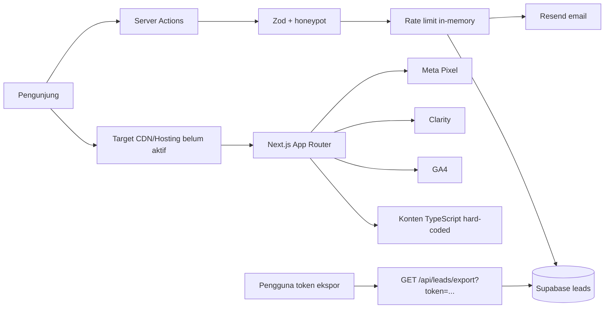
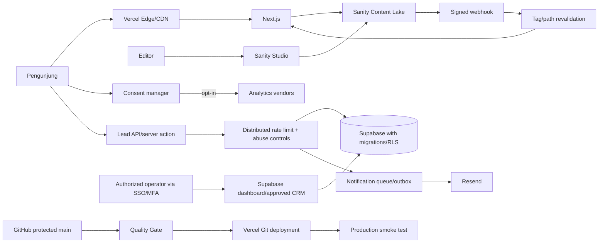

# Alfa Beauty Website - Project Source of Truth

> Status rilis: **TIDAK DISETUJUI UNTUK PRODUKSI**  
> Tanggal audit terakhir: **20 Agustus 2026 (Asia/Jakarta)**  
> Cakupan snapshot: branch lokal `main`, dependency terpasang, build produksi,
> konfigurasi Git, DNS publik, dan respons domain publik  
> Pemilik dokumen: **TBD - Product Owner Alfa Beauty**  
> Pemilik teknis: **TBD - Engineering Lead**  
> Klasifikasi: **Internal - tidak memuat secret**

Dokumen ini adalah sumber kebenaran utama untuk scope, arsitektur, data,
keamanan, CMS, CI/CD, operasi, risiko, serta urutan implementasi website Alfa
Beauty Indonesia. Ia sengaja membedakan fakta saat ini dari rancangan target.
Dokumen ini bukan bukti bahwa sistem telah lolos penetration test, audit hukum,
atau audit akun cloud.

## 1. Cara Menggunakan Dokumen Ini

### 1.1 Urutan otoritas

Jika sumber saling bertentangan, gunakan urutan berikut:

1. Keputusan tertulis berstatus `Accepted` pada bagian ADR dokumen ini.
2. Requirement bisnis yang telah ditandatangani Product Owner dan tercatat pada
   change log dokumen ini.
3. Implementasi dan konfigurasi pada branch produksi yang terlindungi.
4. Dokumen proposal di `docs/archive/` sebagai rekam historis.
5. Percakapan, asumsi lisan, mockup, dan catatan lain.

Kode bukan otomatis sumber requirement yang benar. Kode dapat mengandung bug,
placeholder, atau implementasi yang melenceng. Sebaliknya, proposal lama juga
bukan otomatis gambaran keadaan sistem saat ini.

### 1.2 Kategori pernyataan

- **CURRENT**: diverifikasi dari repo atau layanan publik pada tanggal audit.
- **TARGET**: desain yang harus dicapai, belum tentu telah diterapkan.
- **DECISION REQUIRED**: tidak boleh diasumsikan; pemilik keputusan wajib
  memberi persetujuan tertulis.
- **EXTERNAL CONFIG**: harus dilakukan pada GitHub, Vercel, Sanity, Supabase,
  DNS, atau layanan lain dan tidak dapat diselesaikan hanya dengan commit repo.

### 1.3 Aturan pembaruan

Setiap perubahan arsitektur, data pribadi, CMS, pipeline, domain, vendor, atau
release policy wajib memperbarui dokumen ini dalam pull request yang sama.
Perubahan harus mencantumkan alasan, dampak, migrasi, rollback, pemilik, tanggal,
dan ADR terkait. Jangan memasukkan credential, token, alamat lead, atau data
pribadi ke dokumen.

## 2. Kesimpulan Eksekutif

### 2.1 Putusan audit

Frontend memiliki fondasi visual dan katalog yang cukup luas, tetapi sistem
belum memiliki fondasi operasional yang setara. Kelemahan utamanya bukan sekadar
"CMS belum dipasang". Masalah akar adalah:

1. Tidak ada batas otoritas yang aman untuk admin dan ekspor lead.
2. Tidak ada kontrak database, migration, Row Level Security, atau bukti restore.
3. Consent banner tidak mengendalikan pemuatan analytics.
4. Konten produksi berada di TypeScript, bercampur placeholder dan aset yang
   salah, sehingga tidak memiliki workflow editorial atau audit trail memadai.
5. Requirement CMS Free bertentangan dengan requirement pemisahan peran.
6. Tidak ada test otomatis untuk perilaku bisnis, API, consent, atau browser.
7. Sebelum audit ini, workflow CI berada di lokasi yang tidak dibaca GitHub dan
   berisi perintah yang tidak tersedia.
8. Domain publik masih melayani WordPress/LiteSpeed maintenance page, bukan
   aplikasi Next.js dari repo ini.
9. Dua remote Git memiliki sejarah yang divergen; canonical repository belum
   disahkan secara eksplisit.

Keputusan tegas: **jangan menghubungkan domain produksi, mengaktifkan analytics,
atau memberi akses CMS kepada staf sebelum blocker P0 dan P1 ditutup**.

### 2.2 Perbaikan yang telah diterapkan dalam audit ini

- Dependency produksi utama diperbarui dan `npm audit` menjadi nol temuan pada
  snapshot audit.
- `eslint-config-next` disejajarkan dengan versi Next.js.
- Lint error aksesibilitas dan pola React yang gagal telah diperbaiki.
- Warning lint yang ada dibersihkan dan lint diubah menjadi zero-warning gate.
- Kontrak `lint`, `typecheck`, `build`, dan production dependency audit ditambah.
- Runtime ditetapkan pada Node.js 24 LTS / npm 11.
- Konvensi `src/middleware.ts` dimigrasikan menjadi `src/proxy.ts` untuk Next.js
  16.
- `.env.example`, `.nvmrc`, dan perlindungan `.gitignore` ditambahkan.
- GitHub Actions CI, deployment smoke test, dan Dependabot ditambahkan di root
  repo yang benar.

Perubahan ini membuat baseline engineering dapat diulang. Ia **belum** menutup
risiko aplikasi dan operasi pada bagian risk register.

## 3. Scope Produk

### 3.1 Tujuan produk

Website adalah kanal korporat dan katalog B2B/B2C Alfa Beauty Indonesia untuk:

- memperkenalkan perusahaan, brand, dan kategori produk;
- membantu salon, barber, profesional, dan calon mitra menemukan produk;
- mempublikasikan artikel edukasi serta event;
- menangkap permintaan partnership dan kontak;
- mengarahkan percakapan ke WhatsApp;
- menyediakan informasi legal dan kontak resmi.

Website bukan e-commerce, CRM, ERP, sistem inventori, atau sistem pemrosesan
pembayaran pada scope yang diaudit.

### 3.2 Scope yang diwarisi dari proposal

Requirement historis pada `docs/archive/proposal.md` dan
`docs/archive/paket-a.md` mencakup:

- Home;
- daftar dan detail produk;
- education, event, dan article;
- partnership;
- about dan contact;
- privacy, terms, 404;
- lead capture dengan validasi, anti-spam, Supabase, email, dan CSV;
- CMS Sanity untuk Owner dan Karyawan;
- GA4 dan Google Search Console;
- Bahasa Indonesia dan Inggris;
- WhatsApp CTA.

### 3.3 Di luar scope saat ini

- checkout dan pembayaran;
- akun pelanggan;
- harga atau stok real-time dari ERP;
- admin dashboard buatan sendiri;
- pengelolaan lead di dalam Sanity;
- penyimpanan data sensitif atau data lead di CMS;
- workflow approval kompleks tanpa persetujuan perubahan scope dan biaya.

### 3.4 Koreksi terhadap rancangan awal

Rancangan "Sanity Free dengan Owner dan Karyawan" tidak dapat memenuhi prinsip
least privilege. Sanity Free hanya menyediakan role Administrator dan Viewer.
Role Editor, Developer, dan Contributor tersedia pada Growth atau Enterprise;
custom roles serta SAML SSO memerlukan Enterprise. Karena itu:

- **Free ditolak** untuk operasi editorial multi-user.
- **Growth adalah minimum fungsional** bila staf memakai Contributor dan
  publisher memakai Editor.
- **Enterprise adalah target keamanan ketat** bila SSO terpusat, custom role,
  atau kontrol perusahaan wajib.

Sumber vendor:

- <https://www.sanity.io/docs/user-guides/roles>
- <https://www.sanity.io/docs/developer-guides/sso-saml>
- <https://www.sanity.io/docs/user-guides/history-experience>

## 4. Cakupan dan Metode Audit

### 4.1 Yang diperiksa

- seluruh struktur file relevan pada root dan `frontend/`;
- proposal dan dokumentasi yang tersedia;
- `package.json`, lockfile, dependency tree, outdated package, dan audit npm;
- konfigurasi Next.js, TypeScript, ESLint, middleware/proxy, metadata, sitemap;
- route, server action, API route, Supabase, Resend, logging, rate limiting;
- komponen analytics, consent, bahasa, produk, artikel, dan event;
- konfigurasi Git, remote, branch, divergence, tracked secret patterns;
- build produksi, lint, dan type-check;
- DNS serta respons HTTP domain publik;
- dokumentasi resmi Next.js, Sanity, GitHub Actions, dan Vercel yang relevan.

### 4.2 Yang belum dapat diverifikasi

Tidak ada akses terautentikasi ke GitHub Settings, Vercel project, Sanity
project, Supabase project, Resend, registrar DNS, GA4, Clarity, Meta, email
server, atau backup. Karena itu hal berikut belum terbukti:

- branch protection dan reviewer yang aktif;
- MFA/SSO anggota organisasi;
- isi secret store dan riwayat rotasi;
- schema tabel produksi, RLS, grants, backup, PITR, dan restore;
- konfigurasi domain di Vercel;
- ownership analytics dan consent mode;
- deliverability email, SPF, DKIM, dan DMARC;
- vulnerability pada host WordPress yang saat ini melayani domain;
- hasil DAST, SAST penuh, penetration test, dan browser E2E.

Semua item tersebut harus diperlakukan **belum aman**, bukan diasumsikan aman.

### 4.3 Bukti snapshot

Pada 20 Agustus 2026:

- branch lokal: `main`;
- remote `origin`: `rikzacraft11-art/alfabeauty.git`;
- remote `upstream`: `Farid-Ze/alfabeauty.git`;
- divergence: 21 commit hanya di `origin/main`, 8 commit hanya di
  `upstream/main`;
- tag rilis: tidak ditemukan;
- domain apex `alfabeauty.co.id`: A `103.79.244.233`, TTL sekitar 300 detik;
- `www`: CNAME ke apex;
- MX: `mailserver.abhatigroup.com`, preference 0;
- HTTP publik: WordPress/LiteSpeed maintenance page, bukan aplikasi repo;
- workflow pada sejarah upstream berada di `frontend/.github/workflows`, lokasi
  yang tidak dijalankan GitHub sebagai workflow root.

DNS dan respons domain bersifat temporer. Ambil snapshot baru sebelum cutover.

## 5. Inventaris Sistem Saat Ini

### 5.1 Struktur repo

```text
alfa/
|-- .github/
|   |-- dependabot.yml
|   `-- workflows/
|       |-- ci.yml
|       `-- deployment-smoke.yml
|-- docs/
|   |-- PROJECT_SOURCE_OF_TRUTH.md
|   |-- archive/
|   `-- yucca-uml-system-documentation.md
|-- frontend/
|   |-- public/
|   |-- src/
|   |   |-- actions/
|   |   |-- app/
|   |   |-- components/
|   |   |-- hooks/
|   |   `-- lib/
|   |-- .env.example
|   |-- .nvmrc
|   |-- package.json
|   |-- package-lock.json
|   |-- next.config.ts
|   `-- tsconfig.json
|-- materi/
|-- .gitignore
`-- README.MD
```

Catatan: `docs/yucca-uml-system-documentation.md` membahas sistem Yucca
Packaging dan bukan spesifikasi Alfa Beauty. Jangan menjadikannya requirement
tanpa ADR eksplisit.

### 5.2 Stack CURRENT

| Lapisan | Teknologi | Kondisi |
|---|---|---|
| Web | Next.js 16.3.1 App Router | Build berhasil; seluruh halaman terdeteksi dinamis akibat nonce CSP |
| UI | React 19.2.3, Tailwind CSS 4, Radix, shadcn, Framer Motion | Banyak komponen client dan animasi |
| Bahasa | Context + `localStorage` | Bukan routing i18n; sebagian besar konten tetap Inggris |
| Konten | TypeScript hard-coded | Belum ada CMS |
| Lead DB | Supabase JS 2.112.3 | Hanya client server-side; schema/migration/RLS tidak ada di repo |
| Email | Resend 6.20.0 | Mengirim notifikasi lead; konfigurasi akun belum diaudit |
| Validasi | Zod 4.3.6 | Ada pada server action lead/kontak |
| Rate limit | `Map` in-memory | Tidak cocok untuk multi-instance/serverless |
| Analytics | Next third parties, Clarity, Meta Pixel | Dimuat tanpa enforcement consent yang benar |
| Logging | JSON ke `console` | Tidak terpusat, tidak immutable, belum ada kebijakan redaksi |
| Hosting target | Belum dikonfirmasi; rancangan memakai Vercel | Domain live masih WordPress |
| CMS target | Sanity, belum terpasang | Plan dan role belum disetujui |

### 5.3 Konten CURRENT

- `product-data.ts`: 50 produk hard-coded dan sekitar 1.588 baris.
- `education-data.ts`: 10 event dan 5 artikel placeholder.
- Event April-Juni 2026 masih ditandai `isUpcoming: true` pada tanggal audit
  Agustus 2026.
- Sejumlah produk Alfaparf/Farmavita menunjuk aset Montibello/CORE yang tidak
  sesuai. Rekonsiliasi sumber aset wajib dilakukan, bukan menebak gambar.
- Sitemap memakai `lastModified` hard-coded `2026-03-10`.
- Tidak ada schema, query, preview, webhook, Studio, atau client Sanity.
- Tidak ada locale route, `hreflang`, atau katalog terjemahan lengkap.

### 5.4 Dependency utama setelah stabilisasi

| Package | Versi/audit state |
|---|---|
| `next` | 16.3.1, exact |
| `@next/third-parties` | 16.3.1, exact |
| `react`, `react-dom` | 19.2.3 |
| `@supabase/supabase-js` | 2.112.3, exact |
| `resend` | 6.20.0, exact |
| `sharp` | 0.35.3, exact |
| `eslint-config-next` | 16.3.1, exact |
| runtime CI | Node 24 LTS, npm 11 |

Audit awal menemukan 8 vulnerability dependency produksi (5 high, 3
moderate). Pembaruan terarah menghilangkan temuan tersebut. Percobaan menambah
Vercel CLI 59.1.4 menghasilkan 41 vulnerability transitive sehingga dibatalkan.
Ini alasan CD memakai Vercel Git Integration, bukan menyimpan CLI sebagai
dependency proyek.

`npm audit` adalah satu sinyal, bukan bukti ketiadaan kerentanan. Ia tidak
mendeteksi logic flaw, salah konfigurasi cloud, zero-day yang belum tercatat,
atau risiko kode first-party.

## 6. Arsitektur CURRENT



Trust boundary yang ada:

1. Browser publik ke Next.js.
2. Runtime Next.js ke Supabase memakai service-role key.
3. Runtime Next.js ke Resend.
4. Browser ke vendor analytics.
5. Endpoint ekspor ke seluruh dataset lead.

Boundary nomor 5 tidak memiliki identitas manusia, sesi, MFA, role, atau audit
yang layak. Token query tunggal bukan admin system.

## 7. Arsitektur TARGET



Prinsip target:

- CMS hanya menyimpan konten publik/non-rahasia.
- Data lead tidak pernah masuk Sanity.
- Akses editor dan akses lead dipisah.
- Service-role hanya berada di server dan dipersempit melalui server function
  atau pola database yang disetujui; browser tidak pernah menerima key tersebut.
- Deploy hanya berasal dari commit terlindungi yang melewati gate.
- Konten publish memicu revalidasi terbatas, bukan full rebuild tanpa kontrol.
- Analytics tidak dimuat sebelum opt-in yang relevan.
- Semua tindakan administratif sensitif memiliki identitas, authorization, dan
  audit trail.

## 8. Aliran Data dan Klasifikasi

### 8.1 Klasifikasi

| Kelas | Contoh | Penyimpanan yang diizinkan | Kontrol minimum |
|---|---|---|---|
| Public | produk, brand, artikel, event | Sanity, Next cache, CDN | validasi, review, provenance |
| Internal | roadmap, konfigurasi non-secret | Git private/project docs | least privilege, review |
| Confidential | email/telepon lead, isi pesan | Supabase/CRM | encryption, RBAC, retention, audit |
| Restricted | service-role key, API key, signing secret | platform secret store | no log, rotation, limited admins |

CMS tidak boleh menerima lead, token, credential, data karyawan, kontrak, daftar
harga rahasia, atau dokumen identitas tanpa threat model serta ADR baru.

### 8.2 Aliran lead CURRENT

1. Pengunjung mengisi form partnership/contact.
2. Server Action memvalidasi Zod dan honeypot.
3. Rate limiter memeriksa IP menggunakan `Map` proses lokal.
4. Runtime memakai `SUPABASE_SERVICE_ROLE_KEY` untuk insert.
5. Data lead, termasuk IP pada aliran tertentu, disimpan.
6. Salinan detail lead dikirim melalui email Resend.
7. GET export dengan token query dapat mengambil `select("*")` seluruh lead.

Masalah:

- IP dari forwarded header tidak memiliki trust proxy policy yang terdokumentasi.
- limiter hilang saat cold start dan tidak sinkron antar-instance.
- service-role memiliki blast radius besar.
- email menggandakan PII ke sistem mailbox.
- tidak ada consent version, source version, retention job, delete workflow, atau
  subject-access workflow.
- ekspor tidak memiliki user identity, MFA, per-role authorization, pagination,
  rate limit, immutable audit, atau formula-injection protection.

### 8.3 Aliran lead TARGET

1. Form menyertakan purpose-specific privacy notice dan versi consent/notice.
2. Server memvalidasi schema, content length, origin, honeypot, dan abuse signal.
3. Distributed rate limiter memakai key yang tidak hanya bergantung pada IP.
4. Insert dilakukan melalui database function/role dengan privilege minimum.
5. Record menyimpan `created_at`, `source`, `notice_version`, status, dan
   retention deadline; IP disimpan hanya jika tujuan serta periode disetujui.
6. Notification memakai ID dan ringkasan minimum; detail dibuka pada sistem
   terautentikasi, bukan dikirim penuh ke banyak mailbox.
7. Export hanya melalui Supabase Dashboard/CRM atau service admin dengan SSO/MFA,
   role, alasan export, limit, watermark, audit, dan expiry.

### 8.4 Retention TARGET - menunggu legal approval

Angka berikut adalah default engineering proposal, bukan putusan hukum:

| Data | Retention usulan | Aksi akhir |
|---|---:|---|
| Lead belum diproses | 12 bulan | delete/anonymize |
| Lead aktif | selama hubungan + periode legal yang disetujui | review berkala |
| Raw IP/abuse metadata | maksimal 30 hari | delete/anonymize |
| File export | maksimal 7 hari | auto-delete |
| Security/audit log | 90-365 hari sesuai risiko | archive/delete |
| Backup | 30 hari atau kebijakan vendor yang disetujui | expiry teruji |

Product Owner, Privacy/Legal Owner, dan Security Owner wajib menyetujui tujuan,
dasar pemrosesan, periode, serta proses penghapusan sebelum produksi.

## 9. Threat Model Ringkas

### 9.1 Aset utama

- integritas konten brand dan produk;
- data pribadi lead;
- credential Supabase, Resend, Sanity, Vercel, GitHub, analytics;
- domain dan DNS;
- reputasi pengirim email;
- availability website dan form;
- riwayat publish dan deployment.

### 9.2 Aktor

- pengunjung sah;
- bot/spammer;
- editor/publisher;
- operator lead;
- developer;
- akun internal yang diambil alih;
- pihak ketiga/vendor;
- insider dengan akses berlebihan.

### 9.3 Ancaman prioritas

- pengambilan seluruh lead melalui token bocor dari URL/log/history;
- account takeover pada GitHub, CMS, database, atau registrar;
- publish konten berbahaya/keliru karena role terlalu luas;
- secret masuk bundle browser, log, artifact, atau commit;
- injection pada rich text, URL, redirect, email, dan CSV;
- spam dan cost exhaustion pada form/email;
- analytics berjalan tanpa consent;
- supply-chain compromise pada npm atau GitHub Action;
- DNS takeover atau cutover yang merusak email;
- kehilangan data tanpa restore yang pernah diuji.

## 10. Risk Register

Skala: P0 Critical, P1 High, P2 Medium, P3 Low. Status `Open` berarti belum
ditutup oleh commit audit ini.

| ID | Severity | Temuan dan akar masalah | Dampak | Remediasi wajib | Status |
|---|---|---|---|---|---|
| SEC-001 | P0 | Export lead memakai bearer token di query string dan `select("*")` | Kebocoran seluruh PII melalui history/log/referrer/token reuse | Nonaktifkan route; gunakan dashboard/CRM atau auth+MFA+RBAC+audit+pagination | Open |
| SEC-002 | P0 | Service-role key menjadi primitive umum tanpa migration/RLS/grant contract | Kompromi runtime dapat membaca/menulis luas | Definisikan migration, role minimum, DB function, RLS, key rotation | Open |
| PRIV-001 | P0 | Analytics dimuat terlepas dari accept/reject | Pelacakan sebelum consent dan kebijakan tidak akurat | Consent-aware lazy loading; block default; uji accept/reject/revoke | Open |
| DATA-001 | P1 | Tidak ada migration, generated DB types, retention, deletion, restore test | Drift, kehilangan data, operasi tidak defensible | Versioned SQL, RLS tests, backup/restore runbook | Open |
| AUTH-001 | P1 | Tidak ada identitas admin untuk akses lead | Tidak ada accountability atau revocation per-user | SSO/MFA dan role terpisah; hilangkan shared token | Open |
| ABUSE-001 | P1 | Rate limit in-memory dan forwarded IP dipercaya tanpa policy | Spam, bypass, biaya email/database | Distributed limiter/WAF, trusted proxy policy, layered abuse checks | Open |
| PRIV-002 | P1 | PII diduplikasi ke email dan IP disimpan tanpa policy | Blast radius serta retention tidak terkendali | Minimisasi notifikasi, retention, notice version, legal review | Open |
| CMS-001 | P1 | Requirement Free bertentangan dengan editor non-admin | Semua editor harus admin atau tidak bisa edit | Growth minimum; Enterprise bila SSO/custom role wajib | Open |
| CMS-002 | P1 | Konten hard-coded, placeholder, tanggal usang, aset salah | Salah informasi brand, publish tanpa provenance | Content inventory, owner sign-off, migrasi tervalidasi | Open |
| TEST-001 | P1 | Tidak ada unit/integration/E2E/API/consent tests | CI hanya membuktikan kompilasi dan lint | Tambahkan test pyramid dan critical-flow E2E | Open |
| OPS-001 | P1 | Domain live bukan aplikasi repo | Cutover/rollback belum teruji | Vercel project, preview validation, DNS snapshot, rollback drill | Open |
| GIT-001 | P1 | `origin/main` dan `upstream/main` divergen | Kehilangan perubahan atau deploy branch salah | Tetapkan canonical repo dan rekonsiliasi melalui reviewed PR | Open |
| I18N-001 | P1 | Switcher localStorage bukan implementasi bilingual | SEO/akses bahasa tidak memenuhi scope | Locale routes, full dictionary/CMS locale, canonical/hreflang tests | Open |
| WEB-001 | P2 | Nonce CSP membuat seluruh route dinamis | CDN/ISR hilang dan biaya/latency naik | Pilih nonce dynamic secara sadar atau hash/static strategy | Open |
| WEB-002 | P2 | CSP masih mengizinkan inline style dan vendor luas | XSS surface dan third-party surface lebih besar | Kurangi source per consent/vendor; evaluasi hash/style strategy | Open |
| WEB-003 | P2 | HSTS tidak didefinisikan di repo | Downgrade protection tergantung platform | Aktifkan setelah HTTPS/domain tervalidasi; includeSubDomains bertahap | Open |
| SEO-001 | P2 | Sitemap dan status event hard-coded | Search metadata tidak akurat | Turunkan dari CMS dates/status; automated validation | Open |
| OBS-001 | P2 | Log hanya console tanpa redaksi/alert | Incident sulit dideteksi dan direkonstruksi | Central logging, error tracking, alert, PII redaction | Open |
| PERF-001 | P2 | Banyak client component/animasi dan route dinamis | JS serta render cost lebih tinggi | Bundle/profile audit, server component boundary, CWV budget | Open |
| DOC-001 | P3 | Root README lama minimal dan ber-encoding non-UTF-8 | Onboarding buruk | Normalisasi encoding dan tautkan dokumen ini dalam PR terpisah | Open |

### 10.1 Release policy

- Tidak boleh produksi bila satu P0 masih Open.
- P1 hanya dapat diterima sementara dengan risk acceptance tertulis, expiry,
  compensating control, dan owner. `TEST-001`, `OPS-001`, `GIT-001`, serta
  `CMS-002` tidak direkomendasikan untuk di-waive pada launch.
- P2 masuk backlog terjadwal dengan owner dan due date.
- Risk acceptance tidak boleh berupa persetujuan lisan.

## 11. Analisis Akar Masalah

### 11.1 CMS diperlakukan sebagai form editor, bukan boundary keamanan

Proposal menyebut CMS dan role, tetapi tidak menyelaraskan requirement dengan
kemampuan plan vendor. Akibatnya implementasi berpotensi memilih Free terlebih
dahulu lalu memberi Administrator ke semua editor. Koreksi: putuskan data,
workflow, role, retention history, SSO, dan budget sebelum menulis schema.

### 11.2 Fitur admin direduksi menjadi shared secret

CSV export memecahkan kebutuhan "ambil data" tanpa memodelkan siapa, mengapa,
berapa banyak, kapan, dan bagaimana dicabut. Shared token tidak dapat menjawab
pertanyaan tersebut. Koreksi: gunakan identity provider, authorization per-role,
audit, dan tool operasi yang sudah matang; jangan membangun admin dashboard baru
hanya untuk membungkus endpoint yang sama.

### 11.3 Security control tidak mengikuti deployment model

Rate limit proses tunggal terlihat benar saat lokal, tetapi tidak konsisten pada
serverless multi-instance. Nonce CSP kuat terhadap script injection tertentu,
namun memaksa dynamic rendering pada Next.js dan mengubah biaya/performa.
Koreksi: setiap kontrol harus diuji pada topologi produksi, bukan hanya unit
proses lokal.

### 11.4 Scope konten tidak memiliki ownership

Hard-coded data mempercepat mockup, tetapi tidak ada content provenance,
approval, freshness, atau deprecation. Placeholder akhirnya terlihat seperti
fakta. Koreksi: setiap dokumen CMS wajib memiliki owner, source, locale status,
review date, dan publication state.

### 11.5 Pipeline lama tidak mengikuti struktur monorepo

Workflow historis ditempatkan di `frontend/.github`, menggunakan working
directory yang salah, dan memanggil test/Playwright yang tidak ada. Koreksi:
workflow berada di root `.github/workflows`, menggunakan lockfile path eksplisit,
dan hanya mengklaim gate yang sungguh tersedia.

## 12. Keputusan dan Desain CMS

### 12.1 Keputusan bersyarat

**Sanity dipertahankan sebagai CMS target karena sesuai proposal dan integrasi
resmi Next.js tersedia, tetapi implementasi diblokir sampai plan dan ownership
disetujui.** Package yang direncanakan adalah `next-sanity` dan
`@sanity/image-url`, mengikuti dokumentasi resmi:

- <https://www.sanity.io/docs/nextjs/introduction>
- <https://www.sanity.io/plugins/next-sanity>

Jangan menginstal package atau membuat project/dataset asal-asalan sebelum
keputusan berikut dijawab:

1. Apakah SSO wajib? Jika ya, gunakan Enterprise.
2. Siapa dua administrator/break-glass owner?
3. Siapa yang boleh publish dan siapa yang hanya membuat draft?
4. Apakah audit history 3 hari Free, 90 hari Growth, atau 365 hari Enterprise
   memenuhi kebijakan perusahaan?
5. Apakah Studio di-host Sanity atau pada subdomain perusahaan?
6. Siapa yang membayar dan memiliki organisasi Sanity?

### 12.2 Role TARGET

Model minimum Growth:

| Persona | Sanity role | Hak | Larangan |
|---|---|---|---|
| Platform owner, maksimal 2 | Administrator | member/project config, recovery | editing harian bila tidak perlu |
| Publisher/Marketing Lead | Editor | review dan publish konten | project security/billing |
| Content staff | Contributor | create/edit draft | publish, project config |
| Auditor/stakeholder | Viewer | read | edit/publish |
| Developer | Developer bila diperlukan | schema/tooling | publish bisnis tanpa approval |

Untuk Enterprise, ganti role generik dengan custom least-privilege roles dan
SSO. Administrator harian harus dihindari. Akun keluar perusahaan harus dicabut
sebelum hari terakhir dan diaudit berkala.

### 12.3 Dataset

- `production`: konten yang dapat dipublish ke domain utama.
- `staging`: hanya jika proses editorial benar-benar memerlukannya; jangan
  membuat dataset tanpa owner dan lifecycle.
- Dataset private membutuhkan Growth. Asset Sanity tetap dapat diakses publik
  melalui URL asset meskipun dataset private; jangan unggah materi rahasia.

Sumber:

- <https://www.sanity.io/docs/content-lake/datasets>
- <https://www.sanity.io/docs/content-lake/keeping-your-data-safe>

### 12.4 Content model TARGET

Semua nama field teknis menggunakan Inggris agar konsisten di kode; label Studio
dapat menggunakan Bahasa Indonesia.

#### `siteSettings` - singleton

- `siteName`, `legalName`, `defaultLocale`;
- `contactEmail`, `phone`, `whatsappNumber`;
- alamat terstruktur;
- social links dengan allowlist protocol/host;
- default SEO title, description, OG image;
- analytics ID **bukan secret**, tetapi aktivasi tetap melalui consent manager;
- `contentOwner`, `lastReviewedAt`.

#### `navigation` - singleton atau keyed document

- locale;
- ordered items;
- label dan internal reference/external URL;
- external URL validator `https` dan allowlist bila perlu;
- maksimum kedalaman yang eksplisit.

#### `brand`

- `name`, unique stable `slug`, summary, body;
- logo dan hero asset dengan alt text wajib;
- country/origin bila disahkan;
- official URL;
- status `active|inactive`;
- display order;
- source/provenance dan review date.

#### `productCategory`

- localized name/description;
- stable slug;
- image + alt;
- display order dan active flag.

#### `product`

- unique SKU/internal ID bila tersedia;
- localized name dan slug;
- references ke brand/category;
- localized short/long description;
- verified benefits, directions, ingredients/technical data;
- hero image, gallery, info slides, alt text, asset attribution;
- variants terstruktur;
- CTA configuration;
- `status: draft|active|discontinued`;
- `sourceDocument`, `sourceOwner`, `lastVerifiedAt`;
- SEO fields;
- publish validation yang menolak placeholder dan missing required locale.

Klaim manfaat tidak boleh dibuat oleh developer atau AI tanpa sumber bisnis
yang disetujui.

#### `article`

- localized title, slug, excerpt, Portable Text body;
- author reference, categories/tags;
- cover image + alt;
- `publishedAt`, `updatedAt`, `reviewAt`;
- references ke produk/brand terkait;
- SEO dan canonical override yang tervalidasi.

#### `event`

- localized title, description, slug;
- timezone-aware `startsAt` dan `endsAt`;
- venue/online URL;
- registration URL allowlist;
- capacity bila public;
- status dihitung dari waktu dan explicit cancellation, bukan boolean
  `isUpcoming` manual;
- cover image + alt;
- organizer dan contact owner.

#### `page`

- enum template untuk about, partnership, contact, atau halaman editorial;
- localized title, slug, approved block list;
- jangan menyediakan arbitrary HTML atau arbitrary script field;
- SEO, owner, review date.

#### `legalDocument`

- type `privacy|terms|cookie`;
- locale dan semantic version;
- effective date, approvedBy, approvedAt;
- immutable published revision/reference;
- Portable Text dengan block types terbatas.

#### Object bersama

- `localizedString`, `localizedText`, `seo`, `accessibleImage`, `cta`,
  `sourceMetadata`, `portableText`.
- URL, slug, panjang teks, alt text, reference, dan date range wajib divalidasi.
- Rich text renderer memakai komponen allowlist; jangan merender raw HTML.

### 12.5 I18n

Target route adalah `/id/...` dan `/en/...` atau strategi locale routing lain
yang disetujui secara eksplisit. Satu switcher `localStorage` tidak cukup.

Syarat publish:

- locale wajib lengkap untuk field kritis;
- canonical dan `hreflang` konsisten;
- slug collision dicegah per-locale;
- fallback terlihat pada Studio dan tidak menyamarkan terjemahan yang hilang;
- metadata, sitemap, structured data, form errors, dan legal text ikut
  diterjemahkan.

### 12.6 Editorial workflow

Target:

1. Contributor membuat/mengubah draft.
2. Publisher memeriksa fakta, aset, alt text, locale, link, tanggal, dan SEO.
3. Publisher melakukan preview pada deployment aman.
4. Publisher mempublish.
5. Signed webhook merevalidasi tag/path yang terdampak.
6. Smoke/monitor memeriksa route.
7. Konten memiliki review date; expired event dan discontinued product tidak
   bergantung pada ingatan editor.

Content Releases adalah fitur Enterprise. Jangan menulis workflow yang
bergantung pada fitur tersebut bila plan bukan Enterprise.

### 12.7 Integrasi Next.js

Target module boundary:

```text
frontend/
|-- sanity/
|   |-- schemaTypes/
|   |-- structure.ts
|   `-- sanity.config.ts
`-- src/
    |-- app/api/sanity/revalidate/route.ts
    |-- app/api/draft-mode/enable/route.ts
    |-- components/content/
    `-- lib/sanity/
        |-- client.ts
        |-- queries.ts
        |-- image.ts
        `-- types.ts
```

Aturan:

- browser memakai public project ID/dataset saja;
- write/read token privat tetap server-only;
- production query published perspective dan CDN/cache yang disetujui;
- preview route memverifikasi secret, slug, dan redirect internal;
- webhook memverifikasi signature resmi Sanity sebelum revalidation;
- revalidation menggunakan tag/path minimum;
- query dibuat terpusat dan typed;
- query failure memiliki fallback/monitor, tidak diam-diam mengubah fakta;
- jangan mengaktifkan Sanity Live tanpa load/cost test pada Next.js 16.

Validasi webhook resmi:
<https://www.sanity.io/docs/nextjs/validating-sanity-webhooks-nextjs>.

### 12.8 Migrasi konten

Migrasi tidak boleh berupa copy otomatis buta dari TypeScript.

1. Export inventory 50 produk, 10 event, dan 5 artikel.
2. Tetapkan business owner untuk setiap brand/product.
3. Tandai placeholder, duplikat, orphan, stale date, missing locale, missing alt,
   dan image mismatch.
4. Cocokkan setiap aset dengan sumber resmi; jangan infer dari nama folder.
5. Normalisasi brand/category/SKU/slug.
6. Buat import script idempotent dengan stable `_id` dan dry-run report.
7. Import ke dataset non-produksi.
8. Bandingkan jumlah, reference integrity, URL, gambar, locale, dan sample visual.
9. Business owner menandatangani content acceptance.
10. Freeze perubahan hard-coded, import delta terakhir, lalu alihkan read path.
11. Simpan rollback switch sementara untuk dataset/query lama yang tervalidasi.
12. Hapus hard-coded source hanya setelah dua rilis stabil.

Acceptance migrasi:

- 100% record memiliki provenance/status;
- nol unresolved image mismatch;
- nol stale upcoming event;
- nol duplicate slug/reference orphan;
- seluruh halaman utama lolos visual comparison dan link check;
- jumlah source, imported, rejected, dan exception terdokumentasi.

## 13. CI/CD yang Diimplementasikan

### 13.1 File

- `.github/workflows/ci.yml`
- `.github/workflows/deployment-smoke.yml`
- `.github/dependabot.yml`
- `frontend/.nvmrc`
- scripts pada `frontend/package.json`

### 13.2 CI Quality Gate

Trigger:

- pull request ke `main`;
- push ke `main`;
- manual `workflow_dispatch`.

Environment:

- `ubuntu-24.04`;
- Node.js latest patch pada line 24 LTS;
- npm cache keyed oleh `frontend/package-lock.json`;
- `npm ci`, bukan `npm install`;
- timeout 20 menit dan concurrency cancellation.

Gate berurutan:

1. production dependency audit pada level high;
2. ESLint dengan zero warning;
3. TypeScript no-emit;
4. Next.js production build.

GitHub Action dipin dengan full commit SHA untuk mengurangi tag retargeting.
Dependabot tetap memantau update action.

### 13.3 Batas CI saat ini

CI **belum** menjalankan unit, integration, E2E, accessibility browser, visual
regression, migration test, atau DAST karena test suite tersebut belum ada.
Build hijau tidak berarti aman untuk produksi. `TEST-001` tetap P1.

### 13.4 CD TARGET melalui Vercel Git Integration

Vercel Git Integration resmi membuat preview deployment untuk branch/PR dan
production deployment dari production branch. Referensi:

- <https://vercel.com/docs/git>
- <https://vercel.com/docs/git/vercel-for-github>
- <https://vercel.com/docs/deployment-checks>

Konfigurasi EXTERNAL yang wajib:

1. Tetapkan canonical GitHub repository.
2. Hubungkan Vercel project hanya ke repository tersebut.
3. Set Root Directory `frontend`.
4. Framework preset Next.js; install command `npm ci` bila override diperlukan.
5. Production branch `main` setelah branch reconciliation.
6. Preview deployment untuk PR; production hanya merge `main`.
7. Required GitHub check: `Quality Gate`.
8. Nonaktifkan direct push dan force push ke `main`.
9. Require minimal satu approval; dua approval untuk perubahan auth/data/DNS.
10. Require conversation resolution dan branch up-to-date.
11. Batasi siapa yang dapat mengubah Vercel project, domain, dan environment.
12. Aktifkan deployment protection yang tersedia untuk preview berisi draft.
13. Jangan expose preview ke dataset/lead produksi.
14. Gunakan Vercel Deployment Checks untuk mencegah promotion bila gate gagal.

GitHub environment dengan required reviewers dapat dipakai bila kelak deploy
dijalankan oleh Actions. Referensi:
<https://docs.github.com/en/actions/reference/workflows-and-actions/deployments-and-environments>.

### 13.5 Deployment smoke test

Workflow menerima:

- event deployment production sukses; atau
- URL manual melalui `workflow_dispatch`.

Kontrol:

- URL wajib HTTPS;
- host hanya apex, `www`, atau `*.vercel.app`;
- memeriksa `/`, `/products`, `/education`, `/partnership`, `/contact`, dan
  `/privacy` menghasilkan HTTP 200;
- memeriksa CSP, `X-Content-Type-Options`, dan `Referrer-Policy`.

Smoke test tidak mengirim form dan tidak mengubah data. Vercel preview protection
dapat membuat manual preview test membutuhkan mekanisme bypass resmi; jangan
menonaktifkan protection secara global hanya agar test hijau.

### 13.6 Dependabot

- npm path `/frontend`, mingguan Senin 01:00 Asia/Jakarta;
- production serta development minor/patch dikelompokkan;
- major update tetap menjadi PR terpisah agar migration review eksplisit;
- GitHub Actions diperiksa mingguan;
- tidak ada auto-merge.

### 13.7 Environment contract

`frontend/.env.example` adalah daftar nama variable, bukan secret store.

| Variable | Browser? | Development | Preview | Production |
|---|---|---|---|---|
| `NEXT_PUBLIC_SITE_DOMAIN` | Ya | localhost URL | preview URL bila diperlukan | canonical HTTPS |
| analytics IDs | Ya | kosong | kosong/test | hanya setelah consent fix |
| `SUPABASE_URL` | Tidak | dev project | isolated staging | production |
| `SUPABASE_SERVICE_ROLE_KEY` | Tidak | dev secret | isolated staging secret | production secret |
| `RESEND_API_KEY` | Tidak | test key | test domain/key | production key |
| email sender/recipient | Tidak | safe sink | safe sink | approved mailbox |
| `CSV_EXPORT_TOKEN` | Tidak | legacy only | kosong | **dilarang; route harus diganti** |
| Sanity public IDs | Project ID/dataset dapat public | dev | staging | production |
| Sanity private secrets | Tidak | dev | preview/staging | production scoped |

Jangan memakai production database/email pada PR dari fork atau preview.
Environment variable yang hilang harus gagal dengan pesan yang jelas pada path
terkait; tambahkan startup/env schema saat integrasi backend diselesaikan.

### 13.8 Secret management

- Secret hanya di GitHub/Vercel/Sanity/Supabase/Resend secret store yang sesuai.
- Jangan taruh secret di `NEXT_PUBLIC_*`, CMS content, source map, log, issue,
  screenshot, artifact, atau chat.
- Tetapkan owner, purpose, scope, created date, last rotated, next rotation,
  revoke procedure untuk setiap secret.
- Rotasi segera setelah dugaan kebocoran, perubahan anggota, atau perubahan
  vendor; rotasi berkala mengikuti policy organisasi.
- Preview dan production memakai secret/project terpisah.
- Setelah rotasi, verifikasi versi lama benar-benar ditolak.

## 14. Branch, Release, dan Repository Governance

### 14.1 Canonical repository - DECISION REQUIRED

`origin/main` dan `upstream/main` divergen. Jangan merge/rebase otomatis. Langkah:

1. Product/Engineering Owner menetapkan canonical organization/repository.
2. Ambil backup refs dan catat commit SHA kedua main.
3. Tinjau commit eksklusif dengan:

```powershell
git log --left-right --cherry-pick --oneline origin/main...upstream/main
```

4. Kelompokkan perubahan: feature, security, generated asset, obsolete workflow.
5. Port perubahan yang masih valid melalui pull request ke canonical repo.
6. Jalankan seluruh gate dan review visual.
7. Archive atau ubah remote non-canonical menjadi read-only setelah sign-off.

### 14.2 Branch policy TARGET

- `main` selalu releasable setelah blocker launch tertutup.
- Feature branch berumur pendek.
- Tidak ada direct push/force push/deletion pada `main`.
- Require `Quality Gate` dan kelak test tambahan.
- Require code owner untuk `.github/**`, data/auth/API, CMS schema, dan DNS docs.
- PR dependency tidak auto-merge sebelum CI serta compatibility review.
- Commit deploy harus dapat ditelusuri ke PR dan approver.

### 14.3 Versioning dan release

Saat ini tidak ada tag. Target:

- gunakan SemVer untuk release aplikasi setelah baseline produksi;
- tag annotated dari commit yang telah deployed, contoh `v1.0.0`;
- release note mencantumkan migration, env changes, CMS schema, known issue,
  rollback SHA;
- breaking content/schema/data change membutuhkan migration dan rollback plan;
- jangan memindahkan tag yang sudah dipublish.

## 15. DNS Cutover Runbook

### 15.1 Precondition

- seluruh P0 tertutup;
- canonical repo dan branch disahkan;
- production Vercel deployment tervalidasi pada URL preview;
- database, email, CMS, consent, legal pages, test, monitoring, dan rollback siap;
- akses registrar dengan MFA tersedia untuk minimal dua owner;
- snapshot lengkap A/AAAA/CNAME/MX/TXT/CAA/SRV dan TTL disimpan;
- pemilik email menyetujui perubahan.

### 15.2 Larangan penting

Jangan menghapus atau mengubah MX/TXT email saat mengalihkan web. MX saat audit
menunjuk `mailserver.abhatigroup.com`. DNS web dan email harus diperlakukan
sebagai record terpisah.

### 15.3 Langkah cutover

1. H-2: turunkan TTL web record bila registrar mengizinkan; jangan sentuh mail.
2. H-1: verifikasi Vercel domain ownership dan certificate readiness.
3. T-30 menit: freeze deployment dan content publish.
4. Simpan screenshot/export DNS serta IP/target lama.
5. Ubah hanya apex/`www` sesuai instruksi Vercel yang tampil saat itu.
6. Pantau authoritative resolver dan resolver publik.
7. Uji HTTPS apex/`www`, redirect canonical, seluruh smoke route, form dengan
   safe test data, robots/sitemap, CSP, dan analytics consent.
8. Uji email inbound/outbound untuk memastikan MX/TXT tidak terdampak.
9. Pantau 4xx/5xx, latency, certificate, dan form error minimal 60 menit.
10. Lepas freeze setelah Product dan Engineering sign-off.

### 15.4 Rollback

Rollback bila certificate gagal, critical route gagal, form kehilangan data,
security header hilang, atau error rate melewati threshold yang disetujui.

1. Kembalikan apex/`www` ke snapshot lama.
2. Jangan mengubah MX/TXT.
3. Verifikasi propagasi dan halaman lama.
4. Nonaktifkan promosi deployment bermasalah.
5. Buat incident record dan pertahankan log/evidence.
6. Perbaiki melalui PR baru; jangan hot-patch tanpa rekam perubahan kecuali
   incident commander mendokumentasikan emergency change.

## 16. Test Strategy TARGET

### 16.1 Unit

- Zod schema valid/invalid/boundary;
- URL/slug/date/locale validators;
- event status dari timestamp/timezone;
- CSV neutralization bila export custom tetap dipertahankan;
- analytics consent state machine;
- content mapping dan fallback.

### 16.2 Integration

- server action ke test database;
- DB function privilege dan RLS positive/negative cases;
- Resend adapter dengan fake provider;
- distributed rate limiter;
- Sanity GROQ query terhadap fixture/dataset test;
- signed webhook valid, invalid, replay, dan wrong secret;
- preview/draft-mode authorization.

### 16.3 E2E browser

- critical navigation desktop/mobile;
- product list/detail/filter;
- locale routing dan persistence;
- contact/partnership success, validation, retry, duplicate, spam;
- consent default reject, accept per-category, revoke, revisit;
- draft preview authorization;
- keyboard navigation, modal focus, FAQ, screen reader landmarks;
- 404, privacy, terms, sitemap, robots;
- no console error dan no failed critical resource.

### 16.4 Security tests

- authn/authz matrix untuk operator dan CMS role;
- export access denial, audit, expiry, formula injection;
- CSP regression;
- secret scanning dan dependency review;
- rate-limit distributed behavior;
- malicious Portable Text/URL/file metadata;
- OWASP-oriented DAST pada staging;
- independent penetration test sebelum high-risk production launch.

### 16.5 Performance and visual

- mobile/desktop visual regression untuk page templates;
- image dimensions dan missing assets;
- JS bundle budget per route;
- p75 user metrics target disetujui Product/Engineering;
- reduced-motion behavior;
- CMS publish load/revalidation burst test.

### 16.6 Gate penambahan test

Test baru masuk CI setelah stabil dan memiliki owner. Jangan menambah script
`test` palsu atau Playwright command tanpa dependency, config, fixture, dan test
yang nyata.

## 17. Observability dan SLO

### 17.1 Minimum sebelum produksi

- error tracking client/server dengan source map yang dilindungi;
- central structured logs dengan correlation/request ID;
- redaction email, phone, message, IP, token, authorization header;
- uptime check apex, `www`, critical pages, dan lead submission synthetic yang
  memakai safe isolated sink;
- alert untuk 5xx, form failure, email failure, database error, webhook failure,
  dan certificate expiry;
- Vercel deployment/rollback audit;
- CMS publish/webhook monitoring;
- dashboard consent-aware web vitals.

### 17.2 Proposed SLO - DECISION REQUIRED

- public site monthly availability: 99.9%;
- successful valid lead persistence: 99.5% per rolling 30 days;
- critical publish visible: 99% dalam 5 menit;
- P0 acknowledgement: 15 menit pada coverage window yang disepakati;
- RTO: 4 jam;
- RPO lead data: 24 jam maksimum, target lebih kecil bila vendor mendukung.

Angka ini harus disahkan bersama biaya/on-call capacity. Jangan menjanjikan SLO
tanpa monitoring dan personel yang mampu merespons.

## 18. Backup dan Restore

### 18.1 Konten CMS

- verifikasi retention history sesuai plan;
- jadwalkan dataset export ke storage terenkripsi dengan akses terbatas;
- catat schema commit SHA bersama export;
- lakukan restore drill ke project/dataset terisolasi minimal per kuartal;
- asset rahasia dilarang karena URL asset bukan private boundary.

### 18.2 Lead database

- aktifkan backup/PITR sesuai tier yang disetujui;
- simpan migration dalam repo;
- restore hanya ke environment terisolasi dan akses terbatas;
- masking PII untuk non-production;
- bukti drill memuat waktu, RPO/RTO aktual, checksum/count, dan exception;
- backup tanpa restore test tidak dianggap kontrol yang terbukti.

### 18.3 Git dan konfigurasi

- GitHub adalah source untuk kode, bukan secret;
- dokumentasikan environment variable names dan owner, bukan values;
- export DNS serta vendor configuration setelah perubahan material;
- minimal dua admin yang terpisah untuk recovery, tanpa shared account.

## 19. Incident Response

### 19.1 Severity

- **SEV-0**: lead/secret mass exposure, domain takeover, active compromise.
- **SEV-1**: form/data loss, unauthorized publish, production unavailable luas.
- **SEV-2**: degraded route/vendor, limited incorrect content, delayed publish.
- **SEV-3**: minor issue tanpa security/data impact.

### 19.2 Urutan respons

1. Validasi sinyal dan tunjuk Incident Commander.
2. Catat waktu, reporter, commit, deployment, affected data/user.
3. Contain: revoke token, disable route/vendor, rollback deploy, lock account.
4. Preserve log/evidence dengan akses terbatas; jangan menyalin PII ke chat.
5. Eradicate akar masalah dan rotasi credential terkait.
6. Recover bertahap dengan smoke dan monitoring.
7. Tentukan kewajiban notifikasi bersama Legal/Privacy Owner.
8. Post-incident review tanpa menyalahkan individu, maksimal 5 hari kerja untuk
   SEV-0/1.
9. Update risk register, test, runbook, dan dokumen ini.

### 19.3 Playbook kebocoran export token

- nonaktifkan route/secret segera;
- cari penggunaan token pada access log, application log, proxy, browser/report;
- rotasi/revoke token dan service-role bila exposure tidak dapat dibatasi;
- tentukan record/time range yang mungkin diakses;
- jangan menghapus evidence;
- lakukan legal/privacy assessment;
- route tidak boleh diaktifkan kembali dengan shared query token.

## 20. Roadmap Berbasis Gate

### Phase 0 - Governance dan canonical source

- [ ] Tetapkan Product Owner, Engineering Lead, Security Owner, Privacy Owner.
- [ ] Tetapkan canonical GitHub repo dan rekonsiliasi divergence.
- [ ] Aktifkan branch protection serta CODEOWNERS yang berisi akun nyata.
- [ ] Konfirmasi hosting, budget, vendor owner, dan akses recovery.
- [ ] Normalisasi root README encoding dan tautkan dokumen ini.

Exit gate: satu canonical `main`, owner tercatat, CI berjalan pada PR nyata.

### Phase 1 - Tutup release blocker data/privacy/security

- [ ] Hapus/ganti token-query CSV export.
- [ ] Tambahkan migration, schema types, least privilege, RLS, retention.
- [ ] Terapkan distributed rate limit dan abuse control.
- [ ] Minimalkan email PII dan definisikan lead operations.
- [ ] Implementasikan consent-aware analytics dan perbarui privacy/cookie text.
- [ ] Definisikan log redaction, monitoring, alert, backup, restore.

Exit gate: seluruh P0 closed, control diuji negative/positive, legal sign-off.

### Phase 2 - CMS foundation

- [ ] Setujui Sanity Growth/Enterprise dan role matrix.
- [ ] Buat project/dataset/Studio dengan owner perusahaan.
- [ ] Implement schema, validation, typed queries, preview, signed webhook.
- [ ] Terapkan locale routing.
- [ ] Audit/migrasikan konten dengan business sign-off.
- [ ] Uji role, publish, rollback content, webhook, cache.

Exit gate: CMS acceptance dan content reconciliation 100% tercatat.

### Phase 3 - Test dan hardening

- [ ] Unit/integration/E2E/accessibility/visual/security tests.
- [ ] Performance budget dan server/client boundary review.
- [ ] CSP architecture decision dan HSTS rollout.
- [ ] DAST staging dan penetration test independen.
- [ ] Incident serta restore drill.

Exit gate: CI lengkap hijau, tidak ada unresolved P0/P1 tanpa formal acceptance.

### Phase 4 - Preview, cutover, dan stabilization

- [ ] Hubungkan Vercel Git Integration dan environment isolation.
- [ ] UAT preview oleh bisnis/editor/security/privacy.
- [ ] Ambil DNS snapshot dan jalankan cutover runbook.
- [ ] Jalankan smoke, form test, consent test, email test, monitoring.
- [ ] Tag release dan dokumentasikan rollback SHA.
- [ ] Hypercare minimal 7 hari dan post-launch review.

Exit gate: production stable, SLO observable, ownership operasi aktif.

## 21. RACI - Wajib Diisi

| Area | Accountable | Responsible | Consulted | Informed |
|---|---|---|---|---|
| Product/scope | TBD Product Owner | TBD | Marketing, Engineering | Stakeholders |
| Code/CI/CD | TBD Engineering Lead | Developers | Security | Product |
| CMS content | TBD Marketing Lead | Editors | Legal, Brand owner | Engineering |
| CMS platform | TBD Platform Owner | Engineering | Security | Editors |
| Lead data/privacy | TBD Privacy Owner | Lead Operations | Legal, Security | Product |
| GitHub/Vercel | TBD Engineering Lead | Platform Admin | Security | Product |
| Supabase/backup | TBD Data Owner | Engineering | Security/Privacy | Product |
| DNS/domain | TBD Business IT Owner | Named DNS Admin | Engineering/Email owner | Product |
| Incident | TBD Security Owner | Incident Commander | Legal/Privacy/Engineering | Leadership |

Tidak adanya nama nyata adalah blocker governance. Jangan mengganti `TBD` dengan
nama tebakan.

## 22. Architecture Decision Records

### ADR-001 - Source of truth tunggal

- Status: Accepted.
- Decision: dokumen ini menjadi otoritas proyek dengan precedence dan change
  control pada bagian 1.
- Consequence: proposal lama tetap arsip; perubahan besar wajib mengubah ADR.

### ADR-002 - Vercel Git Integration untuk CD

- Status: Accepted untuk implementasi target; external setup pending.
- Decision: gunakan native Git Integration dan deployment checks, bukan
  menyimpan Vercel CLI sebagai dependency proyek.
- Reason: integrasi resmi lebih sederhana dan percobaan CLI menambah 41 temuan
  dependency transitive pada snapshot audit.
- Consequence: Vercel/GitHub settings harus dikonfigurasi serta diaudit manual.

### ADR-003 - Sanity Free ditolak untuk multi-user editorial

- Status: Accepted.
- Decision: Growth minimum; Enterprise bila SSO/custom role/security policy
  mewajibkan.
- Reason: Free tidak menyediakan role editor/contributor.
- Consequence: CMS implementation menunggu budget dan identity decision.

### ADR-004 - Tidak membangun custom admin dashboard pada scope awal

- Status: Accepted.
- Decision: konten dikelola di Sanity Studio; lead melalui approved Supabase
  dashboard/CRM atau service admin terpisah.
- Reason: custom admin menambah auth, RBAC, MFA, session, audit, export, patching,
  dan incident surface yang belum diperlukan.

### ADR-005 - Nonce CSP versus static rendering

- Status: Proposed, decision pending.
- Context: Next.js nonce CSP memerlukan request-time rendering; build snapshot
  menunjukkan seluruh page dinamis.
- Option A: pertahankan nonce dan terima dynamic cost/latency.
- Option B: gunakan hash/static-compatible CSP dengan keterbatasan framework.
- Required evidence: performance/cost benchmark, threat model, analytics/CMS
  script inventory.
- Referensi: <https://nextjs.org/docs/app/guides/content-security-policy>.

### ADR-006 - Canonical Git remote

- Status: Decision Required.
- Options: `origin`, `upstream`, atau repository perusahaan baru.
- Decision owner: Product Owner + Engineering Lead.
- Deadline: sebelum mengaktifkan Vercel Git Integration.

## 23. Definition of Done

Sebuah perubahan dinyatakan selesai hanya bila:

- requirement dan acceptance criteria jelas;
- threat/privacy impact diperiksa bila menyentuh data/vendor/admin;
- code dan docs konsisten;
- lint zero-warning, typecheck, build, audit, dan test relevan lulus;
- migration forward/rollback tersedia bila data/schema berubah;
- environment contract diperbarui tanpa secret;
- observability dan failure behavior tersedia;
- accessibility keyboard/mobile diperiksa;
- reviewer yang tepat menyetujui;
- preview tervalidasi;
- deployment dan rollback dapat ditelusuri;
- risk register/ADR/change log diperbarui.

"Build berhasil" saja tidak memenuhi Definition of Done.

## 24. Perintah Verifikasi

Jalankan dari root repo:

```powershell
Set-Location frontend
npm ci
npm run audit:production
npm run lint
npm run typecheck
npm run build
```

Audit Git:

```powershell
git status --short
git remote -v
git branch --show-current
git log --left-right --cherry-pick --oneline origin/main...upstream/main
git ls-files | Select-String -Pattern '(^|/)(node_modules|\.next|\.env)(/|$)'
```

Audit DNS sebelum cutover:

```powershell
Resolve-DnsName alfabeauty.co.id -Type A
Resolve-DnsName www.alfabeauty.co.id -Type CNAME
Resolve-DnsName alfabeauty.co.id -Type MX
Resolve-DnsName alfabeauty.co.id -Type TXT
```

Jangan menampilkan values environment atau menjalankan command yang mencetak
secret pada log CI.

## 25. Checklist Go/No-Go

### Governance

- [ ] Semua RACI kritis berisi nama dan backup owner.
- [ ] Canonical repo, branch protection, reviewer, dan recovery access terbukti.
- [ ] Risk acceptance yang masih berlaku tertulis dan belum expired.

### Security dan privacy

- [ ] Semua P0 closed.
- [ ] Admin/lead access memakai per-user identity, MFA/SSO, role, audit.
- [ ] Consent default block dan revoke terbukti melalui E2E/network inspection.
- [ ] Secret scan, dependency audit, DAST, dan penetration test selesai.
- [ ] Privacy/cookie/legal text sesuai implementasi/vendor/retention.

### Data dan CMS

- [ ] Migration/RLS/restore tervalidasi.
- [ ] Sanity plan/roles/owners disetujui dan role matrix diuji.
- [ ] Content count/provenance/locale/image/date reconciliation signed off.
- [ ] Preview/webhook/cache/publish/rollback diuji.

### Delivery

- [ ] CI lengkap hijau pada commit release.
- [ ] Vercel preview/UAT/deployment checks hijau.
- [ ] Production env isolated dan lengkap.
- [ ] DNS serta email snapshot dan rollback siap.
- [ ] Monitoring/alert/on-call/hypercare aktif.

Keputusan launch harus dicatat `GO` atau `NO-GO` dengan waktu, commit SHA,
deployment ID, approver Product, Engineering, Security, dan Privacy.

## 26. Open Decisions

| ID | Keputusan | Opsi | Owner | Blocker untuk |
|---|---|---|---|---|
| DEC-001 | Canonical Git repo | origin/upstream/new org | TBD | CD |
| DEC-002 | Hosting production | Vercel/alternatif | TBD | env, DNS, SLO |
| DEC-003 | Sanity plan | Growth/Enterprise | TBD | CMS roles |
| DEC-004 | SSO requirement | wajib/tidak | TBD Security | CMS/admin |
| DEC-005 | Lead operator tool | Supabase Dashboard/CRM/custom approved | TBD | SEC-001/AUTH-001 |
| DEC-006 | Lead retention/legal basis | policy approved | TBD Privacy | production forms |
| DEC-007 | CSP strategy | nonce dynamic/hash-compatible | TBD Engineering/Security | performance |
| DEC-008 | Locale URL strategy | `/id`,`/en`/alternatif | TBD Product/SEO | CMS/i18n |
| DEC-009 | Monitoring/on-call vendor | pilih dan biayai | TBD | production |
| DEC-010 | DNS owner/window | named admins/date | TBD | cutover |

## 27. Referensi Resmi

Sanity:

- Roles: <https://www.sanity.io/docs/user-guides/roles>
- SAML SSO: <https://www.sanity.io/docs/developer-guides/sso-saml>
- History retention: <https://www.sanity.io/docs/user-guides/history-experience>
- Dataset: <https://www.sanity.io/docs/content-lake/datasets>
- Data safety/assets: <https://www.sanity.io/docs/content-lake/keeping-your-data-safe>
- Studio deployment: <https://www.sanity.io/docs/studio/deployment>
- Next.js integration: <https://www.sanity.io/docs/nextjs/introduction>
- Webhook validation:
  <https://www.sanity.io/docs/nextjs/validating-sanity-webhooks-nextjs>
- Content Releases: <https://www.sanity.io/docs/user-guides/content-releases>

Next.js:

- Content Security Policy:
  <https://nextjs.org/docs/app/guides/content-security-policy>
- Next.js 16 upgrade:
  <https://nextjs.org/docs/app/guides/upgrading/version-16>
- Proxy convention:
  <https://nextjs.org/docs/pages/api-reference/file-conventions/proxy>

GitHub/Vercel:

- Vercel Git integration: <https://vercel.com/docs/git>
- Vercel for GitHub: <https://vercel.com/docs/git/vercel-for-github>
- Deployment checks: <https://vercel.com/docs/deployment-checks>
- GitHub deployment environments:
  <https://docs.github.com/en/actions/reference/workflows-and-actions/deployments-and-environments>
- Dependency caching:
  <https://docs.github.com/en/actions/reference/workflows-and-actions/dependency-caching>

Node.js:

- Node.js 24 archive: <https://nodejs.org/en/download/archive/v24>

## 28. Change Log

| Tanggal | Perubahan | Author/approver |
|---|---|---|
| 2026-08-20 | Audit awal menyeluruh, dependency baseline, CI, smoke test, Dependabot, CMS/security/CD design, risk register | Codex audit; business/technical approval pending |

