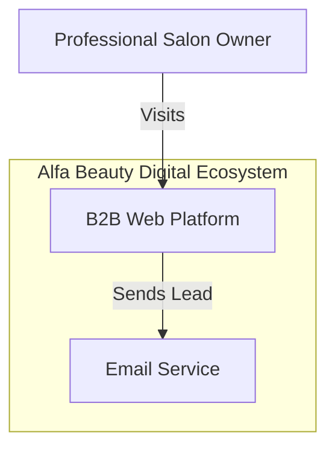
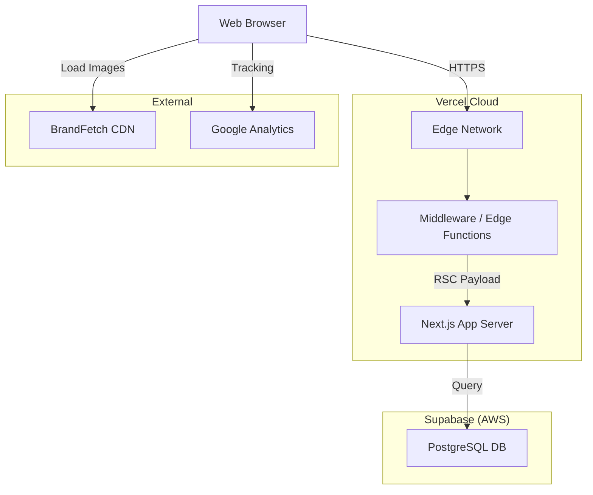

# System Architecture (C4 Model)

## 1. Context Diagram

## 2. Container Diagram

## 3. Technology Stack

- **Frontend:** Next.js 16 (App Router), React Server Components.
- **Styling:** Tailwind CSS 4.
- **State:** Server-Driven (URL as State).
- **Database:** Supabase (PostgreSQL).
- **Validation:** Zod (Strict Schema).
- **Monitoring:** Sentry, Vercel Analytics.

## 4. Strategic Alignment

This architecture is governed by the [2026 Strategic Framework](../docs/strategy-2026.md), aligning with:

- **ITIL 4**: For Service Level Management (Availability).
- **COBIT 2019**: For Governance and Data Protection (UU PDP).
- **TOGAF**: For Modular, Decoupled Architecture.
- **Jamstack**: For Performance and Operational Efficiency.
