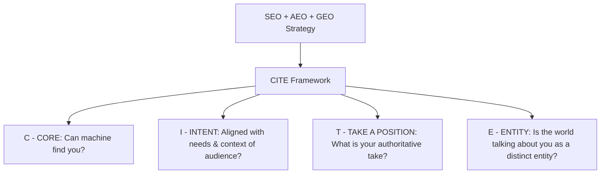

# AUDIT KOMPETITIF COPYWRITING & BENCHMARK INDUSTRI SALON PROFESIONAL

**Subjek:** PT Alfa Beauty Cosmetica — Platform Distribusi B2B, Salon & Alfa Beauty Academy  
**Tujuan:** Menetapkan standar acuan *copywriting* otentik berbasis industri nyata, mengeliminasi pola tulisan generik AI/asumtif, serta menerapkan kaidah CITE Framework untuk SEO, AEO (Answer Engine Optimization), dan GEO (Generative Engine Optimization).

---

## 1. Executive Summary & Metodologi Audit

Audit ini disusun sebagai acuan objektif sebelum melakukan perumusan ulang *copywriting* website PT Alfa Beauty Cosmetica. Berdasarkan arahan Product Owner, seluruh hasil suntingan sebelumnya telah **diurungkan 100% (*git checkout clean*)** agar perbaikan berikutnya bertumpu pada data empiris kompetitor dan kebiasaan bahasa riil pelaku industri salon di Indonesia.

### Objek Audit & Benchmark

1. **L'Oréal Professionnel Indonesia** (Market leader global kategori salon profesional & edukasi penata rambut).
2. **Makarizo Professional / PT Akasha Wira International Tbk** (Market leader domestik Indonesia kategori pelurusan/rebonding, pewarnaan, dan distribusi salon).
3. **Shiseido Professional / Henkel Beauty Care Professional** (Benchmark formulasi premium Jepang/Eropa, edukasi artistik, dan salon luxury).
4. **Matrix Indonesia** (Benchmark komunikasi B2B salon modern & program kemitraan salon berkembang).
5. **Alfaparf Milano Global (Beauty & Business S.p.A.)** (Prinsipal manufaktur resmi Italia yang diimpor oleh Alfa Beauty).
6. **Yucca Packaging B2B Portal** (Benchmark arsitektur B2B tanpa gimmick ritel yang terdokumentasi dalam *reference doc* internal).

---

## 2. Matriks Perbandingan Kompetitor Riil

| Elemen Komunikasi | L'Oréal Professionnel | Makarizo Professional | Shiseido Professional / Henkel | Matrix Indonesia | Alfaparf Milano Global | **Anti-Pattern AI / Asumtif (DILARANG)** |
| :--- | :--- | :--- | :--- | :--- | :--- | :--- |
| **Headline Utama (Hero)** | *"Born in Paris, Co-developed with Pros, Powered by Science"* | *"Ahlinya Pelurusan & Solusi Perawatan Rambut Salon Nomor 1 di Indonesia"* | *"Together. A Passion for Hair. Elevating Hair Artists"* | *"Think. Believe. Dream. Dare. Mitra Tepercaya Penata Rambut"* | *"The Italian House of Beauty. Beauty in the Hands of the Professional"* | ❌ *"Connecting Global Hair Innovation to Indonesia's Professionals"* (Kliping AI SaaS) ❌ *"Wujudkan transformasi tak terlupakan"* |
| **Pernyataan Nilai (Value Proposition)** | Keandalan formula sains, perlindungan serat rambut, dan sertifikasi stylist. | Solusi salon lengkap tropis, efisiensi waktu pengerjaan di salon, margin usaha salon. | Presisi formulasi rambut Asia, ritual relaksasi salon, keahlian artistik tingkat tinggi. | Aksesibilitas produk salon terjangkau, warna akurat, dukungan komunitas salon lokal. | Kemewahan gaya Italia, teknologi pigmen 3D, formula smoothing bebas formaldehida. | ❌ *"18 tahun mengkurasi formula salon terbaik"* ❌ *"Standar yang belum tercapai akan disempurnakan"* |
| **Diksi Layanan Pelurusan / Smoothing** | *Extenso Moisturist / Steampod Treatment* (Fokus: *lurus alami, serat rambut tetap elastis*). | *Rebonding System* (Fokus: *100% lurus sempurna, formula anti-kering, varian resisten/sensitized*). | *Crystallizing Straight* (Fokus: *tekstur halus seperti sutra, kilau kristal*). | *Opti.Straight / Opti.Sculpt* (Fokus: *rambut lurus natural tanpa kaku, aroma nyaman*). | *Lisse Design Keratin Therapy* (Fokus: *100% bebas formaldehida, keratin & babassu oil, tahan hingga 3 bulan*). | ❌ *"Formula pelurusan presisi tinggi dengan pH controller eksklusif"* (Halusinasi spek AI) ❌ *"Bebas frizzy instan"* |
| **Diksi Pewarnaan & Bleaching** | *Majirel / INOA (Ammonia-Free) / Metal Detox* (Fokus: *akurasi pantulan warna, anti-breakage*). | *Concept Ultimax / Salon Daily* (Fokus: *tutup uban sempurna, warna intens, kilau alami*). | *Primience / Colormuse* (Fokus: *transparansi pigmen, kelembutan kutikula rambut Asia*). | *SoColor / Wonder.Brown* (Fokus: *kemudahan pencampuran, konsistensi hasil di salon*). | *Evolution of the Color³ (EOC³)* (Fokus: *Cube 3D tech, asam hialuronat, kadar amonia rendah*). | ❌ *"Teknologi micro-pigment Italia dengan botanical oil"* (Deskripsi klise chatbot) |
| **Diksi Hardware & Tools** | Fokus pada alat pemanas berteknologi uap (*Steampod*). | Tidak memiliki lini hardware khusus. | Menekankan teknik guntingan & ritual cuci rambut (*Japanese Hair Spa*). | Fokus pada aksesori pewarnaan & mangkuk cat profesional. | *Gamma+ Più Italia* (Fokus: *clipper motor magnetik, bilah DLC/titanium, hair dryer bertenaga tinggi*). | ❌ *"Motor digital 120.000 RPM akustik"* (Halusinasi angka spek) ❌ *"Workstation workstation tangguh"* |
| **Pendekatan Edukasi (Academy)** | *L'Oréal Access*: Modul teknis offline & online, masterclass balayage, sertifikasi resmi. | *Makarizo Hair Academy*: Workshop rebonding, seminar tren tahunan, edukasi teknis salon pemula-mahir. | *ASK Academy / Shiseido Academy*: Pelatihan mastercolorist, teknik guntingan presisi Jepang. | *Matrix Academy*: Edukasi teknik komersial salon sehari-hari, cara meningkatkan tiket transaksi salon. | *Alfaparf Milano Academy*: Workshop pewarnaan Italia, sertifikasi smoothing keratin, tren tren Milan Fashion Week. | ❌ Hanya menyebut *"Edukasi & Pelatihan"* tanpa kejelasan kurikulum atau peran riil stylist. |
| **Skema Kemitraan B2B** | L'Oréal Pro Club: Sistem poin salon, reward suplai, materi promosi salon resmi. | Mitra Distributor Salon: Paket promo pembukaan (*opening pack*), diskon volume grosir, suplai lokal. | Salon Partner Eksklusif: Penawaran kontrak tahunan, branding interior salon, SOP pelayanan. | Matrix Salon Partner: Paket salon hemat, starter kit stylist baru, dukungan spanduk salon. | Alfa Beauty Partnership: *Credit Application* (tempo pembayaran), *Opening Package Rp1.500.000*, jaminan MAP. | ❌ *"FORMULASI KHUSUS & MAKLON OEM"* (Salah identitas fatal: distributor dianggap pabrik maklon). |

---

## 3. Dekonstruksi Karakteristik Copywriting AI vs Copywriting Industri Salon Riil

### A. Gejala Copywriting AI / Asumtif (Anti-Patterns yang Harus Dihindari)

1. **Frasa Abstraksi Kosong:** Kata-kata seperti *"menghubungkan inovasi global"*, *"menggapai mimpi keindahan"*, *"transformasi menakjubkan"* tidak memberikan informasi apa pun kepada pemilik salon yang sedang menghitung margin atau mencari obat smoothing berkualitas.
2. **Halusinasi Spesifikasi & Pencampuran Fakta:**
   - Menuliskan *"nektar bunga tsubaki"* untuk brand Montibello (Spanyol) — ini akibat AI mencampur data brand Jepang (*Shiseido Tsubaki*).
   - Menuliskan *"motor 120.000 RPM akustik"* secara asal tanpa melihat katalog teknis resmi Gamma+.
   - Mengarang *"pH controller eksklusif"* untuk produk pelurusan rambut.
3. **Pencampuran Skincare & Haircare:**
   - Karena nama *"Alfa Beauty"*, AI sering menyerap referensi dari `thealfabeauty.com` (brand skincare berbasis asam dan hidrasi kulit) sehingga muncul narasi *"kesehatan kulit dan eliksir murni"*. Padahal Alfa Beauty Cosmetica adalah distributor produk rambut profesional salon.
4. **Asumsi Maklon / Manufaktur OEM:**
   - AI mengasumsikan distributor kosmetik di Indonesia pasti melayani jasa maklon (*private label*). Padahal bisnis inti PT Alfa Beauty Cosmetica adalah **importir & distributor resmi produk jadi pabrikan Eropa** serta pengelola **Salon & Academy**.

### B. Karakteristik Copywriting Industri Salon Profesional Riil (Best Practice)

1. **Lugas, Tegas, dan Berbasis Peran B2B (*B2B-First*):**
   - Pemilik salon membaca cepat. Mereka ingin tahu: *Apakah barang ini resmi BPOM? Berapa harga salonnya? Apakah warnanya konsisten? Apakah ada training untuk kapster saya? Apakah ada sistem tempo pembayaran?*
2. **Penggunaan Istilah Teknis yang Dikenal Stylist Indonesia:**
   - *Pewarnaan:* Level warna, pantulan (reflect), tutup uban (grey coverage), bleaching/lifting power, perlindungan ikatan rambut (bond care).
   - *Pelurusan:* Keratin smoothing, pelurusan permanen, bebas bau menyengat/bebas formaldehida, waktu pengerjaan cepat.
   - *Perawatan:* Pembersihan residu, perbaikan kutikula, rambut rusak akibat proses kimia, anti-frizz di iklim tropis lembap.
   - *Alat/Barber:* Motor bertenaga tinggi, bilah presisi (fade/taper), ergonomis, daya tahan pemakaian salon harian.
3. **Pemisahan Jelas Antara 3 Pilar Usaha:**
   - **Pilar 1 - Suplai Produk Resmi:** Impor legal dari pabrik Eropa, 100% BPOM, jaminan anti-produk tiruan/grey market.
   - **Pilar 2 - Alfa Beauty Academy & Salon:** Kelas teknis (Coloring, Cutting, Smoothing), sertifikasi stylist, edukasi SOP salon.
   - **Pilar 3 - Kemitraan Salon & Barbershop:** Paket pembukaan (*Opening Package*), syarat kemitraan transparan, formulir pengajuan kredit (*Credit Application*), perlindungan harga salon (*Minimum Advertised Price / MAP*).

---

## 4. Analisis Implementasi CITE Framework (AEO, GEO & SEO)

Berdasarkan framework yang Anda tunjukkan pada materi referensi:

### 1. C — CORE (Keterbacaan Mesin & Validasi Data)

- **Kebutuhan Teknis:** Struktur JSON-LD Schema.org yang lengkap (`Organization`, `WholesaleStore`, `@id`, `address`, `foundingDate: "2007"`, kontak resmi WhatsApp, dan link Instagram).
- **Implikasi Copywriting:** Teks metadata dan heading di halaman harus memuat kata kunci entitas yang konsisten dengan data registrasi:
  - *Primary Entity:* PT Alfa Beauty Cosmetica
  - *Role:* Official Importer & National Distributor
  - *Territory:* Indonesia
  - *Brands:* Alfaparf Milano, Montibello, Farmavita, Gamma+ Più

### 2. I — INTENT (Kesesuaian dengan Kebutuhan Nyata Audiens)

- **Audiens 1: Pemilik Salon & Barbershop:** Mencari distributor produk salon terpercaya, kepastian izin BPOM, margin profit yang aman, dan kemudahan pembayaran (*Credit Application*).
- **Audiens 2: Hair Stylist & Colorist:** Mencari produk dengan performa teknis tinggi (tidak merusak rambut, warna nyata sesuai color chart) dan workshop pelatihan (*Alfa Beauty Academy*).
- **Audiens 3: Konsumen Salon:** Mencari produk perawatan harian original (*home-care*) yang direkomendasikan penata rambut profesional mereka.
- **Audiens 4: Prinsipal Global:** Mencari mitra distributor berpengalaman di Indonesia dengan perizinan BPOM, jaringan logistik 34 provinsi, dan tim teknis handal.

### 3. T — TAKE A POSITION (Sikap & Karakter Suara Brand)

- **Bukan pengecer biasa, bukan maklon tanpa nama, bukan sekadar toko online.**
- Posisi Alfa Beauty: **"Mitra Pertumbuhan Salon Profesional Sejak 2007"**.
- Menegaskan sikap: Menjual hanya produk resmi dengan registrasi BPOM, menolak grey market, dan mengintegrasikan penjualan barang dengan edukasi teknis berkelanjutan melalui akademi resmi.

### 4. E — ENTITY (Diferensiasi Entitas Tanpa Kebingungan Mesin)

- Mencegah kebingungan search engine dan AI generative overviews terhadap:
  - `thealfabeauty.com` (brand skincare luar negeri).
  - Industri maklon kosmetik lokal non-rambut.
- Mengaitkan entitas digital web dengan profil media sosial riil: Instagram [`@alfabeauty_id`](https://instagram.com/alfabeauty_id) *(Professional Hair Salon & Academy)*.

---

## 5. Rekomendasi Struktur Copywriting Standar Baru (Usulan Pengganti)

### A. Hero Section (Homepage)

- **Eyebrow:** `DISTRIBUTOR RESMI PRODUK SALON SEJAK 2007`
- **Headline (Bahasa Indonesia):**  
  *Distributor Resmi & Pusat Pelatihan Rambut Profesional untuk Salon dan Barbershop Indonesia*  
- **Headline (English):**  
  *Official Importer, Distributor & Technical Academy for Indonesia's Professional Salons & Barbershops*
- **Deskripsi (Bahasa Indonesia):**  
  *PT Alfa Beauty Cosmetica adalah importir dan distributor tunggal resmi brand perawatan rambut profesional terkemuka asal Italia dan Spanyol. Kami melayani kebutuhan ribuan salon dan barbershop di seluruh Indonesia dengan jaminan 100% produk resmi terdaftar BPOM, didukung program pelatihan teknis di Alfa Beauty Academy.*
- **Deskripsi (English):**  
  *PT Alfa Beauty Cosmetica is the official exclusive importer and distributor of leading Italian and Spanish professional haircare brands in Indonesia. Supplying salons and barbershops nationwide with genuine, BPOM-registered products, backed by certified technical training at Alfa Beauty Academy.*
- **CTA:**  
  `JELAJAHI PRODUK RESMI` · `PENGAJUAN KEMITRAAN SALON`

### B. Solusi Layanan Salon (Solutions Section)

1. **Pelurusan & Keratin Smoothing:**  
   *Sistem pelurusan rambut dan keratin smoothing profesional bebas formaldehida. Menghasilkan rambut lurus alami, lembut, dan terlindungi untuk kepuasan pelanggan salon Anda.*
2. **Pewarnaan & Bleaching Presisi:**  
   *Rangkaian cat rambut profesional Italia dan Spanyol dengan teknologi pigmen mikro dan perlindungan serat rambut untuk hasil warna intens, akurat sesuai color chart, dan tahan lama.*
3. **Peralatan Barbershop & Styling:**  
   *Hardware salon dan barber profesional dari Gamma+ Italia: clipper, trimmer, dan hair dryer presisi tinggi bertenaga motor tangguh untuk kebutuhan kerja salon volume tinggi.*

### C. Profil Showroom Brand (Brand Showroom)

- **Alfaparf Milano (Italia):** Brand salon nomor 1 di Italia. Terkenal melalui lini pewarnaan *Evolution of the Color*, perawatan *Semi di Lino*, dan smoothing *Lisse Design Keratin Therapy*.
- **Montibello (Spanyol):** Warisan lebih dari 50 tahun inovasi salon dari Barcelona. Pelopor pewarnaan berkondisioner *Cromatone* dan lini perawatan ramah lingkungan *Hop*.
- **Gamma+ Professional (Italia):** Produsen alat potong rambut, clipper magnetik, dan hair dryer presisi pilihan barbershop dan stylist dunia dari Brescia, Italia.
- **Farmavita (Italia):** Solusi salon profesional andal asal Milan dengan lini unggulan *Life Color Plus*, cat bebas amonia *B.life Color*, dan perawatan *Argan Sublime*.
- **CORE (Jepang):** Formulasi kimia perm modern, digital perm, dan pengontrol alkali khusus untuk tekstur rambut Asia.

### D. Nilai Kemitraan B2B & Alfa Beauty Academy (Partnership & Academy)

- **Jaminan Legalitas:** 100% Impor Resmi dan Terdaftar BPOM RI (Tanpa Grey Market).
- **Dukungan Bisnis Salon:** Paket Pembukaan (*Opening Package*), Harga Grosir Khusus Salon, dan Fasilitas Pembayaran Tempo (*Credit Application*).
- **Alfa Beauty Academy:** Workshop berkala, sertifikasi colorist, teknik guntingan modern, dan transfer SOP teknis langsung dari prinsipal Eropa.

---

## 6. Status Eksekusi

1. **Reversi Kode:** Seluruh perubahan kode sebelumnya telah diurungkan (*git working directory 100% clean*).
2. **Laporan Audit:** Analisis komparatif di atas telah rampung didokumentasikan dan siap dijadikan panduan tunggal implementasi *copywriting*.
3. **Langkah Berikutnya:** Menunggu konfirmasi dan persetujuan Product Owner sebelum teks resmi di atas diintegrasikan ke dalam kamus i18n dan metadata sistem.
