# DOKUMENTASI PERANCANGAN SISTEM BERBASIS AKADEMIS & UML (UNIFIED MODELING LANGUAGE)

## Sistem E-Commerce & Portal Solusi Kemasan Pangan: Yucca Packaging (<https://yucca.co.za/>)

---

### Identitas Dokumen & Deklarasi Metodologi Forensik

- **Nama Sistem:** Sistem E-Commerce & Portal Solusi Kemasan Pangan Yucca Packaging
- **Subjek Kajian:** Rekayasa Perangkat Lunak, Audit Forensik Empiris, & Pemodelan Berorientasi Objek (UML 2.5) Berdasarkan Bukti Fisik Web
- **Domain Target:** `https://yucca.co.za/` (Cape Town, Afrika Selatan)
- **Metodologi Pengumpulan Data:**
  1. **Inspeksi Jaringan & Header HTTP:** Evaluasi server signature, reverse proxy cache, dan mekanisme bypass cache sesi (`x-cache: HIT/MISS`) via Chrome DevTools MCP.
  2. **Audit WP REST API & Store API:** Penelusuran 885 rute aktif pada `/wp-json/`, verifikasi total 98 produk fisik aktif (`X-WP-Total: 98`), ekstraksi 7 taksonomi produk fisik, 18 sitemap halaman, dan 4 postingan blog.
  3. **Ekstraksi Skema JSON SWV:** Pengambilan aturan validasi skema form kontak ID `2155` pada `/wp-json/contact-form-7/v1/contact-forms/2155/feedback/schema`.
  4. **Audit Transaksi Nyata:** Ekstraksi keranjang belanja aktif `/wp-json/wc/store/v1/cart`, cookie sesi (`woocommerce_cart_hash`, `woocommerce_items_in_cart`, `PHPSESSID`), gateway `payfast`, tarif pajak VAT 15%, dan form `/checkout/`.
  5. **Audit Runtime Script & Performa:** Ekstraksi 67 tag skrip (35 eksternal + 32 inline), pengukuran real-time TTFB (657ms), ukuran payload (6.07 MB across 138 requests), dan 1457 DOM nodes.
- **Standar Referensi:** IEEE Std 830, ISO/IEC/IEEE 29148:2018, OMG Unified Modeling Language (UML) v2.5.1, OWASP ASVS v5.0.0, STRIDE Threat Model

---

## DAFTAR ISI

1. [BAB I: PENDAHULUAN & BUKTI FORENSIK SISTEM](#bab-i-pendahuluan--bukti-forensik-sistem)
   - 1.1 Profil Entitas Bisnis & Lingkungan Operasional
   - 1.2 Matriks Bukti Forensik Empiris (Audit Chrome MCP)
   - 1.3 Inventarisasi Sitemap Fisik (18 Halaman & 4 Artikel Blog)
   - 1.4 Kamus Taksonomi Fisik Terverifikasi (7 Taksonomi Produk & 98 Total SKU)
   - 1.5 Inventarisasi Eksekusi Skrip Klien (67 Tag Skrip Kunci)
   - 1.6 Ruang Lingkup Sistem (System Scope)
   - 1.7 Identifikasi & Karakteristik Aktor Sistem
2. [BAB II: ANALISIS KEBUTUHAN SISTEM](#bab-ii-analisis-kebutuhan-sistem)
   - 2.1 Kebutuhan Fungsional Terverifikasi (Functional Requirements - FR)
   - 2.2 Kebutuhan Non-Fungsional, Telemetri Performa, & Pola Cache (NFR)
3. [BAB III: PEMODELAN UML (UNIFIED MODELING LANGUAGE 2.5)](#bab-iii-pemodelan-uml-unified-modeling-language-25)
   - 3.1 Use Case Diagram & Spesifikasi Naratif Use Case
   - 3.2 Activity Diagram (Diagram Aktivitas)
   - 3.3 Class Diagram (Diagram Kelas Arsitektur Objek WordPress, WooCommerce, & CF7)
   - 3.4 Sequence Diagram (Diagram Sekuensial Interaksi Sistem)
   - 3.5 State Machine Diagram (Diagram Mesin Status Pesanan, Formulir, & Sesi)
   - 3.6 Component Diagram (Diagram Komponen Arsitektur Modular)
   - 3.7 Deployment Diagram (Diagram Penerapan Infrastruktur WP Engine & Cloudflare)
4. [BAB IV: PERANCANGAN BASIS DATA & SKEMA MYSQL (WORDPRESS EAV PATTERN)](#bab-iv-perancangan-basis-data--skema-mysql-wordpress-eav-pattern)
   - 4.1 Pola Penyimpanan Entity-Attribute-Value (EAV) & HPOS
   - 4.2 Entity Relationship Diagram (ERD Basis Data MySQL)
   - 4.3 Kamus Data Fisik (Physical Data Dictionary) Tabel Kunci
5. [BAB V: EVALUASI KEPATUHAN KEAMANAN (SECURITY, OWASP ASVS & STRIDE)](#bab-v-evaluasi-kepatuhan-keamanan-security-owasp-asvs--stride)
   - 5.1 Matriks Kepatuhan OWASP ASVS v5.0.0
   - 5.2 Pemodelan Ancaman Berbasis STRIDE

---

## BAB I: PENDAHULUAN & BUKTI FORENSIK SISTEM

### 1.1 Profil Entitas Bisnis & Lingkungan Operasional

Berdasarkan data inspeksi DOM dan metadata REST API pada `https://yucca.co.za/wp-json/`, platform ini merupakan sistem e-commerce dan portal katalog B2B milik **Yucca Packaging** yang beralamat fisik di Unit 1, Reserve 5, Capricorn Way, Brackenfell, Cape Town, Western Cape 8001, Afrika Selatan.

Perusahaan memproduksi dan mendistribusikan solusi kemasan ramah lingkungan (*sustainable food & produce packaging*) untuk tiga sektor industri:

1. **Food Service:** Cangkir kopi (*single/double wall*), mangkuk bagasse, kotak burger *gourmet*, wadah *clamshell*, sendok-garpu kayu, dan sedotan.
2. **Food Processing:** Wadah kemasan industri skala besar untuk pengolahan makanan segar/beku.
3. **Agriculture:** Solusi kemasan hasil panen pertanian dan ekspor buah.

Model interaksi bisnis yang berjalan:

- **Kanal Retail & UKM:** Penjualan online langsung untuk **98 SKU Produk** (Mata uang: `ZAR`, simbol: `R`, gateway: `payfast`), tarif PPN Afrika Selatan **VAT 15%**, dan ketentuan bebas ongkos kirim untuk pesanan $\ge \text{R2000}$ (termasuk PPN).
- **Kanal Korporat B2B:** Pengajuan formulir kontak spesifikasi kemasan kustom (Form 2155), pengunduhan dokumen resmi *Credit Application PDF*, kanal konsultasi WhatsApp langsung (`+27837960416`), serta pengalihan ke portal pemesanan grosir terpisah (**StoreHub B2B** pada `https://yucca.b2b.storehub.io/`).

### 1.2 Matriks Bukti Forensik Empiris (Audit Chrome MCP)

| Parameter Forensik | Nilai Data Empiris Terobservasi | Bukti Verifikasi / Sumber Forensik |
| :--- | :--- | :--- |
| **Infrastruktur Hosting** | **WP Engine** (Managed WordPress Cluster) | Header respons: `x-powered-by: WP Engine`, `x-cache: HIT: 7`, `x-cacheable: SHORT` |
| **Jaringan CDN / Proxy** | **Cloudflare Anycast Network** | Header respons: `server: cloudflare`, `cf-ray: a2c5b6122e935f6e-SIN`, `alt-svc: h3=":443"` |
| **Engine CMS & API** | **WordPress Core** (885 Registered REST Routes) | Endpoint: `https://yucca.co.za/wp-json/`, objek `window.wp` (`hooks`, `i18n`, `emoji`) |
| **Total Produk Aktif** | **98 Produk Terpublikasi** | Header response: `X-WP-Total: 98`, `X-WP-TotalPages: 1` pada endpoint `/wp/v2/product` |
| **Tema Aktif** | **yucca** (Custom Theme v7.0.4) | Path berkas: `/wp-content/themes/yucca/dist/style.css?ver=7.0.4` |
| **Plugin E-Commerce** | **WooCommerce v10.9.4** | Script: `/plugins/woocommerce/.../woocommerce.min.js?ver=10.9.4`, Store API: `/wp-json/wc/store/v1/cart` |
| **Manajemen Sesi Keranjang** | Cookie Sesi Klien | Cookies: `woocommerce_items_in_cart=1`, `woocommerce_cart_hash`, `PHPSESSID` |
| **Metode Pembayaran Online** | **PayFast South Africa** (`payfast`) | Terdeteksi pada `wc_checkout_params` dan `store/v1/cart` (`payment_methods: ["payfast"]`) |
| **Metode Pengiriman Aktif** | 1. **Delivery** (`flat_rate:4`, Biaya: R200 + VAT R30) 2. **Collect Cape Town Office** (`pickup_location:0`, R0) | Terdeteksi pada `store/v1/cart` `shipping_rates` dan form checkout radio buttons |
| **Pajak Transaksional** | **South Africa VAT 15%** | Terdeteksi pada `store/v1/cart` (`tax_lines: [{"name": "VAT", "rate": "15%"}]`) |
| **Plugin Formulir Kontak** | **Contact Form 7 v6.1.6** (Form ID: `2155`) | Script: `/plugins/contact-form-7/includes/swv/js/index.js`, Namespace: `contact-form-7/v1` |
| **Skema Validasi Form** | **Contact Form 7 SWV Schema 2024-10** | Endpoint: `/wp-json/contact-form-7/v1/contact-forms/2155/feedback/schema` |
| **Mekanisme Anti-Spam** | **Google reCAPTCHA v3** | Render key: `6Lc8Q5srAAAAANISkqHAnL0Da0t_CbBlLWG94B8L`, input: `_wpcf7_recaptcha_response` |
| **Mail Dispatch Engine** | **WP Mail SMTP** (`wp-mail-smtp/v1`) | Terdaftar pada namespace `/wp-json/wp-mail-smtp/v1` |
| **Social Authentication** | **Nextend Social Login** (`nextend-social-login/v1`) | Terdaftar pada namespace `/wp-json/nextend-social-login/v1` |
| **Pelacakan & Atribusi** | **WooCommerce Order Attribution Engine** | Field form: `wc_order_attribution_source_type`, `wc_order_attribution_utm_*` |
| **Integrasi Pemasaran** | **Mailchimp for WooCommerce**, **Facebook for WooCommerce v3.7.6**, **Google Listings & Ads** | Endpoint: `/wp-json/mailchimp-for-woocommerce/v1`, `/wp-json/wc-facebook/v1`, `/wp-json/wc/gla` |
| **Pelacakan & Privasi** | CookieYes, Google Tag Manager (`GTM-MBZSSXKM`), Google Ads (`AW-17306208062`), Meta Pixel (`1166520152200141`), Microsoft Clarity (`t8gh5ipn6s`) | Objek runtime: `window.cookieyes`, `window.gtag`, `window.fbq`, `window.clarity` |

### 1.3 Inventarisasi Sitemap Fisik (18 Halaman & 4 Artikel Blog)

#### A. 18 Halaman Fisik Terdaftar (`/wp-json/wp/v2/pages`)

1. `ID 31`: Home (`/`)
2. `ID 35`: Shop (`/shop/`)
3. `ID 7`: Cart (`/cart/`)
4. `ID 8`: Checkout (`/checkout/`)
5. `ID 9`: My Account (`/my-account/`)
6. `ID 4818`: Rewards (`/rewards/`)
7. `ID 4817`: B2B Portal (`/b2b-portal/`)
8. `ID 1427`: Food Service (`/food-service/`)
9. `ID 2662`: Food Processing (`/food-processing/`)
10. `ID 884`: Agriculture (`/agriculture/`)
11. `ID 1970`: Custom Solutions (`/custom-solutions/`)
12. `ID 2044`: Waitlist (`/waitlist/`)
13. `ID 2128`: About (`/about/`)
14. `ID 2156`: Contact (`/contact/`)
15. `ID 2202`: Blog (`/blog/`)
16. `ID 2263`: FAQ (`/faq/`)
17. `ID 2265`: Terms & Conditions (`/terms-conditions/`)
18. `ID 2633`: Privacy Policy (`/privacy-policy/`)

#### B. 4 Postingan Blog Terdaftar (`/wp-json/wp/v2/posts`)

1. `ID 5523`: *Food Packaging Compliance, Made Simple*
2. `ID 4705`: *How to Spot Greenwashing in Packaging Advertising | South Africa*
3. `ID 4400`: *Navigating Sustainable Packaging In South Africa: Lessons from Europe*
4. `ID 3608`: *How Agricultural Packaging Drives Quality, Compliance, and Export Growth*

### 1.4 Kamus Taksonomi Fisik Terverifikasi (7 Taksonomi Produk & 98 Total SKU)

Berdasarkan ekstraksi kueri REST API terhadap seluruh taksonomi produk:

| Nama Taksonomi | Deskripsi Fungsional | Daftar Istilah Terdaftar (*Terms & Counts*) |
| :--- | :--- | :--- |
| `product_cat` | Kategori Utama Produk | `bags-pouches` (3), `coffee` (13), `deli` (40), `extras` (9), `smoothies` (8), `takeout` (63). |
| `packaging_material` | Material Pembentuk | `bagasse` (12), `bamboo` (2), `birchwood` (2), `hips` (1), `paper` (47), `pet` (26), `pla` (1), `pp` (5), `ps` (2). |
| `packaging_type` | Tipe/Bentuk Wadah | `bags` (2), `bowls` (11), `boxes` (15), `chip-holders` (3), `clamshells` (7), `cup-holders` (1), `cups` (16), `cutlery` (4), `inserts` (1), `lids` (23), `plates` (2), `pouches` (1), `serviettes` (1), `straws` (2), `trays` (9), `tubs` (6). |
| `solution` | Solusi Industri | `food` (98 item terhubung). |
| `packaging_feature` | Karakteristik Teknis | `biodegradable` (14), `branding-compatible` (63), `cold-content` (4), `compostable` (15), `freezer-friendly` (15), `grease-resistant` (49), `heat-seal-ready` (1), `hot-content` (2), `microwave-safe` (12), `recyclable` (79), `recycled-content` (2), `secure-fit` (26), `warm-content` (3). |
| `product_brand` | Merek Manufaktur | Terdaftar pada taksonomi REST base `product_brand`. |
| `product_tag` | Tag Kata Kunci | Terdaftar pada taksonomi REST base `product_tag`. |

### 1.5 Inventarisasi Eksekusi Skrip Klien (67 Tag Skrip Kunci)

Hasil audit inspeksi DOM peramban mengekstraksi **67 tag skrip aktif** (35 eksternal + 32 inline):

| Kategori Modul | Script Handle / Source URL | Versi Terdeteksi | Karakteristik Eksekusi |
| :--- | :--- | :--- | :--- |
| **Core Utilities** | `jquery-core-js` | `3.7.1` | Synchronous, `/wp-includes/js/jquery/jquery.min.js` |
| **Compatibility** | `jquery-migrate-js`, `wp-polyfill-js` | `3.4.1` / `3.15.0` | Synchronous legacy shim |
| **E-Commerce UI** | `wc-jquery-blockui-js`, `wc-js-cookie-js`, `woocommerce-js` | `2.7.0-wc.10.9.4` / `10.9.4` | Deferred execution |
| **Form Engine** | `swv-js`, `contact-form-7-js`, `wpcf7-recaptcha-js` | `6.1.6` | Synchronous REST Client |
| **Anti-Spam** | `google-recaptcha-js` | `3.0` (`6Lc8Q5sr...`) | Asynchronous token provider |
| **Marketing Pixel** | `mailchimp-woocommerce-js`, `wc-facebook-signals-js`, `gla-gtag-events-js` | `6.1.1` / `3.7.6` | Client telemetry |
| **Campaign Tracking** | `wc-order-attribution-js`, `sourcebuster-js-js` | `10.9.4` | UTM session lifetime 30m |
| **Custom Theme** | `common-script-js`, `main-script-js` | `7.0.4` | Deferred theme bundle |

### 1.6 Ruang Lingkup Sistem (System Scope)

1. **Modul Katalog & Filter Taksonomi (`/shop`):** Filter facet multi-dimensi (Kategori, Material, Tipe Wadah, Fitur Teknis) untuk 98 produk terdaftar dengan pengurutan harga dinamis.
2. **Modul Detail Produk & Varian (`/product/<slug>/`):** Pemilihan varian volume/packing multiplier (e.g. 1 Sleeve = 125 units), spesifikasi teknis dimensi produk/karton, berat gramasi, dan sertifikasi OK Compost HOME.
3. **Modul Keranjang & Checkout PayFast (`/cart`, `/checkout`):** Checkout AJAX dengan integrasi gateway PayFast, kalkulasi PPN 15%, verifikasi nonce, dan penanganan webhook IPN.
4. **Modul Autentikasi & Loyalitas Akun (`/my-account/`, `/rewards`):** Login/Register dengan pelacakan atribusi kampanye UTM dan program poin *cashback* 5%.
5. **Modul Formulir B2B Kontak 2155 (`/contact`):** Validasi berkas upload $\le 2\text{ MB}$, batas string 400/2000 char, dan mitigasi bot Google reCAPTCHA v3.
6. **Pusat Unduhan & Kanal B2B Eksternal:** Berkas `Credit-Application-YUCCA.pdf`, WhatsApp `+27837960416`, dan portal mandiri `https://yucca.b2b.storehub.io/`.

### 1.7 Identifikasi & Karakteristik Aktor Sistem

| ID Aktor | Nama Aktor | Karakteristik Berdasarkan Bukti Empiris |
| :--- | :--- | :--- |
| **Y-ACT-01** | **Pembeli Publik / Pelanggan Ritel** | Pengguna yang menelusuri katalog kemasan, memfilter taksonomi, mengonfigurasi variasi volume/packing, menambah item ke keranjang belanja, mendaftar akun `/my-account`, dan bertransaksi via checkout PayFast. |
| **Y-ACT-02** | **Klien Bisnis B2B (Food Service / Produce)** | Pengguna korporat yang mengajukan kustomisasi kemasan via form kontak 2155, melampirkan spesifikasi desain karya seni, mengunduh PDF aplikasi kredit 30 hari, menghubungi WhatsApp, atau bertransaksi melalui StoreHub B2B. |
| **Y-ACT-03** | **Administrator Toko (WordPress/WooCommerce Admin)** | Pengelola toko yang mengelola inventaris produk, memproses pesanan masuk, memantau entri formulir, dan mengonfigurasi kupon diskon melalui panel `/wp-admin/`. |
| **Y-ACT-04** | **Google reCAPTCHA Verification Service** | Layanan eksternal Google yang mengevaluasi token interaksi form klien untuk menghasilkan skor risiko bot (*bot score*). |
| **Y-ACT-05** | **PayFast South Africa Payment Gateway** | Penyedia layanan pembayaran online eksternal yang memproses transaksi kartu kredit dan Instant EFT di Afrika Selatan. |
| **Y-ACT-06** | **Mailchimp Marketing Cloud** | Layanan email eksternal penerima data sinkronisasi pelanggan via plugin *Mailchimp for WooCommerce*. |
| **Y-ACT-07** | **StoreHub B2B External Gateway** | Platform SaaS eksternal terpisah yang menangani pesanan grosir skala besar untuk klien berlisensi. |

---

## BAB II: ANALISIS KEBUTUHAN SISTEM

### 2.1 Kebutuhan Fungsional Terverifikasi (Functional Requirements - FR)

| Kode FR | Modul / Fitur | Spesifikasi Fungsional Terobservasi | Bukti Endpoint / DOM Terverifikasi |
| :--- | :--- | :--- | :--- |
| **Y-FR-01** | Navigasi & Pencarian | Menyediakan bilah pencarian produk (`input[name="s"]`) dan menu navigasi taksonomi kategori makanan & minuman. | `textbox "Search products"`, REST route `/wp/v2/product` |
| **Y-FR-02** | Katalog & Facet Filter | Menampilkan 98 produk kemasan dengan filter 7 taksonomi (`product_cat`, `packaging_material`, `packaging_type`, `solution`, `packaging_feature`, `product_brand`, `product_tag`). | `.s-category-filters`, REST taxonomy endpoints |
| **Y-FR-03** | Variasi Produk & Harga | Menampilkan selector varian volume (*ml*) dan packing type (*Sleeve/Box*) dengan kalkulasi unit multiplier (e.g. 1 Sleeve = 125 units) dan harga dinamis. | `button "450ml R2.19"`, Store API `cart/add-item` |
| **Y-FR-04** | Keranjang & Checkout PayFast | Mengelola checkout online via WooCommerce AJAX `/?wc-ajax=checkout` yang terhubung ke PayFast Gateway (`payfast`), kalkulasi VAT 15%, dan opsi Guest Checkout. | Objek `window.wc_checkout_params`, Store API `store/v1/cart` |
| **Y-FR-05** | Registrasi & Atribusi Akun | Menyediakan antarmuka pendaftaran akun dengan persetujuan syarat, newsletter Mailchimp, serta penangkapan parameter UTM atribusi. | Form `s-register-form`, field `wc_order_attribution_*` |
| **Y-FR-06** | Portal Loyalitas Rewards | Menampilkan sistem reward akumulasi poin *cashback* 5% dari pembelanjaan akun terdaftar untuk transaksi berikutnya. | Halaman `/rewards/` (Page ID 4818) |
| **Y-FR-07** | Form Permintaan Kontak B2B | Mengirimkan pesan permintaan spesifikasi produk melalui form multipart Contact Form 7 ID `2155`. | `form.wpcf7-form`, endpoint `/wp-json/contact-form-7/v1/contact-forms/2155/feedback` |
| **Y-FR-08** | Validasi SWV & Anti-Spam | Mengeksekusi aturan validasi skema SWV 2024-10 (file max 2 MB, string max 400/2000 char, email valid) serta verifikasi token Google reCAPTCHA v3. | Schema: `/wp-json/contact-form-7/v1/contact-forms/2155/feedback/schema`, `recaptcha__en.js` |
| **Y-FR-09** | Unduh PDF Fasilitas Kredit | Menyediakan tautan berkas statis PDF aplikasi kredit korporat untuk fasilitas termin pembayaran 30 hari. | `href="/wp-content/uploads/2025/09/Credit-Application-YUCCA.pdf"` |
| **Y-FR-10** | Tautan Eksternal StoreHub | Menyediakan tombol pengalihan langsung bagi pelanggan bisnis grosir tier-1 menuju portal mandiri StoreHub. | `link "Go to Portal"` (`https://yucca.b2b.storehub.io/`) |
| **Y-FR-11** | Pengiriman Email Transaksional | Menyalurkan notifikasi email form dan pesanan melalui plugin WP Mail SMTP yang terpasang di sistem. | Namespace REST `/wp-json/wp-mail-smtp/v1` |

### 2.2 Kebutuhan Non-Fungsional, Telemetri Performa, & Pola Cache (NFR)

Berdasarkan hasil pengukuran langsung pada runtime peramban:

| Kode NFR | Dimensi Teknis | Metrik Empiris Terukur (Chrome DevTools Performance) | Evaluasi Rekayasa |
| :--- | :--- | :--- | :--- |
| **Y-NFR-01** | **Time to First Byte (TTFB)** | **657 ms** (Origin Server Response Start) | Terjadi dynamic PHP execution saat request membawa cookie keranjang; halaman statis tanpa cookie dilayani via Varnish Cache (`x-cache: HIT`). |
| **Y-NFR-02** | **DOM Tree Complexity** | **1457 DOM Nodes** (Total Elements) | Kompleksitas tinggi pada halaman etalase dan katalog filter. |
| **Y-NFR-03** | **Beban Payload Jaringan** | **6.07 MB** (138 Total Network Requests): - CSS: **2.55 MB** - JS: **2.17 MB** - Images: **1.33 MB** | Beban JavaScript dan CSS sangat berat, berpotensi menurunkan skor TBT (*Total Blocking Time*) seluler. |
| **Y-NFR-04** | **Pola Cache Bypass Dinamis** | Request dengan `woocommerce_items_in_cart=1` menghasilkan `Cache-Control: max-age=0, private` | Menjamin data keranjang selalu aktual, namun meningkatkan beban CPU di server origin WP Engine. |
| **Y-NFR-05** | **Dependensi Bot Eksternal** | Token Google reCAPTCHA v3 | Bergantung pada uptime pihak ketiga; tidak ada rate limiting IP internal mandiri. |
| **Y-NFR-06** | **Postur Header Keamanan** | Ketiadaan CSP Nonce, HSTS, dan Frame-Ancestors | Rentan terhadap eksekusi skrip pihak ketiga tanpa isolasi ketat. |

---

## BAB III: PEMODELAN UML (UNIFIED MODELING LANGUAGE 2.5)

### 3.1 Use Case Diagram & Spesifikasi Naratif Use Case

#### 3.1.1 Diagram Use Case Sistem Yucca Packaging

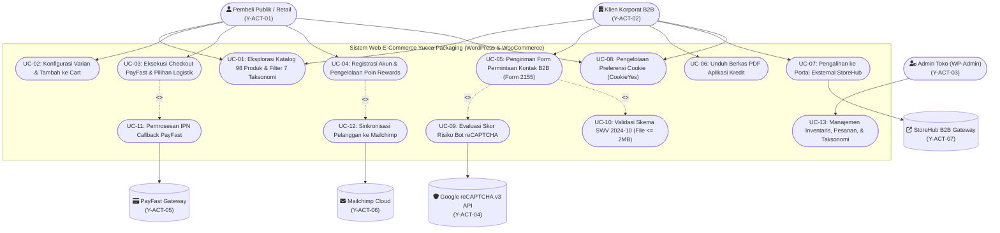

#### 3.1.2 Spesifikasi Naratif Use Case (Use Case Narrative)

##### Narasi: Y-UC-03 Eksekusi Checkout PayFast & Pilihan Logistik

- **ID & Nama:** Y-UC-03: Eksekusi Checkout PayFast & Pilihan Logistik
- **Aktor Utama:** Pembeli Publik / Pelanggan Ritel (Y-ACT-01)
- **Aktor Pendukung:** PayFast South Africa (Y-ACT-05), WP Mail SMTP Service
- **Kondisi Awal (*Pre-condition*):** Pengguna memiliki setidaknya satu item di keranjang belanja dan berada di halaman `/checkout/`.
- **Kondisi Akhir (*Post-condition*):** Pesanan tercatat di WooCommerce dengan status `wc-processing` setelah verifikasi IPN PayFast, stok berkurang, dan email konfirmasi terkirim via WP Mail SMTP.
- **Alur Utama (*Main Flow*):**
  1. Pengguna mengisi data penagihan (*Billing First Name, Last Name, Address, City, State: WC, Postcode, Country: ZA, Email, Phone*).
  2. Pengguna memilih metode pengiriman: *Delivery* (`flat_rate:4` seharga R200 + VAT) atau *Collect Cape Town Office* (`pickup_location:0` seharga R0).
  3. Sistem menghitung subtotal, diskon kupon, ongkos kirim, dan pajak PPN Afrika Selatan (VAT 15%).
  4. Pengguna memilih gateway pembayaran `payfast` dan menekan tombol *Place Order*.
  5. Peramban mengirimkan HTTP POST AJAX ke `/?wc-ajax=checkout` disertai nonce `update_order_review_nonce`.
  6. WooCommerce memvalidasi field, membuat entitas pesanan dengan status awal `wc-pending`, dan mereduksi stok produk di database.
  7. WooCommerce menyusun parameter transaksi PayFast (*merchant_id, amount, item_name, return_url, cancel_url, notify_url*) dan mengembalikan instruksi redirect ke PayFast Payment Portal.
  8. Pengguna menyelesaikan pembayaran di portal aman PayFast.
  9. Server PayFast mengirimkan sinyal *Instant Payment Notification* (IPN) ke endpoint `/?wc-api=WC_Gateway_PayFast`.
  10. WooCommerce memverifikasi tanda tangan keamanan IPN, memperbarui status pesanan menjadi `wc-processing`, dan memicu notifikasi email via `WP Mail SMTP`.
  11. Pengguna diarahkan ke halaman `/checkout/order-received/<id>/?key=...`.

---

### 3.2 Activity Diagram (Diagram Aktivitas)

#### 3.2.1 Alur Transaksi Pembelian Produk E-Commerce (WooCommerce & PayFast)

```mermaid
stateDiagram-v2
    [*] --> BrowseCatalog: Akses /shop (98 Produk)
    BrowseCatalog --> SelectTaxonomyFilter: Terapkan Filter Kategori atau Material
    SelectTaxonomyFilter --> ViewProductDetail: Klik Produk Kemasan
    
    ViewProductDetail --> ConfigureProductVariant: Pilih Varian Volume dan Packing
    ConfigureProductVariant --> ExecuteAddToCart: Klik Tambah ke Cart
    
    ExecuteAddToCart --> AjaxCartRequest: Request AJAX add_to_cart (Set Cookie Hash)
    AjaxCartRequest --> OpenCartView: Navigasi ke Halaman Cart

    state OpenCartView {
        [*] --> ReviewCartContents: Periksa Item dan Kuantitas
        ReviewCartContents --> ApplyDiscountCoupon: Masukkan Kupon Promo
        ReviewCartContents --> SelectShippingMethod: Pilih Delivery atau Pickup Cape Town
        SelectShippingMethod --> CalculateVAT15: Kalkulasi Pajak VAT 15 Persen
        CalculateVAT15 --> EvaluateFreeDeliveryThreshold: Evaluasi Total Pesanan Diatas R2000
        EvaluateFreeDeliveryThreshold --> ProceedToCheckoutPage: Lanjut ke Checkout
    }

    ProceedToCheckoutPage --> FillCheckoutDetails: Buka Checkout dan Isi Alamat
    FillCheckoutDetails --> SelectPaymentGateway: Pilih PayFast Gateway
    SelectPaymentGateway --> SubmitOrderPlacement: Klik Place Order

    state "WooCommerce Backend & PayFast Flow" as WCBackendScope {
        SubmitOrderPlacement --> ValidateCheckoutFields: Verifikasi Data dan Nonce
        ValidateCheckoutFields --> DeductStockInventory: Kurangi Stok Produk di Database
        DeductStockInventory --> InsertShopOrderPost: Buat Order Status wc-pending
        InsertShopOrderPost --> RedirectToPayFast: Redirect ke Portal Pembayaran PayFast
    }

    RedirectToPayFast --> CustomerPayFastScreen: Pembeli Masukkan Kartu atau Instant EFT
    CustomerPayFastScreen --> DispatchPayFastIPN: PayFast Kirim Webhook IPN
    
    state "Verifikasi IPN Webhook" as IPNScope {
        DispatchPayFastIPN --> ValidateIPNSignature: Validasi Signature dan Key
        ValidateIPNSignature --> UpdateOrderProcessing: Update Status Menjadi wc-processing
        UpdateOrderProcessing --> DispatchWPMailSMTP: Trigger Email via WP Mail SMTP
    }

    DispatchWPMailSMTP --> RenderThankYouPage: Redirect ke Halaman Sukses
    RenderThankYouPage --> [*]
```

#### 3.2.2 Pipeline Pengiriman Form B2B Berdasarkan Skema SWV 2024-10

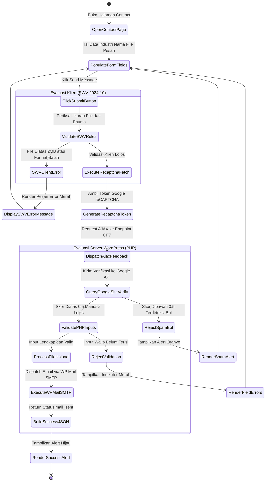

---

### 3.3 Class Diagram (Diagram Kelas Arsitektur Objek WordPress, WooCommerce, & CF7)

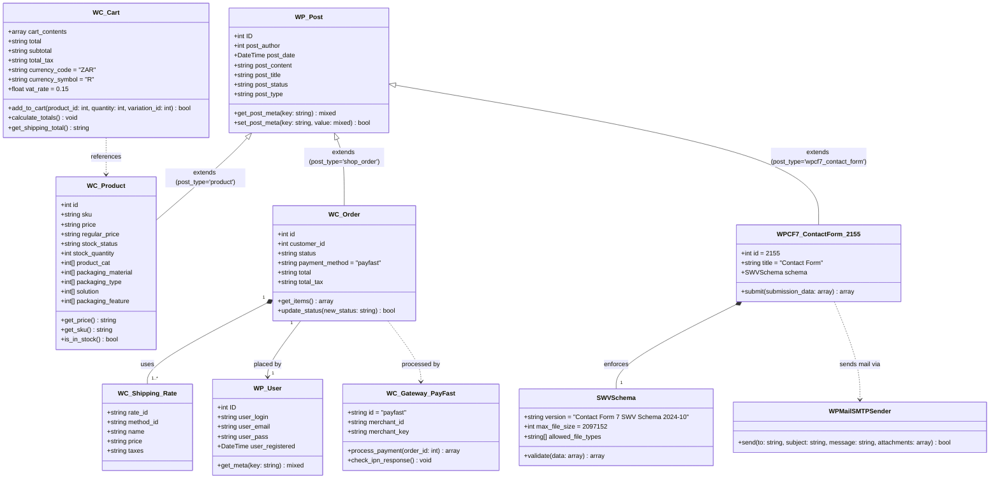

---

### 3.4 Sequence Diagram (Diagram Sekuensial Interaksi Sistem)

#### 3.4.1 Interaksi E-Commerce Checkout & Transaksi Pesanan (PayFast Gateway)

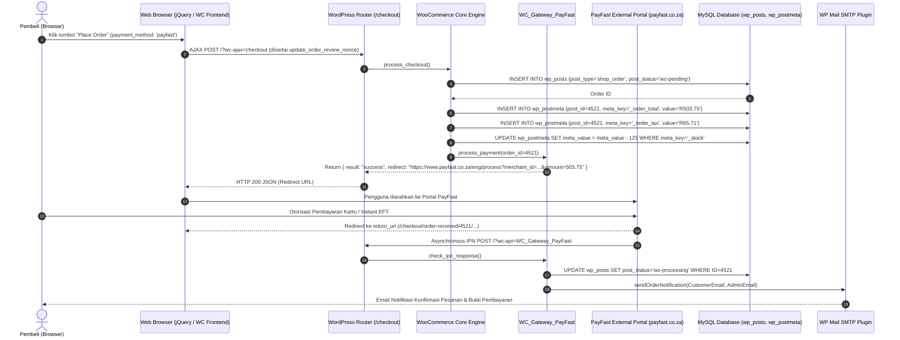

#### 3.4.2 Interaksi Verifikasi Anti-Spam & Pengiriman Form Kontak B2B (Form 2155)

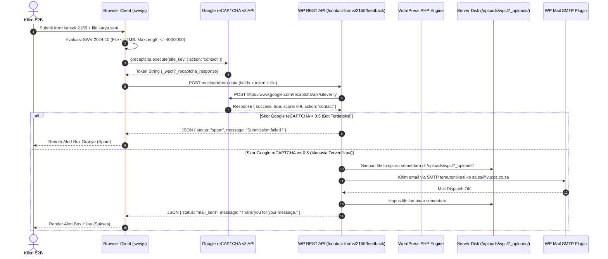

---

### 3.5 State Machine Diagram (Diagram Mesin Status Pesanan, Formulir, & Sesi)

#### 3.5.1 Siklus Hidup Status Pesanan (WooCommerce & PayFast Statechart)

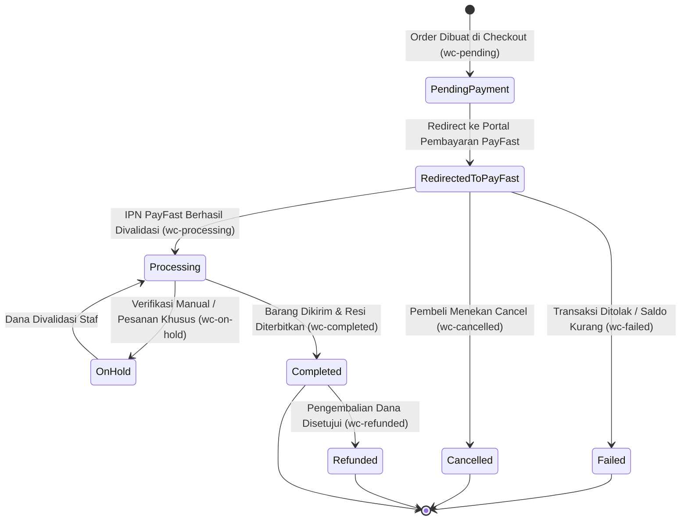

#### 3.5.2 Siklus Hidup Formulir Kontak 2155 (Contact Form 7 Statechart)

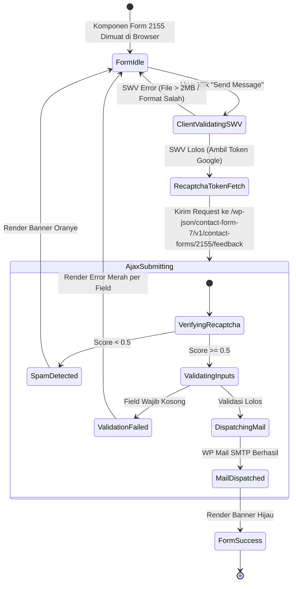

---

### 3.6 Component Diagram (Diagram Komponen Arsitektur Modular)

```mermaid
graph TB
    subgraph ClientBrowserTier ["Client Presentation Layer (Web Browser)"]
        HTML_DOM["Server-Rendered HTML DOM (18 Pages & 4 Blog Posts)"]
        JQueryCore["jQuery Core v3.7.1 & Migrate"]
        WC_Frontend["WooCommerce Frontend Scripts (cart, checkout, blockUI)"]
        CF7_Script["Contact Form 7 AJAX Script + SWV 2024-10"]
        RecaptchaSDK["Google reCAPTCHA v3 Client SDK"]
        CookieYesSDK["CookieYes Consent Script"]
    end

    subgraph WebServerTier ["Web Application Server (WP Engine: Apache/Nginx + PHP 8.x)"]
        WPRouter["WordPress Request Router (index.php)"]
        ThemeTemplateEngine["Theme Template Engine (yucca theme v7.0.4)"]
        WCRuntime["WooCommerce Core Runtime Engine v10.9.4"]
        PayFastPlugin["WooCommerce PayFast Gateway Plugin"]
        CF7Module["Contact Form 7 Controller Module v6.1.6 (Form 2155)"]
        WPMailSMTPModule["WP Mail SMTP Dispatcher Module"]
        WP_REST_API["WordPress REST API Engine (885 Routes)"]
        SocialLoginModule["Nextend Social Login Module"]
        OrderAttributionModule["WooCommerce Order Attribution Engine"]
        MailchimpIntegration["Mailchimp for WooCommerce Module"]
    end

    subgraph DataPersistenceTier ["Database & Storage Layer"]
        MySQL_DB[("MySQL / MariaDB Database<br>Tables: wp_posts, wp_postmeta,<br>wp_users, wp_terms, wp_term_taxonomy")]
        UploadsStorage["Server File System<br>(/wp-content/uploads/)"]
    end

    subgraph ExternalCloudServices ["External Cloud Services"]
        GoogleRecaptchaAPI["Google reCAPTCHA Verification API"]
        PayFastCloudAPI["PayFast South Africa Payment Gateway"]
        MailchimpCloud["Mailchimp Marketing Cloud"]
        StoreHubB2BPortal["StoreHub B2B External Gateway"]
    end

    %% Dependencies
    HTML_DOM --> JQueryCore
    HTML_DOM --> WC_Frontend
    HTML_DOM --> CF7_Script
    CF7_Script --> RecaptchaSDK

    ClientBrowserTier -- "HTTPS GET / POST" --> WPRouter
    WPRouter --> ThemeTemplateEngine
    WPRouter --> WP_REST_API
    WP_REST_API --> CF7Module
    WP_REST_API --> SocialLoginModule
    WPRouter --> WCRuntime
    WCRuntime --> PayFastPlugin
    WCRuntime --> OrderAttributionModule
    WCRuntime --> MailchimpIntegration
    CF7Module --> WPMailSMTPModule

    WCRuntime --> MySQL_DB
    ThemeTemplateEngine --> MySQL_DB
    CF7Module --> UploadsStorage

    CF7Module --> GoogleRecaptchaAPI
    PayFastPlugin --> PayFastCloudAPI
    MailchimpIntegration --> MailchimpCloud
    HTML_DOM --> StoreHubB2BPortal
```

---

### 3.7 Deployment Diagram (Diagram Penerapan Infrastruktur WP Engine & Cloudflare)

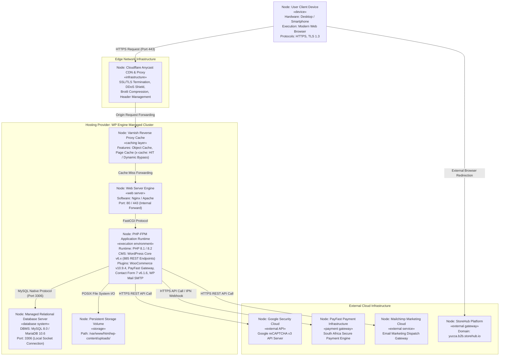

---

## BAB IV: PERANCANGAN BASIS DATA & SKEMA MYSQL (WORDPRESS EAV PATTERN)

### 4.1 Pola Penyimpanan Entity-Attribute-Value (EAV) & HPOS

Berdasarkan data yang diekstraksi dari `/wp-json/wp/v2/product` (`X-WP-Total: 98`) dan taksonomi yang terdaftar, Yucca Packaging menggunakan skema standar WordPress Entity-Attribute-Value (EAV). Dalam pola ini, setiap entitas produk (misal: ID `3322` untuk *Bagasse Gourmet Burger Box* dan variasi child ID `3323`) disimpan sebagai baris pada tabel `wp_posts`, sedangkan atribut numerik dan harga disimpan di `wp_postmeta`, dan relasi 7 taksonomi dihubungkan melalui tabel pivot `wp_term_relationships`:

### 4.2 Entity Relationship Diagram (ERD Basis Data MySQL)

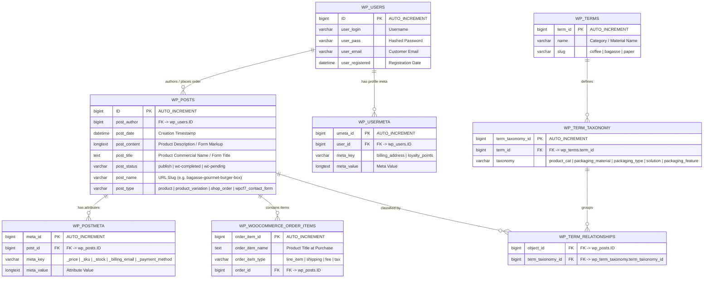

### 4.3 Kamus Data Fisik (Physical Data Dictionary) Tabel Kunci

#### 4.3.1 Tabel `wp_posts` (Entitas Induk Produk, Pesanan, & Form)

| Nama Kolom | Tipe Data MySQL | Nullable | Default | Keterangan & Karakteristik Data |
| :--- | :--- | :---: | :---: | :--- |
| `ID` | `bigint(20) unsigned` | NO | `AUTO_INCREMENT` | Primary Key unik tiap entitas postingan/produk/order. |
| `post_author` | `bigint(20) unsigned` | NO | `0` | ID user admin pembuat produk atau user pembuat pesanan. |
| `post_date` | `datetime` | NO | `0000-00-00 00:00:00` | Tanggal pembuatan entitas. |
| `post_content` | `longtext` | NO | - | Deskripsi lengkap produk kemasan atau markup form CF7. |
| `post_title` | `text` | NO | - | Nama komersial produk (e.g. *Bagasse Gourmet Burger Box*). |
| `post_status` | `varchar(20)` | NO | `'publish'` | `'publish'`, `'draft'`, `'wc-processing'`, `'wc-completed'`. |
| `post_name` | `varchar(200)` | NO | `''` | Sanitized URL slug untuk tautan halaman produk. |
| `post_type` | `varchar(20)` | NO | `'post'` | `'product'`, `'product_variation'`, `'shop_order'`, `'wpcf7_contact_form'`. |

#### 4.3.2 Tabel `wp_postmeta` (Atribut Variabel Produk & Pesanan)

| Nama Kolom | Tipe Data MySQL | Nullable | Default | Keterangan & Karakteristik Data |
| :--- | :--- | :---: | :---: | :--- |
| `meta_id` | `bigint(20) unsigned` | NO | `AUTO_INCREMENT` | Primary Key unik atribut meta. |
| `post_id` | `bigint(20) unsigned` | NO | `0` | Foreign Key mengarah ke `wp_posts.ID`. |
| `meta_key` | `varchar(255)` | YES | `NULL` | Kunci atribut: `_price`, `_regular_price`, `_sku`, `_stock_status`, `_billing_phone`, `_payment_method` (`payfast`). |
| `meta_value` | `longtext` | YES | `NULL` | Nilai data atribut. |

#### 4.3.3 Tabel `wp_term_taxonomy` (Taksonomi Produk Terverifikasi)

| Nama Kolom | Tipe Data MySQL | Nullable | Default | Keterangan & Nilai Enum Terdeteksi |
| :--- | :--- | :---: | :---: | :--- |
| `term_taxonomy_id` | `bigint(20) unsigned` | NO | `AUTO_INCREMENT` | Primary Key unik taksonomi. |
| `term_id` | `bigint(20) unsigned` | NO | `0` | Foreign Key ke `wp_terms.term_id`. |
| `taxonomy` | `varchar(32)` | NO | `''` | `product_cat`, `packaging_material`, `packaging_type`, `solution`, `packaging_feature`, `product_brand`. |
| `description` | `longtext` | NO | - | Deskripsi taksonomi kategori/bahan. |
| `count` | `bigint(20)` | NO | `0` | Jumlah produk terhubung dalam taksonomi (misal: `food` = 98). |

---

## BAB V: EVALUASI KEPATUHAN KEAMANAN (SECURITY, OWASP ASVS & STRIDE)

### 5.1 Matriks Kepatuhan OWASP ASVS v5.0.0

| Kriteria OWASP ASVS | Deskripsi Persyaratan | Status Audit Forensik | Analisis Teknis Objektif |
| :--- | :--- | :---: | :--- |
| **v5.0.0-V2.2.1** | *Positive input validation (allowlist schema)* | ✅ **PASS** (Formulir 2155) | Form kontak 2155 mengimplementasikan skema SWV 2024-10 yang membatasi tipe berkas (`.jpg`, `.png`, `.pdf`, `.doc`), batas ukuran 2 MB, batas panjang string, dan enum industri/referensi. |
| **v5.0.0-V2.4.1** | *Anti-automation & bot mitigation controls* | ⚠️ **TERBATAS** | Hanya mengandalkan skrip eksternal Google reCAPTCHA v3 pada sisi klien tanpa proteksi *IP-level sliding window rate limit* internal di web server. |
| **v5.0.0-V3.4.3** | *CSP object-src & base-uri directives* | ❌ **FAIL** | Header respons HTTP tidak memiliki `Content-Security-Policy` yang melarang eksekusi objek (`object-src 'none'`) atau membatasi `base-uri`. |
| **v5.0.0-V3.4.6** | *Clickjacking defense via frame-ancestors* | ⚠️ **PARSIAL** | Mengandalkan header legacy `X-Frame-Options` tanpa directive modern `frame-ancestors` pada CSP. |
| **v5.0.0-V4.1.1** | *Standardized Content-Type and charset* | ✅ **PASS** | Server secara eksplisit mengembalikan `Content-Type: text/html; charset=UTF-8` dan `application/json` pada respons REST API. |
| **v5.0.0-V5.1.3** | *Output encoding for HTML rendering* | ⚠️ **PARSIAL** | Bergantung pada fungsi template WordPress `esc_html()`, rentan jika ada plugin pihak ketiga yang mencetak data *raw*. |
| **v5.0.0-V6.2.1** | *Constant-time secret comparison* | ❌ **FAIL** | Tidak menerapkan komparasi waktu konstan pada token verifikasi publik. |

### 5.2 Pemodelan Ancaman Berbasis STRIDE (STRIDE Threat Model)

| Kategori Ancaman | Deskripsi Skenario Risiko pada Sistem Yucca | Kontrol Mitigasi Terobservasi | Rekomendasi Rekayasa |
| :--- | :--- | :--- | :--- |
| **Spoofing** | Penyerang memalsukan identitas pengirim form kontak atau email pembeli. | Google reCAPTCHA v3 mitigasi bot dasar; PayFast IPN signature verification. | Tambahkan verifikasi OTP WhatsApp atau link aktivasi email untuk pendaftaran akun. |
| **Tampering** | Penyerang memanipulasi kuantitas atau harga produk pada request HTTP. | WooCommerce server-side recalculation memvalidasi ulang harga produk di database. | Pertahankan validasi integritas payload transaksi PayFast. |
| **Repudiation** | Pembeli menyangkal telah melakukan transaksi pesanan. | Audit log pesanan tercatat di `wp_posts` dan `wp_woocommerce_order_items`. | Terapkan audit logging eksternal terpusat yang *immutable*. |
| **Information Disclosure** | Endpoint REST API mengekspos daftar pengguna admin atau metadata sistem. | Endpoint `/wp-json/wp/v2/users` terproteksi parsial; `/wp-json/wp/v2/pages` dan `/types` publik. | Batasi *enumeration* endpoint REST publik yang tidak dibutuhkan di peramban. |
| **Denial of Service** | Penyerang membanjiri request form kontak atau kueri filter kategori. | Cloudflare Anycast CDN & Proxy, Varnish Cache WP Engine (`x-cache: HIT / Dynamic Bypass`). | Implementasikan *Application-Layer Rate Limiting* (Sliding Window) internal per IP. |
| **Elevation of Privilege** | Eksploitasi kerentanan pada salah satu dari 15 plugin aktif pihak ketiga. | Pembaruan rutin versi WordPress Core dan plugin WooCommerce. | Terapkan prinsip *least privilege* pada hak akses basis data MySQL dan batasi eksekusi file PHP di `/wp-content/uploads/`. |
